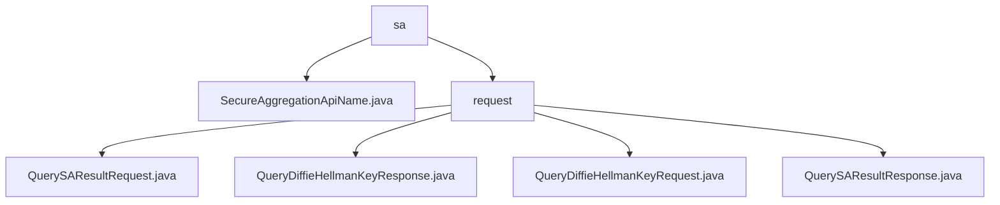

# 基础信息

|      |      |
|------|------|
| 名称 | sa |
| 编码语言 | .java |
| 代码路径 | WeFe/mpc/mpc-common/src/main/java/com/welab/wefe/mpc/sa |
| 包名 | docs.mpc.mpc-common.src.main.java.com.welab.wefe.mpc.sa |
| 概述说明 | 该模块封装安全聚合和密钥交换功能，包含四类数据传输对象，支持多方安全计算流程，采用请求-响应模式，依赖JSON处理库。 |

# 说明

## 概述  
该模块核心职责是实现安全聚合(Secure Aggregation)和Diffie-Hellman密钥交换的协议封装，提供类似加密信封机制的通信保障。接口规范包含四类POJO对象：QuerySAResultRequest/Response处理聚合计算，QueryDiffieHellmanKeyRequest/Response管理密钥交换，均采用JSONField注解实现序列化。  

关键数据结构涵盖请求标识uuid、Diffie-Hellman参数(p/g/public_keys)、操作符operator及权重weight等。外部依赖仅需基础JSON库，例如QueryDiffieHellmanKeyRequest使用JSONObject存储参数。SecureAggregationApiName类定义了SA_RESULT常量，用于标识安全聚合API。  

## 主要业务场景  
模块适用于多方安全计算场景，典型流程为：1) 发起密钥交换(QueryDiffieHellmanKeyRequest) 2) 交换公钥(QueryDiffieHellmanKeyResponse) 3) 提交聚合数据(QuerySAResultRequest) 4) 获取加密结果(QuerySAResultResponse)。  

交互采用请求-响应链模式，通过uuid关联会话。功能完整性体现在支持ADD操作符和权重调节，例如QuerySAResultResponse通过code/message反馈状态。API均为POJO封装，如SA_RESULT常量用于标识安全聚合结果API端点。

### 包内部结构视图

该流程图展示了WeFe项目中mpc-common模块下secure aggregation相关代码的层级结构。根节点"sa"包含一个Java文件和"request"子目录，request目录下包含四个请求/响应类文件，分别处理安全聚合和Diffie-Hellman密钥查询功能。所有节点名称均采用路径最后一级元素命名。

# 文件列表

| 名称   | 类型  | 说明 |
|-------|------|-------------|
| [SecureAggregationApiName.java](SecureAggregationApiName.md) | file | SecureAggregationApiName类定义了一个公共静态字符串常量SA_RESULT，值为"SecureAggregationForResult"。 |
| [request](request/_module.md) | package | QuerySAResultRequest类用于查询安全聚合结果，包含uuid、公钥列表等属性。QueryDiffieHellmanKeyResponse类封装密钥交换响应，含uuid、密钥值等字段。QueryDiffieHellmanKeyRequest类封装密钥交换请求，含requestId、p、g等参数。QuerySAResultResponse类封装查询结果响应，含uuid、result等字段。 |

