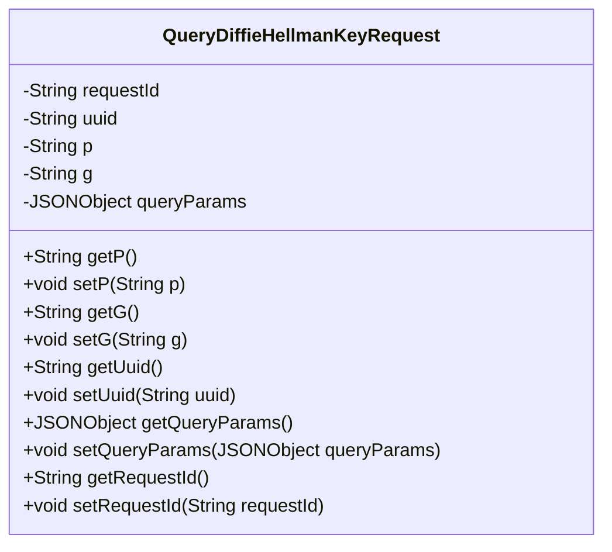

# 基础信息

|      |      |
|------|------|
| 名称 | QueryDiffieHellmanKeyRequest |
| 编码语言 | .java |
| 代码路径 | WeFe/mpc/mpc-common/src/main/java/com/welab/wefe/mpc/sa/request/QueryDiffieHellmanKeyRequest.java |
| 包名 | com.welab.wefe.mpc.sa.request |
| 依赖项 | ['com.alibaba.fastjson.JSONObject', 'com.alibaba.fastjson.annotation.JSONField'] |
| 概述说明 | QueryDiffieHellmanKeyRequest类包含requestId、uuid、p、g和queryParams字段，提供对应的getter和setter方法。 |

# 说明

这是一个名为QueryDiffieHellmanKeyRequest的Java类，用于封装Diffie-Hellman密钥交换请求的相关数据。类中包含五个私有字段：requestId表示请求标识，uuid用于唯一标识，p和g分别代表Diffie-Hellman算法中的大素数和生成元，queryParams是一个JSONObject类型的查询参数集合。类中为每个字段提供了对应的getter和setter方法，其中queryParams字段使用了JSONField注解指定JSON属性名。

# 类列表 Class Summary

| 名称   | 类型  | 说明 |
|-------|------|-------------|
| QueryDiffieHellmanKeyRequest | class | 类QueryDiffieHellmanKeyRequest包含请求ID、UUID、参数p和g，以及查询参数queryParams的JSON对象，提供各字段的getter和setter方法。 |

## 类 QueryDiffieHellmanKeyRequest

|      |      |
|------|------|
| 访问范围 | public |
| 类型 | class |
| 名称 | QueryDiffieHellmanKeyRequest |
| 说明 | 类QueryDiffieHellmanKeyRequest包含请求ID、UUID、参数p和g，以及查询参数queryParams的JSON对象，提供各字段的getter和setter方法。 |

### UML类图

该类图展示了`QueryDiffieHellmanKeyRequest`类的结构，它是一个用于处理Diffie-Hellman密钥交换请求的数据模型类。包含私有字段`requestId`、`uuid`、`p`、`g`和`queryParams`，分别表示请求ID、唯一标识符、素数模数、生成元以及查询参数。通过公有getter和setter方法提供对这些字段的访问和修改能力，符合JavaBean规范。其中`queryParams`字段使用`@JSONField`注解指定了JSON序列化时的别名。

### 内部方法调用关系图

```mermaid
graph TD
    A["类QueryDiffieHellmanKeyRequest"]
    B["属性: String requestId"]
    C["属性: String uuid"]
    D["属性: String p"]
    E["属性: String g"]
    F["属性: JSONObject queryParams"]
    G["方法: String getP()"]
    H["方法: void setP(String p)"]
    I["方法: String getG()"]
    J["方法: void setG(String g)"]
    K["方法: String getUuid()"]
    L["方法: void setUuid(String uuid)"]
    M["方法: JSONObject getQueryParams()"]
    N["方法: void setQueryParams(JSONObject queryParams)"]
    O["方法: String getRequestId()"]
    P["方法: void setRequestId(String requestId)"]

    A --> B
    A --> C
    A --> D
    A --> E
    A --> F
    A --> G
    A --> H
    A --> I
    A --> J
    A --> K
    A --> L
    A --> M
    A --> N
    A --> O
    A --> P
```

该流程图展示了QueryDiffieHellmanKeyRequest类的完整结构，包含5个私有属性和10个公共方法。属性包括requestId、uuid、p、g和带有JSONField注解的queryParams。方法由8个标准getter/setter对组成，用于封装对属性的访问和修改。类设计符合JavaBean规范，通过方法控制属性访问，适合用于JSON序列化场景。

### 字段列表 Field List

| 名称  | 类型  | 说明 |
|-------|-------|------|
| uuid | String | 声明一个私有字符串变量uuid。 |
| p | String | 私有字符串变量p |
| queryParams | JSONObject | JSON字段映射：私有JSONObject变量queryParams，通过注解@JSONField绑定键名query_params。 |
| g | String | 私有字符串变量g。 |
| requestId | String | 私有字符串变量requestId，用于唯一标识请求。 |

### 方法列表

| 名称  | 类型  | 说明 |
|-------|-------|------|
| getQueryParams | JSONObject | 获取查询参数的JSON对象方法。 |
| setP | void | 这是一个Java方法，用于设置类成员变量p的值。方法名为setP，接受一个字符串参数p，并将其赋值给当前对象的p属性。 |
| getRequestId | String | 获取请求ID的方法，返回字符串类型的requestId。 |
| getP | String | 这是一个Java方法，返回私有变量p的值。 |
| setQueryParams | void | 定义了一个公共方法setQueryParams，用于设置类的queryParams属性，参数为JSONObject类型。 |
| setG | void | 这是一个Java方法，用于设置类中的字符串变量g的值。方法名为setG，接受一个字符串参数g，并将其赋值给类的成员变量this.g。 |
| getG | String | 这是一个Java方法，返回字符串类型的成员变量g的值。 |
| getUuid | String | 该方法返回字符串类型的uuid值。 |
| setUuid | void | 这是一个Java方法，用于设置对象的uuid属性，接收一个字符串参数并赋值给成员变量uuid。 |
| setRequestId | void | 定义了一个公共方法setRequestId，用于设置当前对象的requestId属性值。参数为字符串类型。 |

