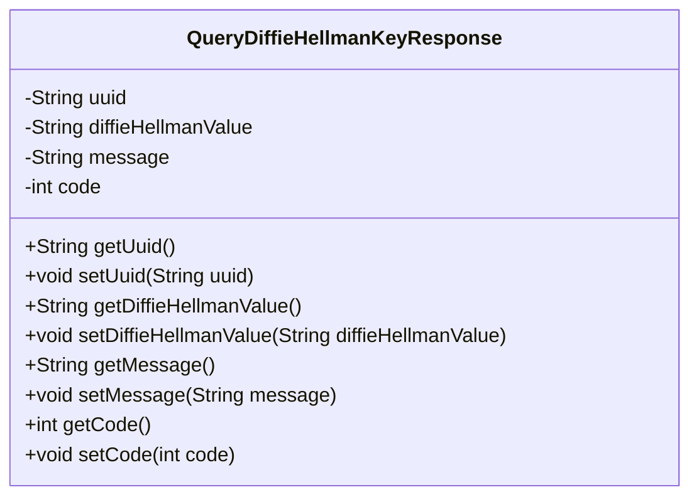
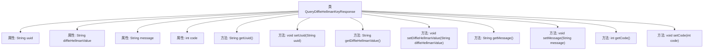

# 基础信息

|      |      |
|------|------|
| 名称 | QueryDiffieHellmanKeyResponse |
| 编码语言 | .java |
| 代码路径 | WeFe/mpc/mpc-common/src/main/java/com/welab/wefe/mpc/sa/request/QueryDiffieHellmanKeyResponse.java |
| 包名 | com.welab.wefe.mpc.sa.request |
| 依赖项 | [] |
| 概述说明 | 查询Diffie-Hellman密钥响应类，包含uuid、密钥值、消息和状态码字段及其getter/setter方法。 |

# 说明

QueryDiffieHellmanKeyResponse类是一个用于封装查询Diffie-Hellman密钥交换响应的Java类。该类包含四个私有字段：uuid用于唯一标识请求，diffieHellmanValue存储密钥交换值，message用于传递响应消息，code表示响应状态码。每个字段都有对应的getter和setter方法，用于获取和设置字段值。这个类主要用于处理密钥交换过程中的响应数据。

# 类列表 Class Summary

| 名称   | 类型  | 说明 |
|-------|------|-------------|
| QueryDiffieHellmanKeyResponse | class | QueryDiffieHellmanKeyResponse类包含uuid、diffieHellmanValue、message和code字段，提供对应的getter和setter方法。 |

## 类 QueryDiffieHellmanKeyResponse

|      |      |
|------|------|
| 访问范围 | public |
| 类型 | class |
| 名称 | QueryDiffieHellmanKeyResponse |
| 说明 | QueryDiffieHellmanKeyResponse类包含uuid、diffieHellmanValue、message和code字段，提供对应的getter和setter方法。 |

### UML类图

这段代码定义了一个名为`QueryDiffieHellmanKeyResponse`的类，用于封装与Diffie-Hellman密钥交换相关的响应数据。该类包含四个私有字段：`uuid`（唯一标识符）、`diffieHellmanValue`（DH密钥值）、`message`（响应消息）和`code`（状态码），并为每个字段提供了对应的getter和setter方法。这种设计模式常用于数据传输对象（DTO），便于在不同层之间传递结构化数据，同时保持封装性和可维护性。

### 内部方法调用关系图

这段代码定义了一个名为QueryDiffieHellmanKeyResponse的类，用于封装与Diffie-Hellman密钥交换相关的响应数据。类中包含四个私有属性：uuid（唯一标识符）、diffieHellmanValue（DH密钥值）、message（消息内容）和code（状态码），并为每个属性提供了对应的getter和setter方法。该类的设计主要用于数据传输，通过方法可以安全地访问和修改这些敏感数据。

### 字段列表 Field List

| 名称  | 类型  | 说明 |
|-------|-------|------|
| uuid | String | 私有字符串类型变量uuid |
| code | int | 私有整型变量code。 |
| diffieHellmanValue | String | DiffieHellman算法的密钥值变量，类型为String。 |
| message | String | 私有字符串类型变量message。 |

### 方法列表

| 名称  | 类型  | 说明 |
|-------|-------|------|
| getUuid | String | 获取uuid字符串的方法，直接返回成员变量uuid的值。 |
| getMessage | String | 这是一个Java方法，返回字符串类型的message变量值。 |
| setDiffieHellmanValue | void | 设置Diffie-Hellman密钥交换值的公共方法。 |
| setUuid | void | 这是一个Java方法，用于设置对象的uuid属性值。方法接收一个字符串参数uuid，并将其赋值给当前对象的uuid字段。 |
| getDiffieHellmanValue | String | 获取DiffieHellman值的公共方法，返回字符串类型变量diffieHellmanValue。 |
| setMessage | void | 设置消息内容的方法，将输入字符串赋值给类成员变量message。 |
| getCode | int | 方法getCode返回整型变量code的值。 |
| setCode | void | 设置整型变量code的值。 |

