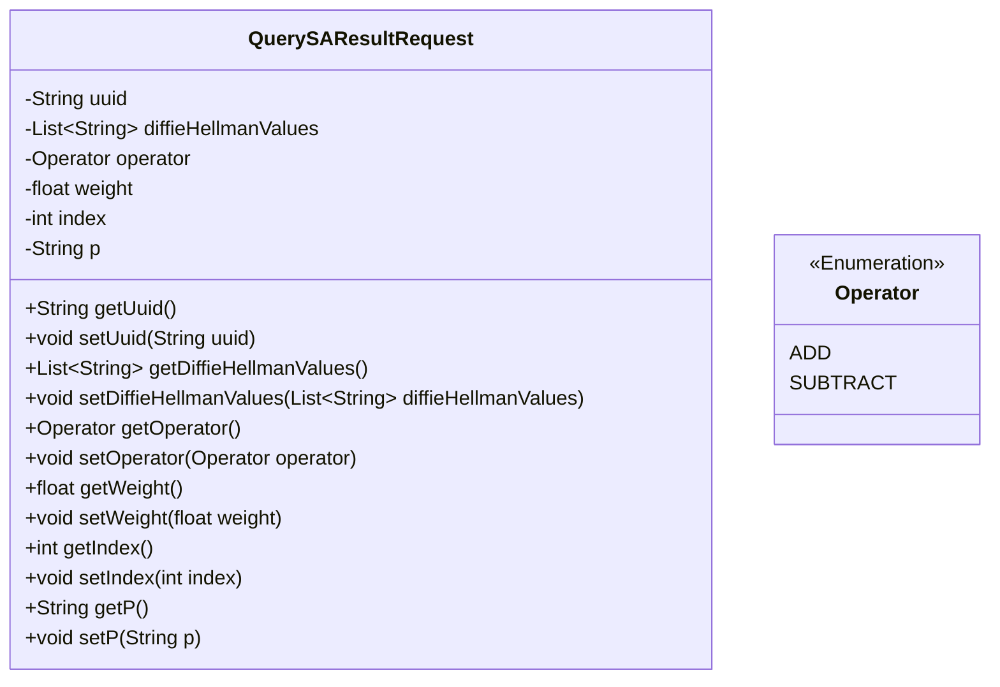

# 基础信息

|      |      |
|------|------|
| 名称 | QuerySAResultRequest |
| 编码语言 | .java |
| 代码路径 | WeFe/mpc/mpc-common/src/main/java/com/welab/wefe/mpc/sa/request/QuerySAResultRequest.java |
| 包名 | com.welab.wefe.mpc.sa.request |
| 依赖项 | ['com.welab.wefe.mpc.commom.Operator', 'java.util.List'] |
| 概述说明 | QuerySAResultRequest类包含请求标识、DH公钥列表、操作符、权重、参与方序号和DH模式字段，提供各字段的getter和setter方法。 |

# 说明

QuerySAResultRequest类用于查询安全聚合结果请求，包含请求标识uuid、所有参与方的DH公钥列表diffieHellmanValues、操作符operator（默认为ADD）、权重weight（默认为1.0）、当前参与方序号index（范围在0到公钥列表大小减1之间）以及DH模式p。类提供了各属性的getter和setter方法。

# 类列表 Class Summary

| 名称   | 类型  | 说明 |
|-------|------|-------------|
| QuerySAResultRequest | class | QuerySAResultRequest类包含请求标识、DH公钥列表、操作符、权重、参与方序号和DH模式字段，提供各字段的getter和setter方法。 |

## 类 QuerySAResultRequest

|      |      |
|------|------|
| 访问范围 | public |
| 类型 | class |
| 名称 | QuerySAResultRequest |
| 说明 | QuerySAResultRequest类包含请求标识、DH公钥列表、操作符、权重、参与方序号和DH模式字段，提供各字段的getter和setter方法。 |

### UML类图

这段代码定义了一个名为QuerySAResultRequest的类，用于封装查询SA结果的请求参数。该类包含请求标识uuid、DH公钥列表diffieHellmanValues、操作符operator、权重weight、参与方序号index以及DH模式p等私有字段，并为每个字段提供了对应的getter和setter方法。Operator是一个枚举类型，定义了ADD和SUBTRACT两种操作符。该类主要用于在多方安全计算场景中传递和操作请求参数。

### 内部方法调用关系图

```mermaid
graph TD
    A["类QuerySAResultRequest"]
    B["属性: String uuid"]
    C["属性: List<String> diffieHellmanValues"]
    D["属性: Operator operator = Operator.ADD"]
    E["属性: float weight = 1.0f"]
    F["属性: int index"]
    G["属性: String p"]
    H["方法: String getUuid()"]
    I["方法: void setUuid(String uuid)"]
    J["方法: List<String> getDiffieHellmanValues()"]
    K["方法: void setDiffieHellmanValues(List<String> diffieHellmanValues)"]
    L["方法: int getIndex()"]
    M["方法: void setIndex(int index)"]
    N["方法: String getP()"]
    O["方法: void setP(String p)"]
    P["方法: Operator getOperator()"]
    Q["方法: void setOperator(Operator operator)"]
    R["方法: float getWeight()"]
    S["方法: void setWeight(float weight)"]

    A --> B
    A --> C
    A --> D
    A --> E
    A --> F
    A --> G
    A --> H
    A --> I
    A --> J
    A --> K
    A --> L
    A --> M
    A --> N
    A --> O
    A --> P
    A --> Q
    A --> R
    A --> S
```

这段代码定义了一个名为QuerySAResultRequest的类，主要用于封装安全聚合查询请求的相关参数。类中包含7个私有属性：uuid作为请求标识，diffieHellmanValues存储所有参与方的DH公钥，operator表示操作符（默认为ADD），weight表示权重（默认为1.0），index表示当前参与方序号，p表示DH的mode。每个属性都有对应的getter和setter方法，用于属性的访问和修改。这个类的主要作用是提供安全聚合计算所需的数据结构和访问接口。

### 字段列表 Field List

| 名称  | 类型  | 说明 |
|-------|-------|------|
| uuid | String | 私有字符串变量uuid，用于存储唯一标识符。 |
| index | int | 私有整型变量index。 |
| diffieHellmanValues | List<String> | 私有字符串列表，存储Diffie-Hellman算法相关值。 |
| operator = Operator.ADD | Operator | 私有变量operator初始化为加法操作符。 |
| weight = 1.0f | float | 定义一个私有浮点变量weight，初始值为1.0。 |
| p | String | 声明一个私有字符串变量p。 |

### 方法列表

| 名称  | 类型  | 说明 |
|-------|-------|------|
| getUuid | String | 获取uuid字符串的方法，直接返回成员变量uuid的值。 |
| getDiffieHellmanValues | List<String> | 该方法返回一个包含Diffie-Hellman值的字符串列表。 |
| setIndex | void | 设置当前对象的索引值为指定参数值。 |
| getIndex | int | 方法返回整型变量index的值。 |
| setP | void | 这是一个Java方法，用于设置类成员变量p的值。方法名为setP，接受一个字符串参数p，并将其赋值给当前对象的p属性。 |
| setDiffieHellmanValues | void | 设置Diffie-Hellman参数列表的方法。 |
| setUuid | void | 设置UUID字符串值的方法。 |
| getP | String | 获取属性p的字符串值。 |
| getOperator | Operator | 这是一个Java方法，返回名为operator的成员变量。 |
| setOperator | void | 设置操作员方法，将传入的操作员对象赋值给当前实例的操作员属性。 |
| getWeight | float | 获取当前对象的重量值。 |
| setWeight | void | 设置对象重量属性的方法，参数为浮点数weight。 |

