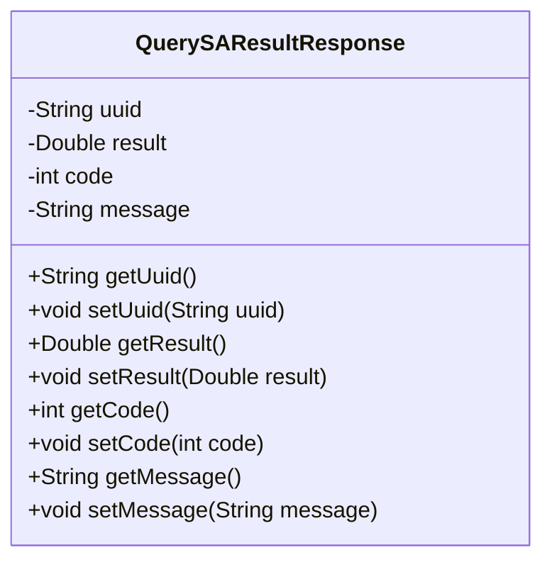
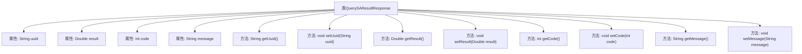

# 基础信息

|      |      |
|------|------|
| 名称 | QuerySAResultResponse |
| 编码语言 | .java |
| 代码路径 | WeFe/mpc/mpc-common/src/main/java/com/welab/wefe/mpc/sa/request/QuerySAResultResponse.java |
| 包名 | com.welab.wefe.mpc.sa.request |
| 依赖项 | [] |
| 概述说明 | Java类QuerySAResultResponse，包含uuid、result、code、message字段及对应的getter和setter方法。 |

# 说明

这是一个名为QuerySAResultResponse的Java类，用于封装查询结果的响应数据。该类包含四个私有字段：uuid用于存储唯一标识符，result用于存储双精度浮点数结果，code用于存储状态码，message用于存储消息文本。每个字段都有对应的getter和setter方法，分别用于获取和设置字段值。这个类主要用于数据传输和封装，不包含任何业务逻辑或方法实现。

# 类列表 Class Summary

| 名称   | 类型  | 说明 |
|-------|------|-------------|
| QuerySAResultResponse | class | QuerySAResultResponse类包含uuid、result、code和message字段，提供对应的getter和setter方法。 |

## 类 QuerySAResultResponse

|      |      |
|------|------|
| 访问范围 | public |
| 类型 | class |
| 名称 | QuerySAResultResponse |
| 说明 | QuerySAResultResponse类包含uuid、result、code和message字段，提供对应的getter和setter方法。 |

### UML类图

这段代码定义了一个名为QuerySAResultResponse的类，用于封装查询结果的响应数据。该类包含四个私有字段：uuid（唯一标识符）、result（双精度浮点数结果）、code（状态码）和message（消息文本），并为每个字段提供了对应的getter和setter方法。这个类典型用于RESTful API或服务调用中，作为返回结果的标准化数据结构，便于客户端解析和处理服务端返回的信息。

### 内部方法调用关系图

该流程图展示了QuerySAResultResponse类的完整结构，包含4个私有属性和对应的8个getter/setter方法。类用于封装查询结果响应数据，其中uuid标识唯一请求，result存储双精度结果值，code表示状态码，message携带描述信息。每个属性都通过get方法提供读取访问，通过set方法实现写入控制，符合JavaBean规范的数据封装模式。

### 字段列表 Field List

| 名称  | 类型  | 说明 |
|-------|-------|------|
| uuid | String | 声明一个私有字符串变量uuid。 |
| result | Double | 私有双精度浮点型变量result。 |
| code | int | 私有整型变量code。 |
| message | String | 声明一个私有字符串变量message。 |

### 方法列表

| 名称  | 类型  | 说明 |
|-------|-------|------|
| getResult | Double | 该方法返回一个Double类型的result值。 |
| getCode | int | 方法返回整型变量code的值。 |
| setUuid | void | 这是一个Java方法，用于设置对象的uuid属性值。方法接收一个字符串参数uuid，并将其赋值给当前对象的uuid字段。 |
| setResult | void | 设置结果值为传入的双精度数值。 |
| getMessage | String | 获取message字符串的方法。 |
| setMessage | void | 设置消息内容的方法，将输入字符串赋值给类成员变量message。 |
| getUuid | String | 方法返回字符串类型的uuid变量值。 |
| setCode | void | 设置整型变量code的值。 |

