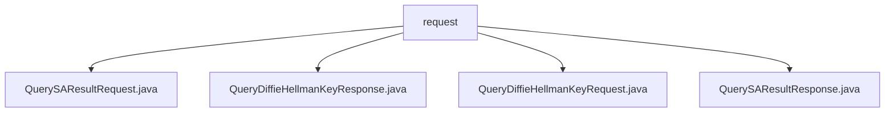

# 基础信息

|      |      |
|------|------|
| 名称 | request |
| 编码语言 | .java |
| 代码路径 | WeFe/mpc/mpc-common/src/main/java/com/welab/wefe/mpc/sa/request |
| 包名 | docs.mpc.mpc-common.src.main.java.com.welab.wefe.mpc.sa.request |
| 概述说明 | QuerySAResultRequest类用于查询安全聚合结果，包含uuid、公钥列表等属性。QueryDiffieHellmanKeyResponse类封装密钥交换响应，含uuid、密钥值等字段。QueryDiffieHellmanKeyRequest类封装密钥交换请求，含requestId、p、g等参数。QuerySAResultResponse类封装查询结果响应，含uuid、result等字段。 |

# 说明

## 概述  
该模块核心职责是实现安全聚合(Secure Aggregation)和Diffie-Hellman密钥交换的请求/响应封装，类似加密通信中的信封机制。接口规范包含四类数据传输对象：QuerySAResultRequest/Response处理聚合结果，QueryDiffieHellmanKeyRequest/Response处理密钥交换。  

关键数据结构包括：uuid请求标识、Diffie-Hellman参数(p/g/公钥列表)、操作符operator、权重weight等。外部依赖仅涉及JSON处理库(如JSONField注解)。例如QueryDiffieHellmanKeyRequest使用JSONObject存储查询参数。  

## 主要业务场景  
模块支持多方安全计算场景，典型流程为：1) 发起密钥交换请求(QueryDiffieHellmanKeyRequest) 2) 交换公钥(QueryDiffieHellmanKeyResponse) 3) 提交聚合计算(QuerySAResultRequest) 4) 获取结果(QuerySAResultResponse)。  

交互模式采用请求-响应模型，例如通过uuid关联请求链。功能完整性体现在支持ADD操作符、权重调节等聚合参数。API类型均为POJO封装，如QuerySAResultResponse用code/message实现状态反馈。

### 包内部结构视图

该流程图展示了`request`目录下的四个Java文件之间的层级关系。所有文件都直接隶属于`request`目录，没有更深层次的嵌套结构。这些文件包括两个请求类（QuerySAResultRequest和QueryDiffieHellmanKeyRequest）和两个响应类（QuerySAResultResponse和QueryDiffieHellmanKeyResponse），共同构成了安全计算模块的基础通信协议。

# 文件列表

| 名称   | 类型  | 说明 |
|-------|------|-------------|
| [QuerySAResultRequest.java](QuerySAResultRequest.md) | file | QuerySAResultRequest类包含请求标识、DH公钥列表、操作符、权重、参与方序号和DH模式字段，提供各字段的getter和setter方法。 |
| [QueryDiffieHellmanKeyResponse.java](QueryDiffieHellmanKeyResponse.md) | file | 查询Diffie-Hellman密钥响应类，包含uuid、密钥值、消息和状态码字段及其getter/setter方法。 |
| [QueryDiffieHellmanKeyRequest.java](QueryDiffieHellmanKeyRequest.md) | file | QueryDiffieHellmanKeyRequest类包含requestId、uuid、p、g和queryParams字段，提供对应的getter和setter方法。 |
| [QuerySAResultResponse.java](QuerySAResultResponse.md) | file | Java类QuerySAResultResponse，包含uuid、result、code、message字段及对应的getter和setter方法。 |

