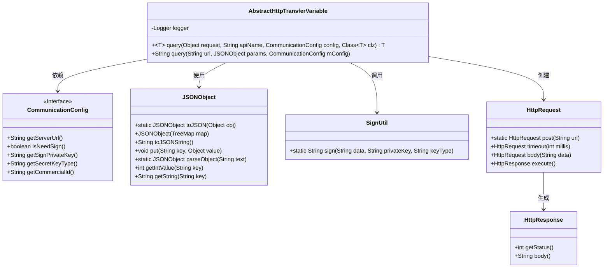
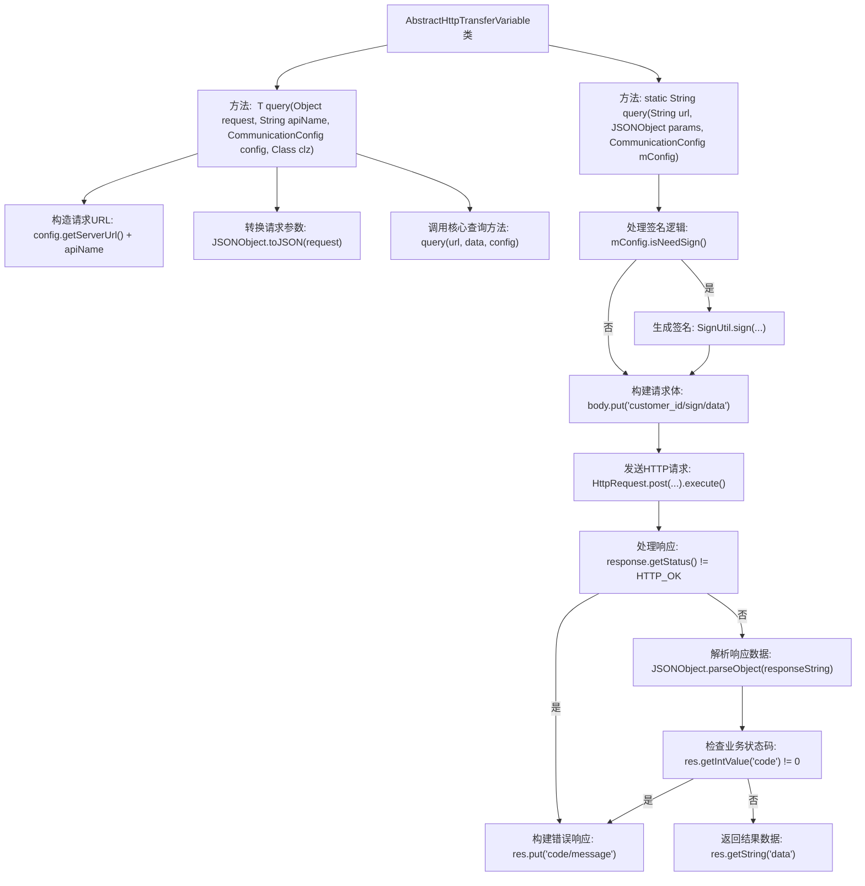

# 基础信息

|      |      |
|------|------|
| 名称 | AbstractHttpTransferVariable |
| 编码语言 | .java |
| 代码路径 | WeFe/mpc/mpc-common/src/main/java/com/welab/wefe/mpc/trasfer/AbstractHttpTransferVariable.java |
| 包名 | com.welab.wefe.mpc.trasfer |
| 依赖项 | ['java.util.TreeMap', 'org.slf4j.Logger', 'org.slf4j.LoggerFactory', 'com.alibaba.fastjson.JSON', 'com.alibaba.fastjson.JSONObject', 'com.welab.wefe.mpc.config.CommunicationConfig', 'com.welab.wefe.mpc.util.SignUtil', 'cn.hutool.http.HttpGlobalConfig', 'cn.hutool.http.HttpRequest', 'cn.hutool.http.HttpResponse', 'cn.hutool.http.HttpStatus'] |
| 概述说明 | 抽象类AbstractHttpTransferVariable提供HTTP查询功能，支持签名和错误处理，返回JSON格式数据。 |

# 说明

AbstractHttpTransferVariable是一个抽象类，提供HTTP请求处理功能。核心方法query支持两种重载：泛型方法将请求对象转换为JSON并调用底层查询，静态方法处理实际HTTP请求。请求处理包含签名验证逻辑，若配置需要签名则生成签名并封装请求体。请求发送后检查响应状态，非200状态或业务错误码时返回包含错误信息的JSON。成功响应则提取data字段返回。日志记录贯穿请求全过程，包含URL、响应状态等关键信息。

# 类列表 Class Summary

| 名称   | 类型  | 说明 |
|-------|------|-------------|
| AbstractHttpTransferVariable | class | 抽象类AbstractHttpTransferVariable提供HTTP查询功能，支持签名和错误处理，返回JSON格式响应。 |

## 类 AbstractHttpTransferVariable

|      |      |
|------|------|
| 访问范围 | public abstract |
| 类型 | class |
| 名称 | AbstractHttpTransferVariable |
| 说明 | 抽象类AbstractHttpTransferVariable提供HTTP查询功能，支持签名和错误处理，返回JSON格式响应。 |

### UML类图

类图描述：该图展示了一个HTTP传输抽象类AbstractHttpTransferVariable及其相关依赖关系。核心类通过CommunicationConfig获取配置信息，使用JSONObject处理JSON数据，调用SignUtil进行签名，通过HttpRequest发起请求并接收HttpResponse响应。主要实现了带签名的HTTP POST请求功能，包含异常处理和日志记录，支持泛型返回类型转换。

### 内部方法调用关系图

流程图描述：该流程图展示了AbstractHttpTransferVariable类的HTTP请求处理流程。从构建请求URL开始，经过参数转换后进入核心查询方法。根据配置决定是否进行签名验证，构建请求体后发送HTTP请求。处理响应时先检查HTTP状态码，再验证业务状态码，最后返回有效数据或错误信息。整个过程包含完整的异常处理和日志记录机制。

### 字段列表 Field List

| 名称  | 类型  | 说明 |
|-------|-------|------|
| logger = LoggerFactory.getLogger(AbstractHttpTransferVariable.class) | Logger | 定义私有静态常量日志记录器，关联AbstractHttpTransferVariable类。 |

### 方法列表

| 名称  | 类型  | 说明 |
|-------|-------|------|
| query | String | 静态方法query通过HTTP POST请求发送JSON数据，根据配置决定是否签名。处理响应状态和错误信息，返回结果或错误JSON。 |
| query | T | 这是一个Java泛型方法，用于通过HTTP查询API。它接收请求对象、API名称、配置和目标类，拼接URL并转换请求为JSON，最后返回解析后的响应对象。 |

