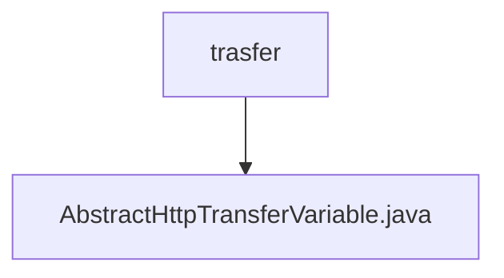

# 基础信息

|      |      |
|------|------|
| 名称 | trasfer |
| 编码语言 | .java |
| 代码路径 | WeFe/mpc/mpc-common/src/main/java/com/welab/wefe/mpc/trasfer |
| 包名 | docs.mpc.mpc-common.src.main.java.com.welab.wefe.mpc.trasfer |
| 概述说明 | 抽象类AbstractHttpTransferVariable提供HTTP查询功能，支持签名和错误处理，返回JSON格式数据。 |

# 说明

AbstractHttpTransferVariable是一个抽象类，提供HTTP请求处理功能。核心方法query支持两种重载：泛型方法将请求对象转换为JSON并调用底层查询，静态方法处理实际HTTP请求。请求处理包含签名验证逻辑，若配置需要签名则生成签名并封装请求体。请求发送后检查响应状态，非200状态或业务错误码时返回包含错误信息的JSON。成功响应则提取data字段返回。日志记录贯穿请求全过程，包含URL、响应状态等关键信息。

### 包内部结构视图

该流程图展示了WeFe项目中mpc-common模块的trasfer目录结构。trasfer作为父节点，包含一个子节点AbstractHttpTransferVariable.java文件，表示这是一个传输相关的抽象类实现。整个结构简洁明了，体现了Java项目中典型的包与类文件的层级关系。

# 文件列表

| 名称   | 类型  | 说明 |
|-------|------|-------------|
| [AbstractHttpTransferVariable.java](AbstractHttpTransferVariable.md) | file | 抽象类AbstractHttpTransferVariable提供HTTP查询功能，支持签名和错误处理，返回JSON格式数据。 |

