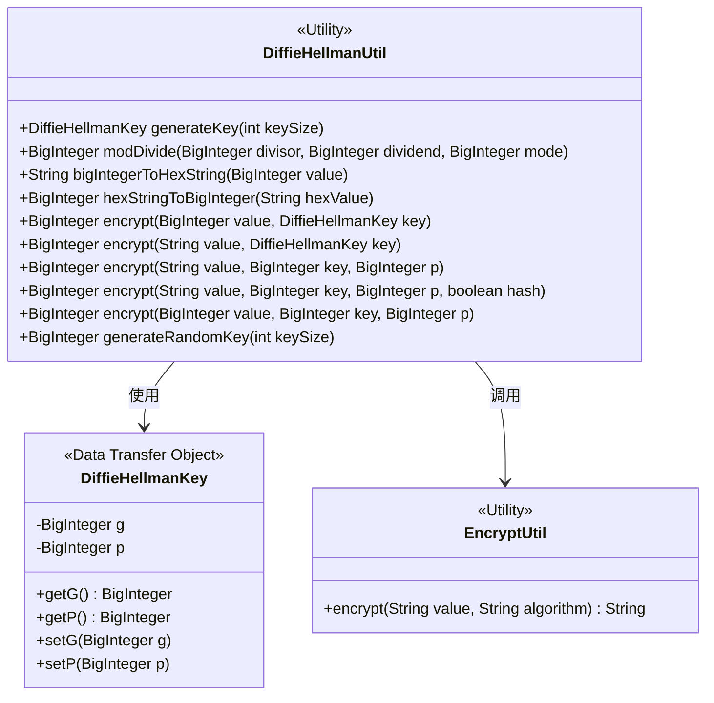

# 基础信息

|      |      |
|------|------|
| 名称 | DiffieHellmanUtil |
| 编码语言 | .java |
| 代码路径 | WeFe/mpc/mpc-common/src/main/java/com/welab/wefe/mpc/util/DiffieHellmanUtil.java |
| 包名 | com.welab.wefe.mpc.util |
| 依赖项 | ['com.welab.wefe.mpc.commom.AccountEncryptionType', 'com.welab.wefe.mpc.key.DiffieHellmanKey', 'javax.crypto.interfaces.DHPublicKey', 'java.math.BigInteger', 'java.security.KeyPair', 'java.security.KeyPairGenerator', 'java.security.NoSuchAlgorithmException', 'java.util.Random'] |
| 概述说明 | DiffieHellmanUtil类提供DH密钥生成、模除运算、大整数与16进制转换及模幂加密功能，支持MD5哈希预处理。 |

# 说明

DiffieHellmanUtil是一个提供迪菲-赫尔曼密钥交换相关功能的工具类。主要功能包括生成DH密钥对、模除运算、大整数与十六进制字符串转换、加密运算等。其中generateKey方法可生成指定长度的DH密钥对并返回包含G和P参数的DiffieHellmanKey对象。加密方法支持对大整数或字符串进行模幂运算，字符串加密时可选择是否先进行MD5哈希处理。此外还提供了生成随机大整数密钥的方法。所有方法均为静态方法，可直接调用。异常处理方面，当算法不存在时会抛出运行时异常。

# 类列表 Class Summary

| 名称   | 类型  | 说明 |
|-------|------|-------------|
| DiffieHellmanUtil | class | DiffieHellmanUtil类提供DH密钥生成、模除运算、大整数与16进制转换及模幂加密功能，支持随机密钥生成和多种加密方式。 |

## 类 DiffieHellmanUtil

|      |      |
|------|------|
| 访问范围 | public |
| 类型 | class |
| 名称 | DiffieHellmanUtil |
| 说明 | DiffieHellmanUtil类提供DH密钥生成、模除运算、大整数与16进制转换及模幂加密功能，支持随机密钥生成和多种加密方式。 |

### UML类图

该图展示了DiffieHellmanUtil工具类与相关组件的交互关系。作为核心加密工具类，它依赖DiffieHellmanKey存储密钥参数，并在哈希处理时调用EncryptUtil。类图清晰呈现了7个加密相关方法签名和关键数据流转路径，包括密钥生成、模运算、进制转换等功能模块，体现了迪菲-赫尔曼密钥交换算法的实现框架。

### 内部方法调用关系图

```mermaid
graph TD
    A["类DiffieHellmanUtil"]
    B["方法: generateKey(int keySize)"]
    C["方法: modDivide(BigInteger divisor, BigInteger dividend, BigInteger mode)"]
    D["方法: bigIntegerToHexString(BigInteger value)"]
    E["方法: hexStringToBigInteger(String hexValue)"]
    F["方法: encrypt(BigInteger value, DiffieHellmanKey key)"]
    G["方法: encrypt(String value, DiffieHellmanKey key)"]
    H["方法: encrypt(String value, BigInteger key, BigInteger p)"]
    I["方法: encrypt(String value, BigInteger key, BigInteger p, boolean hash)"]
    J["方法: encrypt(BigInteger value, BigInteger key, BigInteger p)"]
    K["方法: generateRandomKey(int keySize)"]
    L["内部调用: KeyPairGenerator.getInstance('DH')"]
    M["内部调用: generator.initialize(keySize)"]
    N["内部调用: generator.generateKeyPair()"]
    O["内部调用: pair.getPublic()"]
    P["内部调用: publicKey.getParams().getG()"]
    Q["内部调用: publicKey.getParams().getP()"]
    R["内部调用: dividend.modInverse(mode)"]
    S["内部调用: divisor.multiply(inv)"]
    T["内部调用: multi.mod(mode)"]
    U["内部调用: value.toString(16)"]
    V["内部调用: new BigInteger(hexValue, 16)"]
    W["内部调用: encrypt(key.getG(), value, key.getP())"]
    X["内部调用: encrypt(key.getG(), hexStringToBigInteger(value), key.getP())"]
    Y["内部调用: encrypt(value, key, p, true)"]
    Z["内部调用: EncryptUtil.encrypt(value, AccountEncryptionType.md5.name())"]
    AA["内部调用: hexStringToBigInteger(value)"]
    AB["内部调用: value.modPow(key, p)"]
    AC["内部调用: new BigInteger(keySize, new Random())"]

    A --> B
    A --> C
    A --> D
    A --> E
    A --> F
    A --> G
    A --> H
    A --> I
    A --> J
    A --> K
    B --> L
    B --> M
    B --> N
    B --> O
    B --> P
    B --> Q
    C --> R
    C --> S
    C --> T
    D --> U
    E --> V
    F --> W
    G --> X
    H --> Y
    I --> Z
    I --> AA
    J --> AB
    K --> AC
```

这段代码实现了一个Diffie-Hellman密钥交换工具类，包含密钥生成、模运算、加密转换等功能。流程图展示了类中所有方法的调用关系，包括密钥生成时调用的KeyPairGenerator相关方法，模运算中的逆元和乘法操作，以及不同类型参数加密方法之间的相互调用关系。核心加密操作最终通过modPow方法实现，同时支持字符串和BigInteger两种输入形式的处理。

### 字段列表 Field List

| 名称  | 类型  | 说明 |
|-------|-------|------|

### 方法列表

| 名称  | 类型  | 说明 |
|-------|-------|------|
| bigIntegerToHexString | String | 该方法将BigInteger对象转换为16进制字符串，直接调用其toString(16)方法实现。 |
| generateKey | DiffieHellmanKey | 生成Diffie-Hellman密钥，包含参数G和P，处理异常。 |
| hexStringToBigInteger | BigInteger | 将十六进制字符串转换为BigInteger类型。 |
| encrypt | BigInteger | Java方法：使用DiffieHellmanKey加密字符串，将十六进制字符串转为大整数，基于参数g和p进行加密。 |
| generateRandomKey | BigInteger | 生成指定位数的随机大整数密钥。 |
| encrypt | BigInteger | 加密方法：输入字符串、密钥和大数p，可选MD5哈希处理后转为大整数，再与密钥和p进行加密运算。 |
| modDivide | BigInteger | 该方法实现模除运算，通过计算除数的模逆元与被除数相乘，再取模返回结果。 |
| encrypt | BigInteger | Java方法：使用DiffieHellmanKey加密BigInteger值，参数为g、value和p。 |
| encrypt | BigInteger | 该方法使用模幂运算对输入值进行加密，参数为值、密钥和大素数p，返回加密结果。 |
| encrypt | BigInteger | Java方法：使用BigInteger对字符串加密，接收值、密钥和质数参数，默认启用加密标志。 |

