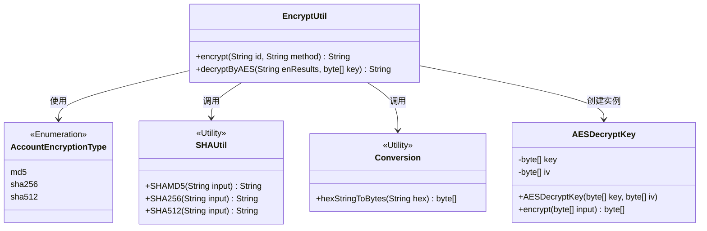
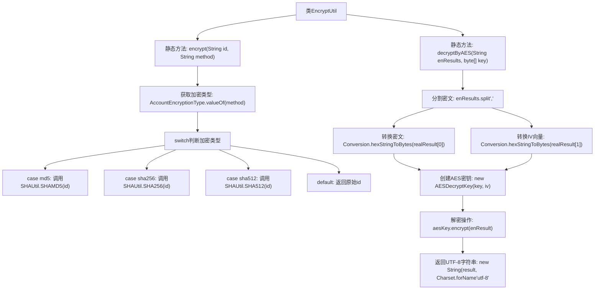

# 基础信息

|      |      |
|------|------|
| 名称 | EncryptUtil |
| 编码语言 | .java |
| 代码路径 | WeFe/mpc/mpc-common/src/main/java/com/welab/wefe/mpc/util/EncryptUtil.java |
| 包名 | com.welab.wefe.mpc.util |
| 依赖项 | ['java.nio.charset.Charset', 'com.welab.wefe.mpc.commom.AccountEncryptionType', 'com.welab.wefe.mpc.commom.Conversion', 'com.welab.wefe.mpc.pir.protocol.se.SymmetricKey', 'com.welab.wefe.mpc.pir.protocol.se.aes.AESDecryptKey'] |
| 概述说明 | EncryptUtil类提供加密与解密功能，支持MD5、SHA256、SHA512加密方法，以及基于AES的解密操作。 |

# 说明

EncryptUtil类提供两种加密相关功能。encrypt方法根据指定加密类型对字符串进行哈希处理，支持MD5、SHA256和SHA512三种算法，默认返回原字符串。decryptByAES方法用于AES解密，接收加密结果和密钥，先拆分加密数据和初始向量，再通过AESDecryptKey进行解密，最终返回UTF-8格式的字符串。

# 类列表 Class Summary

| 名称   | 类型  | 说明 |
|-------|------|-------------|
| EncryptUtil | class | EncryptUtil类提供加密与解密功能，支持MD5、SHA256、SHA512加密方法，以及基于AES的解密方法，需传入密钥和初始向量。 |

## 类 EncryptUtil

|      |      |
|------|------|
| 访问范围 | public |
| 类型 | class |
| 名称 | EncryptUtil |
| 说明 | EncryptUtil类提供加密与解密功能，支持MD5、SHA256、SHA512加密方法，以及基于AES的解密方法，需传入密钥和初始向量。 |

### UML类图

该类图展示了加密工具类`EncryptUtil`的核心结构及其关联关系。`EncryptUtil`提供`encrypt()`和`decryptByAES()`两个公开方法，分别依赖枚举类型`AccountEncryptionType`选择加密算法，调用`SHAUtil`的静态方法进行哈希计算，以及通过`Conversion`工具类处理字节转换。解密功能通过创建`AESDecryptKey`实例完成，该类封装了AES密钥和初始化向量。所有工具类均标记为`<<Utility>>`，体现了无状态工具类的设计特征。

### 内部方法调用关系图

流程图描述：该流程图展示了EncryptUtil类的两个核心方法。encrypt方法根据输入的加密类型(md5/sha256/sha512)调用对应的SHAUtil哈希函数，默认返回原始字符串。decryptByAES方法执行AES解密流程：先分割密文和IV向量，转换为字节数组后创建解密密钥对象，最终解密并返回UTF-8字符串。整个流程清晰展现了加密类型的分派逻辑和解密过程的数据转换步骤。

### 字段列表 Field List

| 名称  | 类型  | 说明 |
|-------|-------|------|

### 方法列表

| 名称  | 类型  | 说明 |
|-------|-------|------|
| encrypt | String | 静态方法encrypt根据method参数选择加密类型（MD5、SHA256、SHA512）对id进行加密，无匹配则返回原id。 |
| decryptByAES | String | 该方法使用AES解密字符串，输入为加密字符串和密钥，输出为解密后的UTF-8字符串。过程包括拆分输入、转换字节数组、初始化AES密钥并解密。 |

