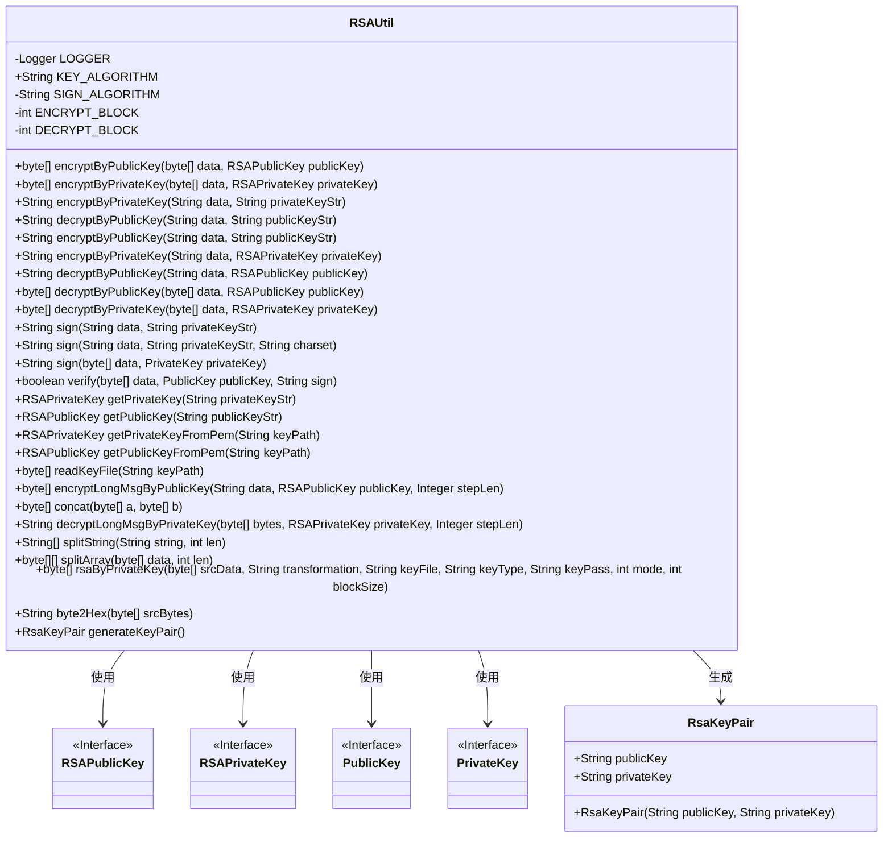
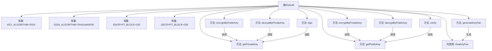

# 基础信息

|      |      |
|------|------|
| 名称 | RSAUtil |
| 编码语言 | .java |
| 代码路径 | WeFe/mpc/mpc-common/src/main/java/com/welab/wefe/mpc/util/RSAUtil.java |
| 包名 | com.welab.wefe.mpc.util |
| 依赖项 | ['org.slf4j.Logger', 'org.slf4j.LoggerFactory', 'javax.crypto.Cipher', 'java.io', 'java.nio.charset.StandardCharsets', 'java.security', 'java.security.interfaces.RSAPrivateKey', 'java.security.interfaces.RSAPublicKey', 'java.security.spec.PKCS8EncodedKeySpec', 'java.security.spec.X509EncodedKeySpec', 'java.util.Base64', 'java.util.Enumeration'] |
| 概述说明 | RSAUtil类提供RSA加密、解密、签名和验证功能，支持公私钥转换、分段处理长文本及密钥对生成。 |

# 说明

该RSAUtil类是一个功能全面的RSA加密工具类，提供公钥加密、私钥解密、私钥签名、公钥验签等核心功能。支持密钥格式转换（字符串与RSAPublicKey/RSAPrivateKey互转）、分段加解密处理长文本、Base64编解码，并包含密钥对生成方法。通过常量定义加密块大小（ENCRYPT_BLOCK=245/DECRYPT_BLOCK=256）和签名算法（SHA1withRSA），同时提供PEM文件读取和十六进制转换等辅助功能。

# 类列表 Class Summary

| 名称   | 类型  | 说明 |
|-------|------|-------------|
| RSAUtil | class | RSAUtil类提供RSA加密、解密、签名和密钥生成功能，支持公私钥转换及分段处理大数据。 |

## 类 RSAUtil

|      |      |
|------|------|
| 访问范围 | public |
| 类型 | class |
| 名称 | RSAUtil |
| 说明 | RSAUtil类提供RSA加密、解密、签名和密钥生成功能，支持公私钥转换及分段处理大数据。 |

### UML类图

该代码是一个RSA加密工具类，提供了公钥/私钥的加密解密、签名验证、密钥转换等功能。核心类RSAUtil包含20+个静态方法，支持字符串/字节数组的加密解密操作，处理长文本分段加解密，并能从文件/PEM格式读取密钥。内部类RsaKeyPair用于存储密钥对，通过generateKeyPair()方法生成。类图展示了与Java安全接口(RSAPublicKey/RSAPrivateKey等)的依赖关系，体现了完整的非对称加密解决方案。

### 内部方法调用关系图

该流程图展示了RSAUtil类的核心结构和主要方法调用关系。类包含加密/解密方法组（如encryptByPublicKey、decryptByPrivateKey）、签名验证方法（sign/verify）、密钥转换方法（getPrivateKey/getPublicKey）以及密钥对生成功能。关键流程表现为：加密方法依赖密钥获取方法，签名验证需要先转换密钥格式，generateKeyPair方法会生成包含公私钥的RsaKeyPair内部类实例。所有方法均基于RSA算法实现，处理流程包含密钥初始化、数据分块处理、Base64编解码等关键步骤。

### 字段列表 Field List

| 名称  | 类型  | 说明 |
|-------|-------|------|
| ENCRYPT_BLOCK = 245 | int | 加密块大小为245字节。 |
| LOGGER = LoggerFactory.getLogger(RSAUtil.class) | Logger | 定义静态常量LOGGER，用于RSAUtil类的日志记录。 |
| KEY_ALGORITHM = "RSA" | String | 定义常量字符串KEY_ALGORITHM，值为RSA，表示密钥算法类型。 |
| DECRYPT_BLOCK = 256 | int | 定义常量DECRYPT_BLOCK，值为256，用于解密块大小。 |
| SIGN_ALGORITHM = "SHA1withRSA" | String | 定义常量SIGN_ALGORITHM，值为SHA1withRSA签名算法。 |

### 方法列表

| 名称  | 类型  | 说明 |
|-------|-------|------|
| decryptByPublicKey | byte[] | 使用RSA公钥解密数据：传入字节数组和公钥，初始化Cipher为解密模式，执行解密并返回结果。 |
| sign | String | 这是一个Java方法，使用私钥对字节数组数据进行签名，返回Base64编码的签名结果。方法采用指定算法，处理异常。 |
| encryptLongMsgByPublicKey | byte[] | 使用RSA公钥分段加密长文本，默认步长为模长/8，每组明文长度不超过模长减11，拼接加密结果后返回。 |
| getPublicKeyFromPem | RSAPublicKey | 从PEM文件读取RSA公钥：读取文件内容，使用X509编码规范，通过密钥工厂生成RSAPublicKey对象。 |
| decryptByPrivateKey | byte[] | 使用私钥解密数据：传入数据和私钥，初始化解密模式，返回解密结果。 |
| getPrivateKeyFromPem | RSAPrivateKey | 从PEM文件读取RSA私钥：读取文件内容，使用PKCS8编码规范，通过KeyFactory生成RSAPrivateKey对象。 |
| splitArray | byte[][] | 将字节数组按指定长度分割成二维数组，处理余数部分，返回分割后的结果。 |
| decryptByPublicKey | String | 使用RSA公钥分段解密Base64编码数据，支持PKCS1填充，返回UTF-8字符串。 |
| readKeyFile | byte[] | 读取密钥文件内容，过滤以'-'开头的行，Base64解码后返回字节数组。文件不存在或读取错误时抛出异常。 |
| getPrivateKey | RSAPrivateKey | 该方法将Base64编码的RSA私钥字符串转换为RSAPrivateKey对象，通过PKCS8格式解析并生成密钥实例。 |
| verify | boolean | 该方法用于验证数据签名，接收数据字节数组、公钥和签名字符串，使用指定算法初始化验证器，更新数据后验证签名是否匹配。 |
| encryptByPrivateKey | String | 使用RSA私钥加密数据，分块处理并Base64解码后返回结果。 |
| sign | String | 使用RSA私钥对数据进行签名，返回Base64编码结果。步骤包括解码私钥、初始化签名器、更新数据并生成签名。 |
| concat | byte[] | 静态方法concat合并两个字节数组a和b，返回新数组c包含a和b的所有元素。 |
| encryptByPublicKey | String | 使用RSA公钥加密数据，输入数据和公钥字符串，输出Base64编码的加密结果。 |
| decryptLongMsgByPrivateKey | String | 使用RSA私钥分段解密长消息，支持自定义分段长度，默认按模长分组解密，拼接结果后返回。 |
| sign | String | 使用RSA私钥对数据进行签名，返回Base64编码的签名结果。 |
| encryptByPublicKey | byte[] | 使用RSA公钥加密数据，初始化Cipher为加密模式，执行加密并返回结果。 |
| splitString | String[] | 将字符串按指定长度分割成数组，处理余数部分确保完整。 |
| encryptByPrivateKey | byte[] | 使用RSA私钥加密数据，返回加密后的字节数组。 |
| decryptByPublicKey | String | 使用公钥字符串解密数据，先转换为RSAPublicKey对象再调用解密方法。 |
| encryptByPrivateKey | String | 静态方法使用私钥加密数据，输入数据和私钥字符串，返回加密结果。 |
| getPublicKey | RSAPublicKey | 该方法将Base64编码的RSA公钥字符串转换为RSAPublicKey对象，使用X509标准解码并生成密钥实例。 |
| rsaByPrivateKey | byte[] | 使用私钥进行RSA加密或解密，支持分块处理，需提供密钥文件、类型及密码，异常时返回null。 |
| byte2Hex | String | 将字节数组转换为十六进制字符串，每个字节转为两位十六进制数，不足补零。 |
| generateKeyPair | RsaKeyPair | 生成RSA密钥对，公钥和私钥经Base64编码后返回。 |

