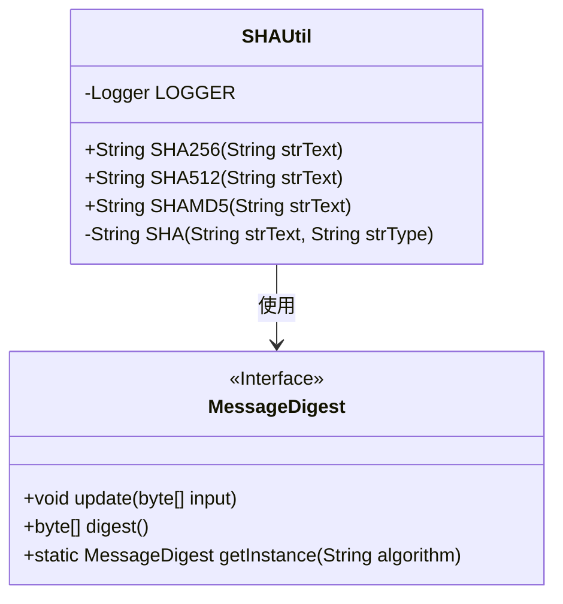
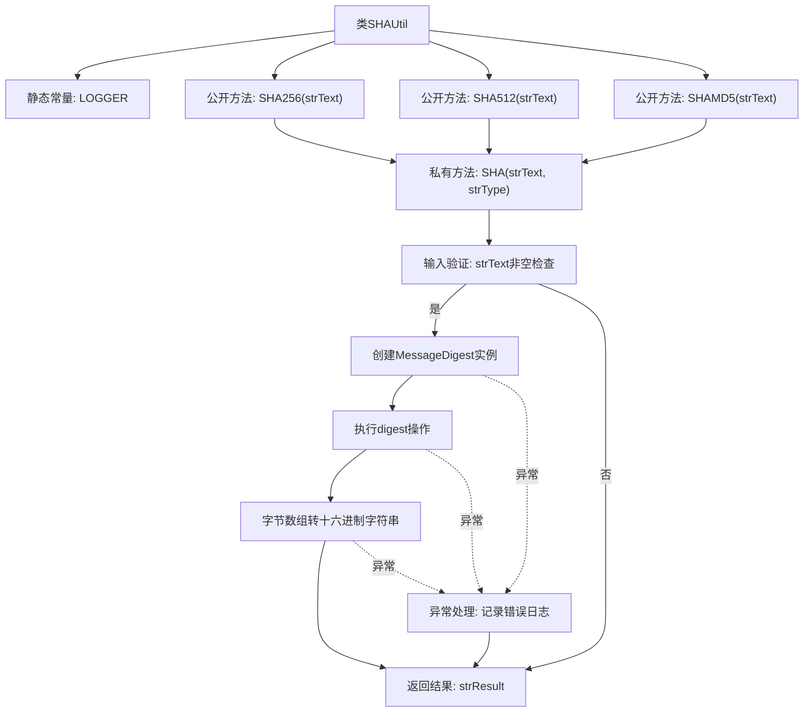

# 基础信息

|      |      |
|------|------|
| 名称 | SHAUtil |
| 编码语言 | .java |
| 代码路径 | WeFe/mpc/mpc-common/src/main/java/com/welab/wefe/mpc/util/SHAUtil.java |
| 包名 | com.welab.wefe.mpc.util |
| 依赖项 | ['org.slf4j.Logger', 'org.slf4j.LoggerFactory', 'java.security.MessageDigest'] |
| 概述说明 | SHAUtil类提供SHA256、SHA512和MD5加密方法，通过MessageDigest实现字符串加密并返回十六进制结果。 |

# 说明

SHAUtil类提供静态方法用于字符串的SHA加密，支持SHA-256、SHA-512和MD5算法。内部私有方法SHA处理实际加密逻辑，包括创建加密对象、传入字符串、生成字节结果并转换为十六进制字符串。若输入无效或加密出错，返回null并记录错误日志。

# 类列表 Class Summary

| 名称   | 类型  | 说明 |
|-------|------|-------------|
| SHAUtil | class | SHAUtil类提供SHA256、SHA512和MD5加密方法，通过MessageDigest实现字符串加密，返回十六进制结果。异常时记录日志。 |

## 类 SHAUtil

|      |      |
|------|------|
| 访问范围 | public |
| 类型 | class |
| 名称 | SHAUtil |
| 说明 | SHAUtil类提供SHA256、SHA512和MD5加密方法，通过MessageDigest实现字符串加密，返回十六进制结果。异常时记录日志。 |

### UML类图

这段代码展示了一个SHAUtil工具类，提供了SHA256、SHA512和MD5三种哈希算法的静态方法。类中包含一个私有的SHA方法作为核心实现，通过Java的MessageDigest接口完成加密操作。类图清晰地显示了SHAUtil与MessageDigest接口的依赖关系，其中SHAUtil调用MessageDigest的getInstance、update和digest方法来完成加密过程。私有方法SHA处理了字符串有效性检查、异常捕获和字节到十六进制的转换逻辑。

### 内部方法调用关系图

这段代码是一个SHA加密工具类，提供了SHA-256、SHA-512和MD5三种哈希算法的封装实现。流程图展示了从公开方法到核心私有方法SHA的调用关系，以及内部处理流程包括输入验证、加密操作、字节转换和异常处理。所有公开方法最终都委托给私有SHA方法执行实际加密，该方法通过Java的MessageDigest类实现加密功能，并将结果转换为十六进制字符串返回。

### 字段列表 Field List

| 名称  | 类型  | 说明 |
|-------|-------|------|
| LOGGER = LoggerFactory.getLogger(SHAUtil.class) | Logger | SHAUtil类中定义了一个名为LOGGER的私有静态不可变日志记录器实例。 |

### 方法列表

| 名称  | 类型  | 说明 |
|-------|-------|------|
| SHA | String | 该方法实现字符串的SHA加密，接收明文和算法类型，返回加密后的十六进制字符串。处理异常并记录日志。 |
| SHA512 | String | 这是一个静态方法，使用SHA-512算法对输入字符串进行哈希处理。 |
| SHAMD5 | String | 该方法定义了一个静态函数SHAMD5，接收字符串参数strText，调用SHA函数并指定加密方式为MD5，返回加密结果。 |
| SHA256 | String | 这是一个静态方法，用于对输入字符串进行SHA-256加密，调用内部SHA方法实现。 |

