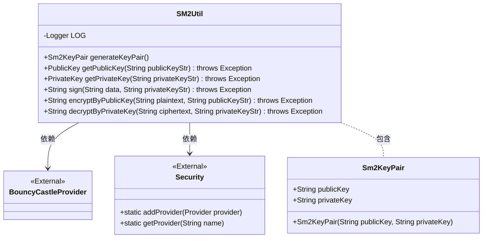

# 基础信息

|      |      |
|------|------|
| 名称 | SM2Util |
| 编码语言 | .java |
| 代码路径 | WeFe/mpc/mpc-common/src/main/java/com/welab/wefe/mpc/util/SM2Util.java |
| 包名 | com.welab.wefe.mpc.util |
| 依赖项 | ['org.bouncycastle.asn1.gm.GMNamedCurves', 'org.bouncycastle.asn1.gm.GMObjectIdentifiers', 'org.bouncycastle.asn1.x9.X9ECParameters', 'org.bouncycastle.crypto.engines.SM2Engine', 'org.bouncycastle.crypto.params.ECDomainParameters', 'org.bouncycastle.crypto.params.ECPrivateKeyParameters', 'org.bouncycastle.crypto.params.ECPublicKeyParameters', 'org.bouncycastle.crypto.params.ParametersWithRandom', 'org.bouncycastle.jcajce.provider.asymmetric.ec.BCECPrivateKey', 'org.bouncycastle.jcajce.provider.asymmetric.ec.BCECPublicKey', 'org.bouncycastle.jce.provider.BouncyCastleProvider', 'org.bouncycastle.jce.spec.ECParameterSpec', 'org.bouncycastle.math.ec.ECPoint', 'org.bouncycastle.util.encoders.Hex', 'org.slf4j.Logger', 'org.slf4j.LoggerFactory', 'java.math.BigInteger', 'java.nio.charset.StandardCharsets', 'java.security', 'java.security.spec.ECGenParameterSpec', 'java.util.Base64', 'org.bouncycastle.jce.spec.ECPrivateKeySpec', 'org.bouncycastle.jce.spec.ECPublicKeySpec'] |
| 概述说明 | SM2Util类提供SM2算法功能，包括生成密钥对、公私钥转换、签名验签、加解密等操作，使用BouncyCastle库实现。 |

# 说明

SM2Util类是一个基于BouncyCastle库实现SM2国密算法的工具类。主要功能包括：静态初始化块确保BouncyCastle提供者已注册；generateKeyPair方法生成SM2密钥对，包含16进制格式的公私钥；内部类Sm2KeyPair封装密钥对；getPublicKey/getPrivateKey方法实现公私钥字符串与密钥对象的转换；sign方法使用私钥对数据进行SM2签名；encryptByPublicKey方法用公钥加密数据；decryptByPrivateKey方法用私钥解密数据。所有操作均采用SM2P256V1椭圆曲线参数。

# 类列表 Class Summary

| 名称   | 类型  | 说明 |
|-------|------|-------------|
| SM2Util | class | SM2Util类提供SM2算法工具，包括密钥对生成、公私钥转换、数据签名、公钥加密和私钥解密功能，使用BouncyCastle库实现。 |

## 类 SM2Util

|      |      |
|------|------|
| 访问范围 | public |
| 类型 | class |
| 名称 | SM2Util |
| 说明 | SM2Util类提供SM2算法工具，包括密钥对生成、公私钥转换、数据签名、公钥加密和私钥解密功能，使用BouncyCastle库实现。 |

### UML类图

这段代码实现了一个SM2加密工具类，主要功能包括生成SM2密钥对、公钥/私钥格式转换、数据签名、公钥加密和私钥解密。类图中展示了SM2Util工具类与其内部类Sm2KeyPair的关系，以及对外部类BouncyCastleProvider和Security的依赖。SM2Util通过静态方法提供各种加密操作，而Sm2KeyPair则用于封装生成的公钥和私钥字符串。整个设计遵循了工具类的常见模式，所有方法均为静态方法，便于直接调用。

### 内部方法调用关系图

```mermaid
graph TD
    A["类SM2Util"]
    B["静态块: 注册BouncyCastleProvider"]
    C["方法: generateKeyPair"]
    D["内部类: Sm2KeyPair"]
    E["方法: getPublicKey"]
    F["方法: getPrivateKey"]
    G["方法: sign"]
    H["方法: encryptByPublicKey"]
    I["方法: decryptByPrivateKey"]

    A --> B
    A --> C
    A --> D
    A --> E
    A --> F
    A --> G
    A --> H
    A --> I

    C --> C1["创建ECGenParameterSpec"]
    C --> C2["初始化KeyPairGenerator"]
    C --> C3["生成KeyPair"]
    C --> C4["转换密钥格式"]
    C --> C5["返回Sm2KeyPair"]

    E --> E1["获取椭圆曲线参数"]
    E --> E2["解码公钥字符串"]
    E --> E3["生成PublicKey对象"]

    F --> F1["转换私钥字符串"]
    F --> F2["生成PrivateKey对象"]

    G --> G1["初始化签名对象"]
    G --> G2["加载私钥"]
    G --> G3["生成签名"]

    H --> H1["加载公钥"]
    H --> H2["初始化SM2引擎"]
    H --> H3["执行加密"]

    I --> I1["加载私钥"]
    I --> I2["初始化SM2引擎"]
    I --> I3["执行解密"]
```

该流程图展示了SM2Util类的核心结构和功能调用链。静态块确保BouncyCastleProvider注册，主要方法包括密钥对生成(generateKeyPair)、密钥格式转换(getPublicKey/getPrivateKey)、数字签名(sign)以及加解密操作(encryptByPublicKey/decryptByPrivateKey)。每个方法内部详细展示了关键步骤，如密钥生成时的参数初始化、签名时的引擎配置等，完整呈现了SM2国密算法的实现逻辑。

### 字段列表 Field List

| 名称  | 类型  | 说明 |
|-------|-------|------|
| LOG = LoggerFactory.getLogger(SM2Util.class) | Logger | SM2Util类中定义了一个私有静态不可变日志对象LOG，使用LoggerFactory获取日志器。 |

### 方法列表

| 名称  | 类型  | 说明 |
|-------|-------|------|
| sign | String | 使用SM2算法和SM3哈希对数据进行签名，输入数据和私钥字符串，返回Base64编码的签名结果。 |
| generateKeyPair | Sm2KeyPair | 生成SM2密钥对，包含公钥和私钥的十六进制字符串，使用BouncyCastle库实现。 |
| encryptByPublicKey | String | 使用SM2算法和公钥加密明文，生成Base64编码的密文。 |
| getPublicKey | PublicKey | 该方法从HEX字符串生成SM2椭圆曲线公钥，使用BouncyCastle库解析参数和点坐标，最终返回BCECPublicKey对象。 |
| getPrivateKey | PrivateKey | Java方法：将HEX字符串转为SM2椭圆曲线私钥，使用BouncyCastle库实现。 |
| decryptByPrivateKey | String | 使用私钥解密SM2加密的密文，涉及密钥转换、参数设置、引擎初始化和数据处理，最终返回解密后的明文。 |

