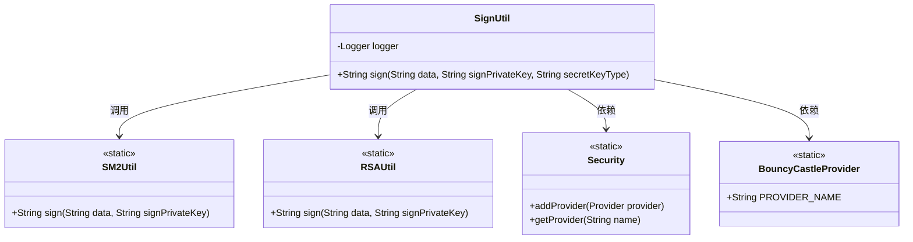
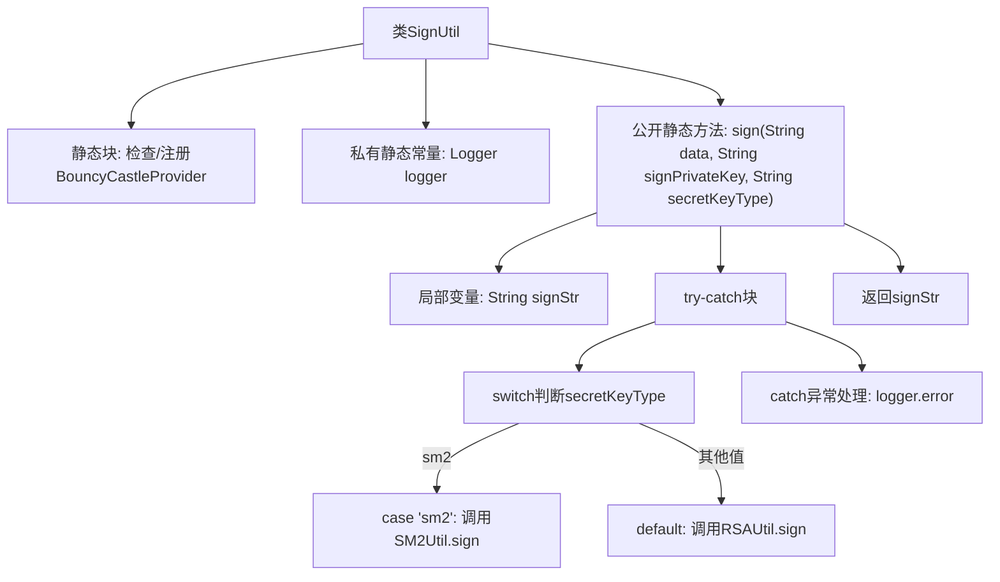

# 基础信息

|      |      |
|------|------|
| 名称 | SignUtil |
| 编码语言 | .java |
| 代码路径 | WeFe/mpc/mpc-common/src/main/java/com/welab/wefe/mpc/util/SignUtil.java |
| 包名 | com.welab.wefe.mpc.util |
| 依赖项 | ['java.security.Security', 'org.bouncycastle.jce.provider.BouncyCastleProvider', 'org.slf4j.Logger', 'org.slf4j.LoggerFactory'] |
| 概述说明 | SignUtil类提供签名功能，静态块初始化BouncyCastleProvider。sign方法根据密钥类型调用SM2或RSA签名，异常时记录日志。 |

# 说明

SignUtil是一个提供签名功能的工具类，静态代码块确保BouncyCastleProvider安全提供者已注册。类包含一个静态日志记录器，用于记录错误信息。sign方法接收数据、签名私钥和密钥类型参数，根据密钥类型调用SM2Util或RSAUtil进行签名，默认使用RSA算法。异常时记录错误日志并返回null。

# 类列表 Class Summary

| 名称   | 类型  | 说明 |
|-------|------|-------------|
| SignUtil | class | SignUtil类提供签名功能，静态块初始化BouncyCastleProvider。sign方法根据密钥类型选择SM2或RSA签名，异常时记录日志。 |

## 类 SignUtil

|      |      |
|------|------|
| 访问范围 | public |
| 类型 | class |
| 名称 | SignUtil |
| 说明 | SignUtil类提供签名功能，静态块初始化BouncyCastleProvider。sign方法根据密钥类型选择SM2或RSA签名，异常时记录日志。 |

### UML类图

这段代码展示了一个签名工具类SignUtil，它通过静态初始化块确保BouncyCastleProvider安全提供者已注册。主要功能是通过sign方法根据密钥类型选择SM2或RSA算法进行数据签名，并处理异常日志记录。类图中显示了SignUtil与SM2Util、RSAUtil的调用关系，以及对Security和BouncyCastleProvider的依赖，体现了多算法支持的灵活性和安全提供者管理的机制。

### 内部方法调用关系图

该流程图展示了SignUtil类的完整签名流程：首先在静态块中初始化加密提供者，然后通过sign方法根据密钥类型选择不同的签名算法（SM2或RSA），包含异常处理和日志记录。关键路径包括密钥类型判断分支、两种签名算法的调用，以及错误处理机制，最终返回签名结果字符串。

### 字段列表 Field List

| 名称  | 类型  | 说明 |
|-------|-------|------|
| logger = LoggerFactory.getLogger(SignUtil.class) | Logger | 类SignUtil中定义了一个静态不可变的日志记录器logger，通过LoggerFactory获取。 |

### 方法列表

| 名称  | 类型  | 说明 |
|-------|-------|------|
| sign | String | 这是一个Java签名方法，根据密钥类型选择SM2或RSA算法对数据进行签名，出错时记录日志并返回null。 |

