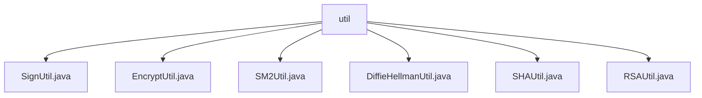

# 基础信息

|      |      |
|------|------|
| 名称 | util |
| 编码语言 | .java |
| 代码路径 | WeFe/mpc/mpc-common/src/main/java/com/welab/wefe/mpc/util |
| 包名 | docs.mpc.mpc-common.src.main.java.com.welab.wefe.mpc.util |
| 概述说明 | SignUtil提供签名功能，支持SM2和RSA。EncryptUtil支持MD5/SHA256/SHA512哈希和AES解密。SM2Util实现SM2国密算法，含密钥生成、加解密和签名。DiffieHellmanUtil提供DH密钥交换功能。SHAUtil支持SHA和MD5加密。RSAUtil提供RSA加解密、签名验签及密钥处理。 |

# 说明

## 概述  
该模块是密码学工具集，核心职责是提供多种加密算法实现和安全通信功能，类似安全中间件。接口规范涵盖签名（SM2/RSA）、加密（AES/SHA/DH）、密钥交换等操作，统一采用静态方法调用。关键数据结构包括SM2KeyPair、DiffieHellmanKey和RSA密钥对。依赖BouncyCastleProvider实现国密算法，例如SM2P256V1曲线参数。具体实现如SignUtil自动选择签名算法，EncryptUtil支持MD5/SHA256/AES混合加密。

## 主要业务场景  
典型应用包括数据签名验证（如SignUtil调用SM2Util签名）、安全传输（如DiffieHellmanUtil生成DH密钥交换参数）、敏感信息加密（如RSAUtil分段处理长文本）。业务流程通常为：生成密钥→加密/签名→传输→解密/验签，例如SM2Util同时提供加密和签名功能。交互模式以API为主，如SHAUtil直接调用静态方法进行哈希。功能完整性体现在覆盖主流算法，包括国密SM2、RSA、AES和传统哈希算法。

### 包内部结构视图

该流程图展示了WeFe项目中mpc-common模块下util工具类的文件结构。根节点为util文件夹，其下包含6个工具类实现文件：SignUtil、EncryptUtil、SM2Util、DiffieHellmanUtil、SHAUtil和RSAUtil，这些文件都直接隶属于util目录，没有更深层级的子目录结构。

# 文件列表

| 名称   | 类型  | 说明 |
|-------|------|-------------|
| [SignUtil.java](SignUtil.md) | file | SignUtil类提供签名功能，静态块初始化BouncyCastleProvider。sign方法根据密钥类型调用SM2或RSA签名，异常时记录日志。 |
| [EncryptUtil.java](EncryptUtil.md) | file | EncryptUtil类提供加密与解密功能，支持MD5、SHA256、SHA512加密方法，以及基于AES的解密操作。 |
| [SM2Util.java](SM2Util.md) | file | SM2Util类提供SM2算法功能，包括生成密钥对、公私钥转换、签名验签、加解密等操作，使用BouncyCastle库实现。 |
| [DiffieHellmanUtil.java](DiffieHellmanUtil.md) | file | DiffieHellmanUtil类提供DH密钥生成、模除运算、大整数与16进制转换及模幂加密功能，支持MD5哈希预处理。 |
| [SHAUtil.java](SHAUtil.md) | file | SHAUtil类提供SHA256、SHA512和MD5加密方法，通过MessageDigest实现字符串加密并返回十六进制结果。 |
| [RSAUtil.java](RSAUtil.md) | file | RSAUtil类提供RSA加密、解密、签名和验证功能，支持公私钥转换、分段处理长文本及密钥对生成。 |

