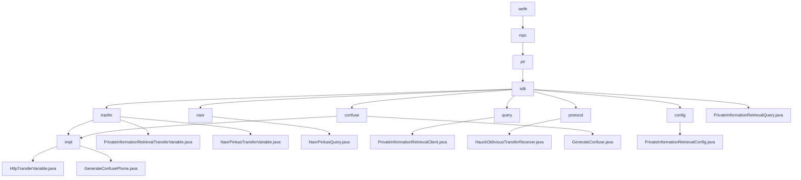

# 基础信息

|      |      |
|------|------|
| 名称 | wefe |
| 编码语言 | .java |
| 代码路径 | WeFe/mpc/mpc-pir/mpc-pir-sdk/src/main/java/com/welab/wefe |
| 包名 | docs.mpc.mpc-pir.mpc-pir-sdk.src.main.java.com.welab.wefe |
| 概述说明 | 该模块实现基于Naor-Pinkas协议的安全私有信息检索，包含数据混淆、OT交互和加密查询功能。核心类处理密钥生成、参数验证和结果解密，支持客户端-服务器安全检索流程。提供混淆接口生成差异化实例，配置类校验参数合法性。整体确保查询隐私性和流程安全性。 |

# 说明

## 概述  
该模块核心职责是实现安全私有信息检索(PIR)功能，基于Naor-Pinkas和Hauck不经意传输协议，通过数据混淆和加密传输确保查询隐私性。接口规范分为两类：基础PIR接口(如generate/query)处理数据准备和检索，协议专用接口(如queryNaorPinkasRandom)管理加密参数交换。关键数据结构包括QueryKeysRequest、ObliviousTransferKey等传输对象，以及包含主键列表和混淆参数的PrivateInformationRetrievalConfig。外部依赖涉及基础通信框架和RandomPhoneNum等工具类。例如NaorPinkasQuery类实现1024位密钥的Diffie-Hellman加密流程。

## 主要业务场景  
典型应用为客户端-服务器安全检索流程：先通过generateConfuse生成混淆数据集，再分阶段调用协议接口完成加密传输，最终解密目标结果。交互类似两阶段提交协议，支持Naor-Pinkas和Hauck两种OT模式。例如HauckObliviousTransferReceiver通过MAC验证和密钥派生确保传输安全。完整功能覆盖从数据混淆(如MD5加密电话号码)、参数校验到安全检索的全生命周期，异常处理贯穿各环节。API集成案例包括匿名查询和合规检查等场景。

### 包内部结构视图

该流程图展示了WeFe项目中MPC-PIR-SDK模块的完整层级结构，从根目录wefe开始逐级展开到具体实现文件。核心节点pir下包含sdk目录，sdk又细分为trasfer、naor、query等8个子模块，每个子模块包含对应的实现类或配置文件，如HttpTransferVariable.java、NaorPinkasQuery.java等关键组件。整体结构清晰展现了私有信息检索功能的模块化设计，各组件间通过层级关系形成完整的SDK架构。

# 文件列表

| 名称   | 类型  | 说明 |
|-------|------|-------------|
| [mpc](mpc/_module.md) | package | 该模块实现基于Naor-Pinkas协议的安全私有信息检索，包含数据混淆、OT交互和加密查询功能。核心类处理密钥生成、参数验证和结果解密，支持客户端-服务器安全检索流程。提供混淆接口生成差异化实例，配置类校验参数合法性。整体确保查询隐私性和流程安全性。 |

