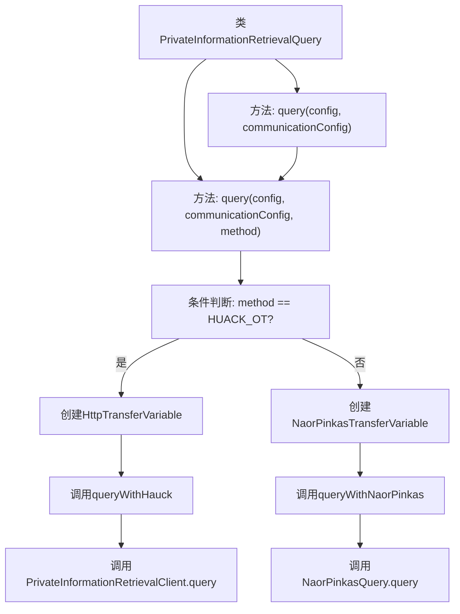

# 基础信息

|      |      |
|------|------|
| 名称 | PrivateInformationRetrievalQuery |
| 编码语言 | .java |
| 代码路径 | WeFe/mpc/mpc-pir/mpc-pir-sdk/src/main/java/com/welab/wefe/mpc/pir/sdk/PrivateInformationRetrievalQuery.java |
| 包名 | com.welab.wefe.mpc.pir.sdk |
| 依赖项 | ['com.welab.wefe.mpc.commom.Constants', 'com.welab.wefe.mpc.config.CommunicationConfig', 'com.welab.wefe.mpc.pir.sdk.config.PrivateInformationRetrievalConfig', 'com.welab.wefe.mpc.pir.sdk.naor.NaorPinkasQuery', 'com.welab.wefe.mpc.pir.sdk.query.PrivateInformationRetrievalClient', 'com.welab.wefe.mpc.pir.sdk.trasfer.NaorPinkasTransferVariable', 'com.welab.wefe.mpc.pir.sdk.trasfer.PrivateInformationRetrievalTransferVariable', 'com.welab.wefe.mpc.pir.sdk.trasfer.impl.HttpTransferVariable', 'java.util.Locale'] |
| 概述说明 | 类PrivateInformationRetrievalQuery实现匿踪查询功能，支持naorpinkas_ot和huack_ot两种不经意传输方法，通过配置参数和通信配置执行查询并返回结果。 |

# 说明

这是一个实现匿踪查询功能的Java类，包含两种不经意传输方法：NaorPinkas和Huack。类提供了三个核心方法：默认查询方法使用NaorPinkas实现；重载查询方法允许指定传输方法；两个具体实现方法分别处理不同传输协议。所有方法都接收配置参数和通信配置，通过传输变量与服务器交互，最终返回查询结果。异常处理通过throws Exception声明。

# 类列表 Class Summary

| 名称   | 类型  | 说明 |
|-------|------|-------------|
| PrivateInformationRetrievalQuery | class | 匿踪查询类，支持两种不经意传输方法：NaorPinkas和Huack，通过配置参数和通信配置执行查询并返回结果。 |

## 类 PrivateInformationRetrievalQuery

|      |      |
|------|------|
| 访问范围 | public |
| 类型 | class |
| 名称 | PrivateInformationRetrievalQuery |
| 说明 | 匿踪查询类，支持两种不经意传输方法：NaorPinkas和Huack，通过配置参数和通信配置执行查询并返回结果。 |

### UML类图

```mermaid
classDiagram
    class PrivateInformationRetrievalQuery {
        +query(PrivateInformationRetrievalConfig config, CommunicationConfig communicationConfig) String
        +query(PrivateInformationRetrievalConfig config, CommunicationConfig communicationConfig, String method) String
        +queryWithHauck(PrivateInformationRetrievalConfig config, PrivateInformationRetrievalTransferVariable transferVariable) String
        +queryWithNaorPinkas(PrivateInformationRetrievalConfig config, NaorPinkasTransferVariable transferVariable) String
    }

    class PrivateInformationRetrievalConfig
    class CommunicationConfig
    class Constants.PIR {
        <<Interface>>
        +NAORPINKAS_OT
        +HUACK_OT
    }
    class PrivateInformationRetrievalTransferVariable {
        <<Interface>>
    }
    class HttpTransferVariable {
        +HttpTransferVariable(CommunicationConfig communicationConfig)
    }
    class NaorPinkasTransferVariable {
        <<Interface>>
    }
    class PrivateInformationRetrievalClient {
        +PrivateInformationRetrievalClient(PrivateInformationRetrievalTransferVariable transferVariable, PrivateInformationRetrievalConfig config)
        +query() String
    }
    class NaorPinkasQuery {
        +query(PrivateInformationRetrievalConfig config, NaorPinkasTransferVariable transferVariable) String
    }

    PrivateInformationRetrievalQuery --> PrivateInformationRetrievalConfig : 依赖
    PrivateInformationRetrievalQuery --> CommunicationConfig : 依赖
    PrivateInformationRetrievalQuery --> Constants.PIR : 依赖
    PrivateInformationRetrievalQuery --> PrivateInformationRetrievalTransferVariable : 依赖
    PrivateInformationRetrievalQuery --> NaorPinkasTransferVariable : 依赖
    HttpTransferVariable ..|> PrivateInformationRetrievalTransferVariable : 实现
    HttpTransferVariable ..|> NaorPinkasTransferVariable : 实现
    PrivateInformationRetrievalQuery --> PrivateInformationRetrievalClient : 创建
    PrivateInformationRetrievalQuery --> NaorPinkasQuery : 创建
```

这段代码实现了一个匿踪查询(PIR)系统，通过两种不同的不经意传输(OT)方法(Hauck和Naor-Pinkas)来保护查询隐私。核心类PrivateInformationRetrievalQuery提供了查询入口，根据配置选择不同的OT实现方式，通过HttpTransferVariable处理网络通信，最终由PrivateInformationRetrievalClient或NaorPinkasQuery执行具体查询逻辑。系统设计符合开闭原则，便于扩展新的OT方法。

### 内部方法调用关系图

这段代码实现了一个匿踪查询(PIR)功能，通过两种不同的不经意传输(OT)方法(Huack和Naor-Pinkas)来执行查询。主入口方法query()会调用重载方法并默认使用Naor-Pinkas OT方法。根据传入的method参数，系统会创建不同的传输变量对象(HttpTransferVariable)，并分别调用对应的查询方法(queryWithHauck或queryWithNaorPinkas)，最终通过不同的客户端实现完成匿踪查询。整个流程包含条件分支和两种不同的执行路径，最终都返回查询结果。

### 字段列表 Field List

| 名称  | 类型  | 说明 |
|-------|-------|------|

### 方法列表

| 名称  | 类型  | 说明 |
|-------|-------|------|
| query | String | 该方法根据输入方法选择不同隐私信息检索算法：HUACK_OT调用queryWithHauck，否则调用queryWithNaorPinkas，均通过HTTP传输变量。 |
| queryWithHauck | String | Java方法：使用Hauck协议进行隐私信息检索，接收配置和传输变量参数，返回查询结果。 |
| queryWithNaorPinkas | String | 该方法使用NaorPinkas协议执行私有信息检索查询，接收配置和传输变量参数，返回查询结果。 |
| query | String | 这是一个Java方法，用于私有信息检索查询，接受配置参数并调用内部查询方法，默认使用Naor-Pinkas OT协议。 |

