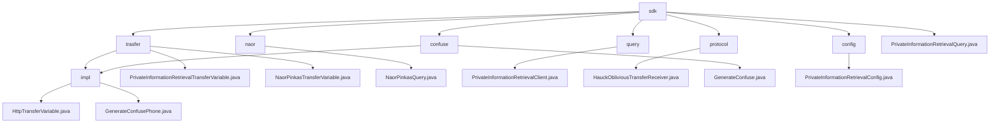

# 基础信息

|      |      |
|------|------|
| 名称 | sdk |
| 编码语言 | .java |
| 代码路径 | WeFe/mpc/mpc-pir/mpc-pir-sdk/src/main/java/com/welab/wefe/mpc/pir/sdk |
| 包名 | docs.mpc.mpc-pir.mpc-pir-sdk.src.main.java.com.welab.wefe.mpc.pir.sdk |
| 概述说明 | 该模块实现基于Naor-Pinkas协议的安全私有信息检索，包含数据混淆、OT交互和加密查询功能。核心类处理密钥生成、参数验证和结果解密，支持客户端-服务器安全检索流程。提供混淆接口生成差异化实例，配置类校验参数合法性。整体确保查询隐私性和流程安全性。 |

# 说明

## 概述  
该模块核心职责是实现安全私有信息检索(PIR)功能，基于Naor-Pinkas和Hauck不经意传输协议，通过数据混淆和加密传输确保查询隐私性。接口规范分为两类：基础PIR接口(如generate/query)处理数据准备和检索，协议专用接口(如queryNaorPinkasRandom)管理加密参数交换。关键数据结构包括QueryKeysRequest、ObliviousTransferKey等传输对象，以及包含主键列表和混淆参数的PrivateInformationRetrievalConfig。外部依赖涉及基础通信框架和RandomPhoneNum等工具类。例如NaorPinkasQuery类实现1024位密钥的Diffie-Hellman加密流程。

## 主要业务场景  
典型应用为客户端-服务器安全检索流程：先通过generateConfuse生成混淆数据集，再分阶段调用协议接口完成加密传输，最终解密目标结果。交互类似两阶段提交协议，支持Naor-Pinkas和Hauck两种OT模式。例如HauckObliviousTransferReceiver通过MAC验证和密钥派生确保传输安全。完整功能覆盖从数据混淆(如MD5加密电话号码)、参数校验到安全检索的全生命周期，异常处理贯穿各环节。API集成案例包括匿名查询和合规检查等场景。

### 包内部结构视图

该流程图展示了MPC-PIR-SDK模块的代码结构，以sdk为根节点，包含transfer、naor、query等7个子模块。其中transfer模块下分impl实现层和两个核心传输变量类，confuse模块包含混淆生成器及其实现，其他模块均直接关联核心功能类。整体结构清晰体现了隐私信息检索SDK的分层设计。

# 文件列表

| 名称   | 类型  | 说明 |
|-------|------|-------------|
| [PrivateInformationRetrievalQuery.java](PrivateInformationRetrievalQuery.md) | file | 类PrivateInformationRetrievalQuery实现匿踪查询功能，支持naorpinkas_ot和huack_ot两种不经意传输方法，通过配置参数和通信配置执行查询并返回结果。 |
| [config](config/_module.md) | package | PrivateInformationRetrievalConfig类用于私有信息检索配置，包含目标索引、主键列表和混淆查询功能。当主键列表大小为1时，生成混淆查询集并随机设置目标索引。提供构造方法和校验逻辑确保参数合法。 |
| [trasfer](trasfer/_module.md) | package | HttpTransferVariable类继承AbstractHttpTransferVariable，实现两个接口，提供多种查询方法，均调用内部query方法处理请求和响应。接口定义了私有信息检索和Naor-Pinkas协议相关方法。 |
| [confuse](confuse/_module.md) | package | GenerateConfusePhone类实现GenerateConfuse接口，其generate方法通过RandomPhoneNum.getKeys生成指定数量的随机电话号码列表，使用MD5加密处理目标对象字符串。 |
| [protocol](protocol/_module.md) | package | HauckObliviousTransferReceiver类实现ObliviousTransfer接口，负责密钥派生。通过生成随机数x和验证s合法性，计算r和xs，最终生成目标密钥。包含异步操作和错误处理。 |
| [query](query/_module.md) | package | PrivateInformationRetrievalClient类继承BasePrivateInformationRetrieval，通过传输变量和配置初始化，实现基于HauckObliviousTransfer的隐私信息查询功能，包括密钥生成、查询请求和结果解密。 |
| [naor](naor/_module.md) | package | NaorPinkasQuery类实现私有信息检索，通过Diffie-Hellman密钥交换和AES加密安全获取目标索引数据。 |

