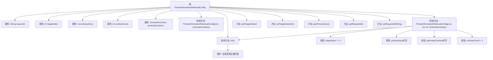

# 基础信息

|      |      |
|------|------|
| 名称 | PrivateInformationRetrievalConfig |
| 编码语言 | .java |
| 代码路径 | WeFe/mpc/mpc-pir/mpc-pir-sdk/src/main/java/com/welab/wefe/mpc/pir/sdk/config/PrivateInformationRetrievalConfig.java |
| 包名 | com.welab.wefe.mpc.pir.sdk.config |
| 依赖项 | ['com.welab.wefe.mpc.pir.sdk.confuse.GenerateConfuse', 'java.util.List', 'java.util.Random'] |
| 概述说明 | PrivateInformationRetrievalConfig类用于私有信息检索配置，包含目标索引、主键列表和混淆查询功能。当主键列表大小为1时，生成混淆查询集并随机设置目标索引。提供构造方法和校验逻辑确保参数合法。 |

# 说明

PrivateInformationRetrievalConfig类用于配置私有信息检索参数，包含请求ID、目标索引、主键列表和混淆参数。目标索引必须大于0，主键列表不能为空。当主键数量为1时，需通过generateConfuse接口生成混淆查询集，混淆数量需大于1。构造函数会校验参数合法性，并在主键数量为1时随机生成目标索引和混淆主键列表。提供getter和setter方法访问和修改配置参数。

# 类列表 Class Summary

| 名称   | 类型  | 说明 |
|-------|------|-------------|
| PrivateInformationRetrievalConfig | class | PrivateInformationRetrievalConfig类用于私有信息检索配置，包含请求ID、目标索引、主键列表和混淆查询功能。当主键数量为1时，通过generateConfuse生成混淆查询集，确保目标索引随机且有效。构造函数验证参数合法性并初始化配置。 |


## 类 PrivateInformationRetrievalConfig

|      |      |
|------|------|
| 访问范围 | public |
| 类型 | class |
| 名称 | PrivateInformationRetrievalConfig |
| 说明 | PrivateInformationRetrievalConfig类用于私有信息检索配置，包含请求ID、目标索引、主键列表和混淆查询功能。当主键数量为1时，通过generateConfuse生成混淆查询集，确保目标索引随机且有效。构造函数验证参数合法性并初始化配置。 |


### UML类图

```mermaid
classDiagram
    class PrivateInformationRetrievalConfig {
        -String requestId
        -int targetIndex
        -List~Object~ primaryKeys
        -int confuseCount
        -GenerateConfuse generateConfuse
        +PrivateInformationRetrievalConfig(List~Object~ primaryKeys, GenerateConfuse generateConfuse)
        +PrivateInformationRetrievalConfig(List~Object~ primaryKeys, int targetIndex, int confuseCount, GenerateConfuse generateConfuse)
        -void init()
        +Integer getTargetIndex()
        +void setTargetIndex(int targetIndex)
        +List~Object~ getPrimaryKeys()
        +String getRequestId()
        +void setRequestId(String requestId)
    }

    <<Interface>> GenerateConfuse {
        +List~Object~ generate(int count, Object key)
    }

    PrivateInformationRetrievalConfig --> GenerateConfuse : 依赖
```

类图描述：
PrivateInformationRetrievalConfig类用于配置私有信息检索参数，包含目标索引、主键列表、混淆数量和请求ID等私有字段，通过构造函数进行参数校验和初始化。当主键列表大小为1时，会使用GenerateConfuse接口生成混淆数据。该类提供了获取和设置目标索引、主键列表及请求ID的方法，并通过init方法实现主键列表的混淆处理逻辑。


### 内部方法调用关系图



该流程图展示了私有信息检索配置类的完整结构。核心是参数校验逻辑和初始化过程，当primaryKeys大小为1时会触发混淆主键生成机制。构造方法包含四层参数校验，通过后调用init()方法生成随机目标索引并扩展主键列表，确保查询隐私性。属性包含请求ID、目标索引等关键字段，提供标准getter/setter方法。

### 字段列表 Field List

| 名称  | 类型  | 说明 |
|-------|-------|------|
| primaryKeys | List<Object> | 存储主键的对象列表。 |
| targetIndex = -1 | int | 声明一个私有整型变量targetIndex，初始值为-1。 |
| requestId | String | 私有字符串变量requestId，用于唯一标识请求。 |
| generateConfuse | GenerateConfuse | 私有生成混淆对象。 |
| confuseCount = 100 | int | 私有整型变量confuseCount初始值为100。 |

### 方法列表

| 名称  | 类型  | 说明 |
|-------|-------|------|
| setTargetIndex | void | 设置目标索引的方法，将参数值赋给类的成员变量targetIndex。 |
| init | void | 初始化方法，当主键数量为1时，随机生成混淆值并插入主键到随机位置，更新主键列表。 |
| getPrimaryKeys | List<Object> | 获取主键列表的方法，返回存储主键的集合对象。 |
| getTargetIndex | Integer | 获取目标索引值的方法，返回整数类型。 |
| getRequestId | String | 获取请求ID的方法，返回字符串类型的requestId。 |
| setRequestId | void | 设置请求ID的方法，将传入的requestId赋值给当前对象的requestId属性。 |


