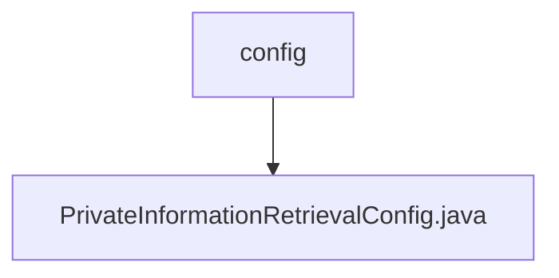

# 基础信息

|      |      |
|------|------|
| 名称 | config |
| 编码语言 | .java |
| 代码路径 | WeFe/mpc/mpc-pir/mpc-pir-sdk/src/main/java/com/welab/wefe/mpc/pir/sdk/config |
| 包名 | docs.mpc.mpc-pir.mpc-pir-sdk.src.main.java.com.welab.wefe.mpc.pir.sdk.config |
| 概述说明 | PrivateInformationRetrievalConfig类用于私有信息检索配置，包含目标索引、主键列表和混淆查询功能。当主键列表大小为1时，生成混淆查询集并随机设置目标索引。提供构造方法和校验逻辑确保参数合法。 |

# 说明

PrivateInformationRetrievalConfig类用于配置私有信息检索参数，包含请求ID、目标索引、主键列表和混淆参数。目标索引必须大于0，主键列表不能为空。当主键数量为1时，需通过generateConfuse接口生成混淆查询集，混淆数量需大于1。构造函数会校验参数合法性，并在主键数量为1时随机生成目标索引和混淆主键列表。提供getter和setter方法访问和修改配置参数。

### 包内部结构视图

该流程图展示了WeFe项目中MPC-PIR-SDK模块的配置目录结构，顶层节点为config文件夹，包含一个PrivateInformationRetrievalConfig.java配置文件。这种结构体现了典型的Java项目配置层设计，其中配置类集中存放在专属目录下，便于统一管理和维护。

# 文件列表

| 名称   | 类型  | 说明 |
|-------|------|-------------|
| [PrivateInformationRetrievalConfig.java](PrivateInformationRetrievalConfig.md) | file | PrivateInformationRetrievalConfig类用于私有信息检索配置，包含目标索引、主键列表和混淆查询功能。当主键列表大小为1时，生成混淆查询集并随机设置目标索引。提供构造方法和校验逻辑确保参数合法。 |

