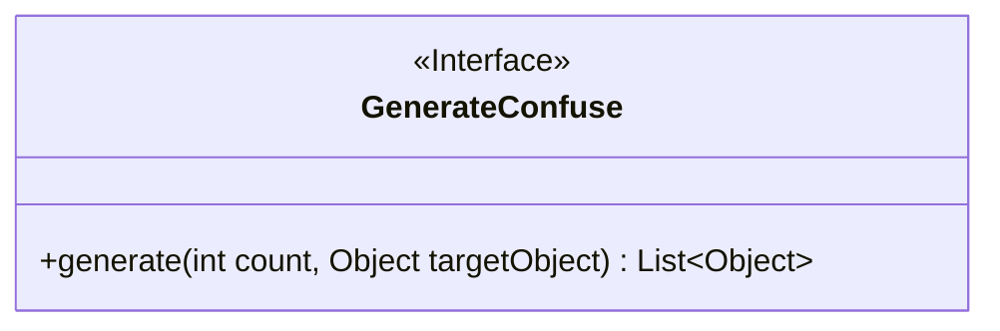
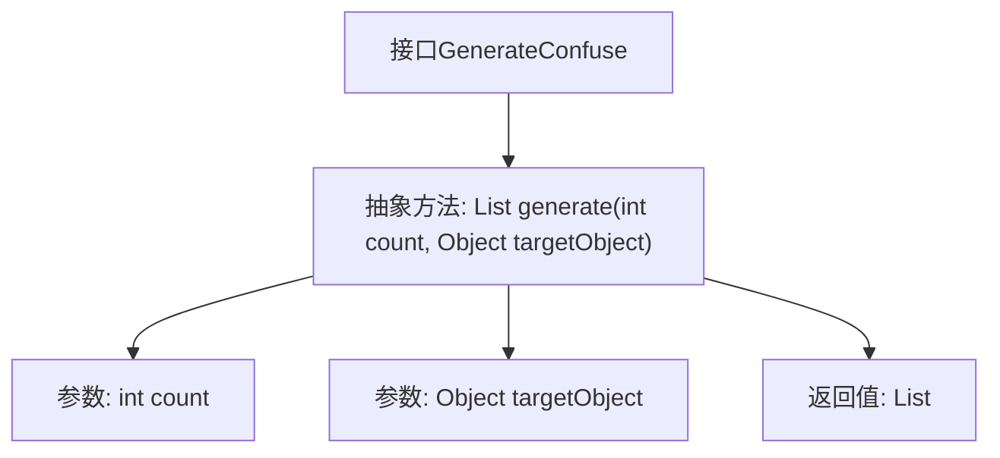

# 基础信息

|      |      |
|------|------|
| 名称 | GenerateConfuse |
| 编码语言 | .java |
| 代码路径 | WeFe/mpc/mpc-pir/mpc-pir-sdk/src/main/java/com/welab/wefe/mpc/pir/sdk/confuse/GenerateConfuse.java |
| 包名 | com.welab.wefe.mpc.pir.sdk.confuse |
| 依赖项 | ['java.util.List'] |
| 概述说明 | 接口GenerateConfuse定义方法generate，生成指定数量与目标对象不同的对象列表。 |

# 说明

GenerateConfuse是一个接口，定义了一个方法generate，用于生成指定数量的与目标对象不同的对象列表。方法接收两个参数：count表示生成对象的数量，targetObject是目标对象。返回值为一个包含生成对象的列表。该方法旨在创建与目标对象有差异的多个对象实例。

# 类列表 Class Summary

| 名称   | 类型  | 说明 |
|-------|------|-------------|
| GenerateConfuse | interface | 接口GenerateConfuse定义生成与目标对象不同的多个对象的方法，参数为数量和目标对象，返回对象列表。 |

## 类 GenerateConfuse

|      |      |
|------|------|
| 访问范围 | public |
| 类型 | interface |
| 名称 | GenerateConfuse |
| 说明 | 接口GenerateConfuse定义生成与目标对象不同的多个对象的方法，参数为数量和目标对象，返回对象列表。 |

### UML类图

这段代码定义了一个名为GenerateConfuse的接口，该接口声明了一个生成混淆对象的方法。接口的核心功能是通过generate方法生成指定数量的与目标对象不同的对象列表。方法接收两个参数：count表示生成数量，targetObject作为参照对象；返回值为Object类型的List集合。该设计适用于需要动态生成差异化对象的场景，如测试数据生成或混淆算法实现。接口通过泛型List~Object~确保返回集合的类型安全性，体现了良好的抽象设计原则。

### 内部方法调用关系图

该流程图描述了`GenerateConfuse`接口的结构，核心是抽象方法`generate`，接收两个参数（生成数量`count`和目标对象`targetObject`），返回一个包含差异对象的列表。接口定义了生成与目标对象不同实例的契约，具体实现需满足参数校验、对象差异化和集合返回等逻辑。箭头清晰展示了方法签名与参数的从属关系。

### 字段列表 Field List

| 名称  | 类型  | 说明 |
|-------|-------|------|

### 方法列表

| 名称  | 类型  | 说明 |
|-------|-------|------|
| generate | List<Object> | 生成指定数量的目标对象列表。 |

