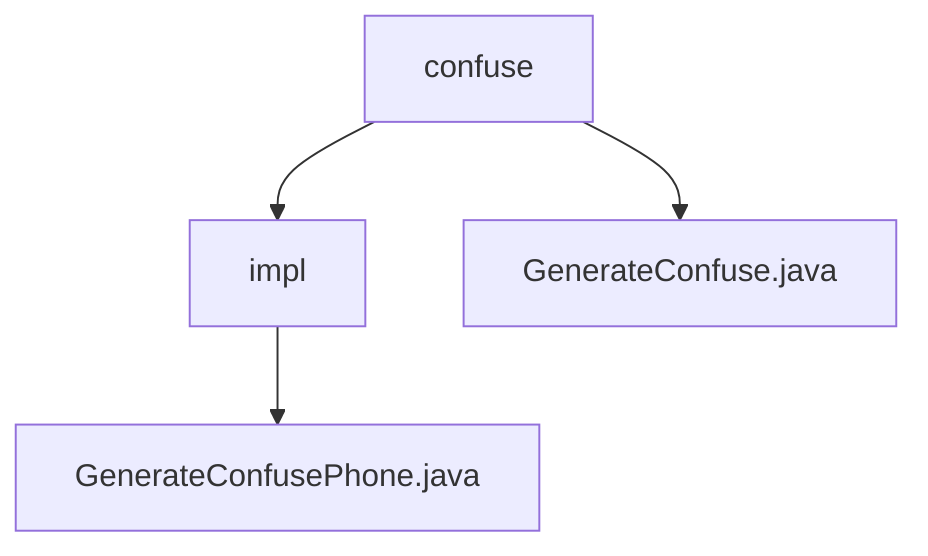

# 基础信息

|      |      |
|------|------|
| 名称 | confuse |
| 编码语言 | .java |
| 代码路径 | WeFe/mpc/mpc-pir/mpc-pir-sdk/src/main/java/com/welab/wefe/mpc/pir/sdk/confuse |
| 包名 | docs.mpc.mpc-pir.mpc-pir-sdk.src.main.java.com.welab.wefe.mpc.pir.sdk.confuse |
| 概述说明 | GenerateConfusePhone类实现GenerateConfuse接口，其generate方法通过RandomPhoneNum.getKeys生成指定数量的随机电话号码列表，使用MD5加密处理目标对象字符串。 |

# 说明

## 概述  
该模块核心职责是实现数据混淆功能，通过GenerateConfuse接口生成与目标对象差异化的实例列表。接口规范要求实现类必须包含generate方法，接收数量参数count和目标对象targetObject，返回混淆后的对象列表。  

关键数据结构包括目标对象字符串和MD5加密类型标识。外部依赖仅涉及RandomPhoneNum工具类。例如GenerateConfusePhone类调用RandomPhoneNum.getKeys，结合MD5加密生成随机电话号码列表。  

## 主要业务场景  
典型应用模式是为隐私信息检索（PIR）提供数据混淆服务，类似数据脱敏处理流程。业务流程包含：接收目标对象→生成差异化实例→返回混淆结果。例如传入电话号码和数量参数，输出经过MD5加密的随机号码列表。  

交互模式遵循标准接口契约，支持多类型对象混淆。功能完整性体现在同时满足数量控制和加密处理需求。API类型为生成型接口，集成案例包括电话号码混淆等具体实现。

### 包内部结构视图

该流程图展示了mpc-pir-sdk项目中confuse包的层级结构。根节点为confuse目录，包含GenerateConfuse.java文件和impl子目录。impl子目录下又包含GenerateConfusePhone.java实现文件，清晰地呈现了混淆功能模块的文件组织关系。

# 文件列表

| 名称   | 类型  | 说明 |
|-------|------|-------------|
| [GenerateConfuse.java](GenerateConfuse.md) | file | 接口GenerateConfuse定义方法generate，生成指定数量与目标对象不同的对象列表。 |
| [impl](impl/_module.md) | package | 生成混淆电话号码的类，实现GenerateConfuse接口，通过随机生成指定数量的MD5加密电话号码列表。 |

