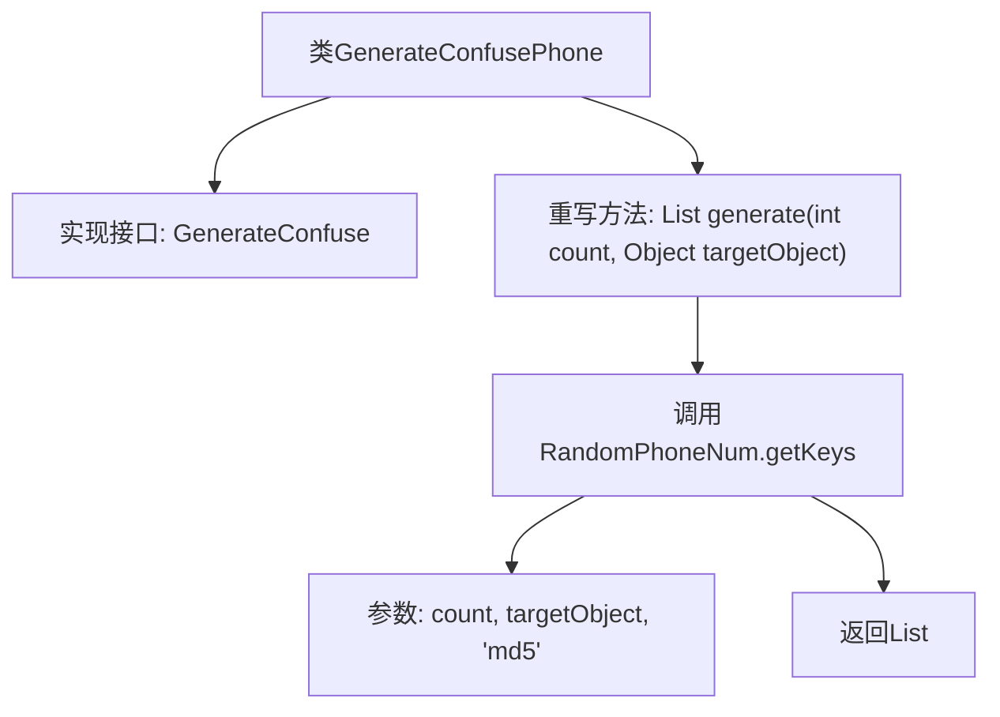

# 基础信息

|      |      |
|------|------|
| 名称 | GenerateConfusePhone |
| 编码语言 | .java |
| 代码路径 | WeFe/mpc/mpc-pir/mpc-pir-sdk/src/main/java/com/welab/wefe/mpc/pir/sdk/confuse/impl/GenerateConfusePhone.java |
| 包名 | com.welab.wefe.mpc.pir.sdk.confuse.impl |
| 依赖项 | ['com.welab.wefe.mpc.commom.AccountEncryptionType', 'com.welab.wefe.mpc.commom.RandomPhoneNum', 'com.welab.wefe.mpc.pir.sdk.confuse.GenerateConfuse', 'java.util.List'] |
| 概述说明 | 生成混淆电话号码的类，实现GenerateConfuse接口，通过随机生成指定数量的MD5加密电话号码列表。 |

# 说明

该内容描述了一个名为GenerateConfusePhone的类，实现了GenerateConfuse接口。该类包含一个generate方法，接收整数count和目标对象targetObject作为参数。方法内部调用RandomPhoneNum.getKeys函数，传入count、targetObject字符串和加密类型md5，生成指定数量的随机电话号码列表并返回。整个过程涉及数据混淆和MD5加密处理。

# 类列表 Class Summary

| 名称   | 类型  | 说明 |
|-------|------|-------------|
| GenerateConfusePhone | class | 生成混淆手机号的类，实现GenerateConfuse接口，通过随机生成指定数量的MD5加密手机号列表。 |


## 类 GenerateConfusePhone

|      |      |
|------|------|
| 访问范围 | public |
| 类型 | class |
| 名称 | GenerateConfusePhone |
| 说明 | 生成混淆手机号的类，实现GenerateConfuse接口，通过随机生成指定数量的MD5加密手机号列表。 |


### UML类图

```mermaid
classDiagram
    class GenerateConfusePhone {
        +generate(int count, Object targetObject) List~Object~
    }
    <<Interface>> GenerateConfuse {
        +generate(int count, Object targetObject) List~Object~
    }
    GenerateConfusePhone ..|> GenerateConfuse : 实现
    GenerateConfusePhone --> RandomPhoneNum : 调用
    GenerateConfusePhone --> AccountEncryptionType : 引用

    class RandomPhoneNum {
        +getKeys(int count, String targetObject, String encryptionType) List~Object~
    }
    class AccountEncryptionType {
        <<enumeration>>
        md5
        // 其他枚举值...
    }
```

这段代码展示了一个`GenerateConfusePhone`类实现`GenerateConfuse`接口，通过调用`RandomPhoneNum.getKeys()`方法生成混淆电话号码列表。类图清晰地呈现了实现关系、方法调用和枚举引用，其中`GenerateConfusePhone`作为核心类，依赖`RandomPhoneNum`的工具方法和`AccountEncryptionType`的加密类型枚举。整个设计遵循接口隔离原则，通过泛型保证返回列表的灵活性。


### 内部方法调用关系图



该流程图描述了GenerateConfusePhone类的结构和方法调用关系。该类实现了GenerateConfuse接口并重写了generate方法，该方法通过调用RandomPhoneNum.getKeys生成指定数量的随机电话号码列表。关键步骤包括传递count参数、目标对象和加密类型'md5'，最终返回处理后的List<Object>结果。流程清晰展示了从方法入口到结果返回的完整调用链。

### 字段列表 Field List

| 名称  | 类型  | 说明 |
|-------|-------|------|

### 方法列表

| 名称  | 类型  | 说明 |
|-------|-------|------|
| generate | List<Object> | 方法重写，生成指定数量的随机电话号码列表，使用MD5加密目标对象字符串。 |


