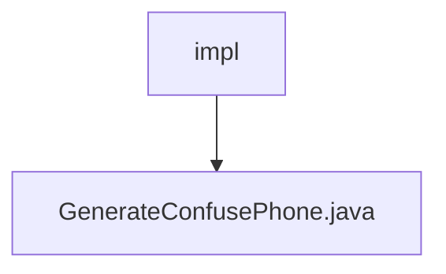

# 基础信息

|      |      |
|------|------|
| 名称 | impl |
| 编码语言 | .java |
| 代码路径 | WeFe/mpc/mpc-pir/mpc-pir-sdk/src/main/java/com/welab/wefe/mpc/pir/sdk/confuse/impl |
| 包名 | docs.mpc.mpc-pir.mpc-pir-sdk.src.main.java.com.welab.wefe.mpc.pir.sdk.confuse.impl |
| 概述说明 | 生成混淆电话号码的类，实现GenerateConfuse接口，通过随机生成指定数量的MD5加密电话号码列表。 |

# 说明

该内容描述了一个名为GenerateConfusePhone的类，实现了GenerateConfuse接口。该类包含一个generate方法，接收整数count和目标对象targetObject作为参数。方法内部调用RandomPhoneNum.getKeys函数，传入count、targetObject字符串和加密类型md5，生成指定数量的随机电话号码列表并返回。整个过程涉及数据混淆和MD5加密处理。

### 包内部结构视图

该流程图展示了一个简单的层级关系，其中"impl"文件夹包含"GenerateConfusePhone.java"文件。这是一个典型的Java项目结构，表示在混淆功能实现目录下的具体生成混淆电话号码的实现类文件。整个结构清晰地反映了源代码的组织方式。

# 文件列表

| 名称   | 类型  | 说明 |
|-------|------|-------------|
| [GenerateConfusePhone.java](GenerateConfusePhone.md) | file | 生成混淆电话号码的类，实现GenerateConfuse接口，通过随机生成指定数量的MD5加密电话号码列表。 |

