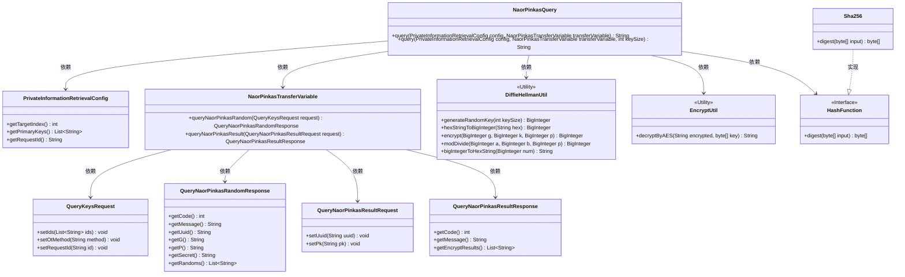
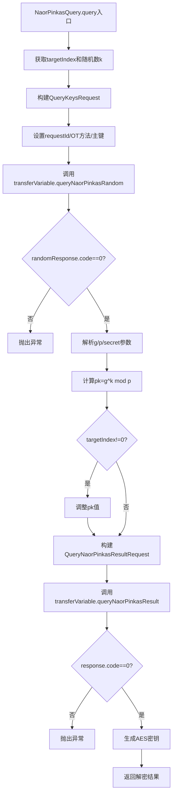

# 基础信息

|      |      |
|------|------|
| 名称 | NaorPinkasQuery |
| 编码语言 | .java |
| 代码路径 | WeFe/mpc/mpc-pir/mpc-pir-sdk/src/main/java/com/welab/wefe/mpc/pir/sdk/naor/NaorPinkasQuery.java |
| 包名 | com.welab.wefe.mpc.pir.sdk.naor |
| 依赖项 | ['java.math.BigInteger', 'java.util.UUID', 'org.apache.commons.lang3.StringUtils', 'com.welab.wefe.mpc.commom.Constants', 'com.welab.wefe.mpc.pir.protocol.ro.hf.HashFunction', 'com.welab.wefe.mpc.pir.protocol.ro.hf.Sha256', 'com.welab.wefe.mpc.pir.request.QueryKeysRequest', 'com.welab.wefe.mpc.pir.request.naor.QueryNaorPinkasRandomResponse', 'com.welab.wefe.mpc.pir.request.naor.QueryNaorPinkasResultRequest', 'com.welab.wefe.mpc.pir.request.naor.QueryNaorPinkasResultResponse', 'com.welab.wefe.mpc.pir.sdk.config.PrivateInformationRetrievalConfig', 'com.welab.wefe.mpc.pir.sdk.trasfer.NaorPinkasTransferVariable', 'com.welab.wefe.mpc.util.DiffieHellmanUtil', 'com.welab.wefe.mpc.util.EncryptUtil'] |
| 概述说明 | NaorPinkasQuery类实现私有信息检索，通过Diffie-Hellman密钥交换和AES加密安全获取目标索引数据。 |

# 说明

NaorPinkasQuery类实现了基于Naor-Pinkas不经意传输协议的私有信息检索查询功能。该类包含两个重载方法，核心方法接收配置参数、传输变量和密钥大小，默认密钥大小为1024位。方法首先生成随机密钥k，构建随机查询请求并获取响应，验证响应有效性后提取参数。通过Diffie-Hellman加密生成公钥pk，处理目标索引偏移量后发送结果请求。最后使用SHA-256哈希和AES解密返回目标索引的加密结果。整个过程实现了安全的信息检索，确保查询隐私性。

# 类列表 Class Summary

| 名称   | 类型  | 说明 |
|-------|------|-------------|
| NaorPinkasQuery | class | NaorPinkasQuery类实现私有信息检索功能，通过Diffie-Hellman密钥交换和AES加密确保数据安全，支持自定义密钥大小和异常处理。 |

## 类 NaorPinkasQuery

|      |      |
|------|------|
| 访问范围 | public |
| 类型 | class |
| 名称 | NaorPinkasQuery |
| 说明 | NaorPinkasQuery类实现私有信息检索功能，通过Diffie-Hellman密钥交换和AES加密确保数据安全，支持自定义密钥大小和异常处理。 |

### UML类图

类图描述：该图展示了NaorPinkasQuery类与多个辅助类的关系，包括配置类PrivateInformationRetrievalConfig、传输变量类NaorPinkasTransferVariable、请求响应类（QueryKeysRequest等）、加密工具类DiffieHellmanUtil和EncryptUtil，以及哈希接口HashFunction及其实现Sha256。NaorPinkasQuery通过组合这些类实现基于Naor-Pinkas不经意传输协议的隐私信息检索功能。

### 内部方法调用关系图

该流程图展示了NaorPinkas隐私信息检索协议的完整查询流程。从初始化参数开始，经过两轮OT协议交互（随机数获取和结果查询），包含异常处理、Diffie-Hellman密钥计算和AES解密等关键步骤，最终返回目标索引的解密结果。整个过程严格遵循Naor-Pinkas协议规范，确保在不暴露查询目标的情况下安全获取数据。

### 字段列表 Field List

| 名称  | 类型  | 说明 |
|-------|-------|------|

### 方法列表

| 名称  | 类型  | 说明 |
|-------|-------|------|
| query | String | 该方法执行Naor-Pinkas加密查询，生成随机密钥，处理请求和响应，进行Diffie-Hellman加密计算，最终解密并返回目标索引结果。 |
| query | String | Java方法：根据配置和传输变量查询信息，默认缓冲区大小1024，可能抛出异常。 |

