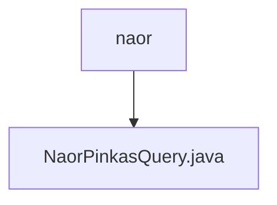

# 基础信息

|      |      |
|------|------|
| 名称 | naor |
| 编码语言 | .java |
| 代码路径 | WeFe/mpc/mpc-pir/mpc-pir-sdk/src/main/java/com/welab/wefe/mpc/pir/sdk/naor |
| 包名 | docs.mpc.mpc-pir.mpc-pir-sdk.src.main.java.com.welab.wefe.mpc.pir.sdk.naor |
| 概述说明 | NaorPinkasQuery类实现私有信息检索，通过Diffie-Hellman密钥交换和AES加密安全获取目标索引数据。 |

# 说明

NaorPinkasQuery类实现了基于Naor-Pinkas不经意传输协议的私有信息检索查询功能。该类包含两个重载方法，核心方法接收配置参数、传输变量和密钥大小，默认密钥大小为1024位。方法首先生成随机密钥k，构建随机查询请求并获取响应，验证响应有效性后提取参数。通过Diffie-Hellman加密生成公钥pk，处理目标索引偏移量后发送结果请求。最后使用SHA-256哈希和AES解密返回目标索引的加密结果。整个过程实现了安全的信息检索，确保查询隐私性。

### 包内部结构视图

该流程图展示了WeFe项目中mpc-pir-sdk模块的naor包结构，其中naor目录下包含一个Java文件NaorPinkasQuery.java。这表示在隐私信息检索SDK中，Naor-Pinkas协议相关的查询功能被封装在这个单独的文件中实现。

# 文件列表

| 名称   | 类型  | 说明 |
|-------|------|-------------|
| [NaorPinkasQuery.java](NaorPinkasQuery.md) | file | NaorPinkasQuery类实现私有信息检索，通过Diffie-Hellman密钥交换和AES加密安全获取目标索引数据。 |

