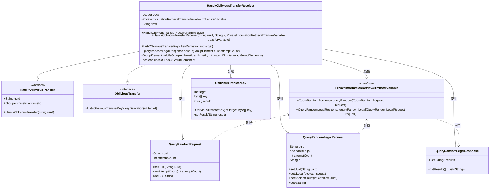
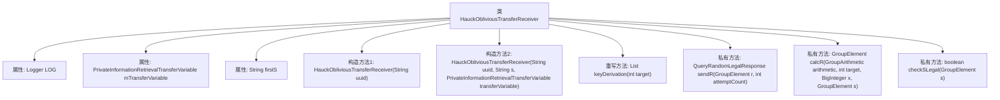
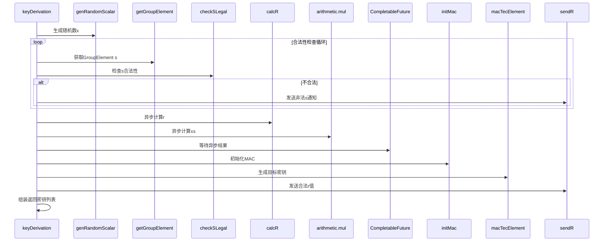

# 基础信息

|      |      |
|------|------|
| 名称 | HauckObliviousTransferReceiver |
| 编码语言 | .java |
| 代码路径 | WeFe/mpc/mpc-pir/mpc-pir-sdk/src/main/java/com/welab/wefe/mpc/pir/sdk/protocol/HauckObliviousTransferReceiver.java |
| 包名 | com.welab.wefe.mpc.pir.sdk.protocol |
| 依赖项 | ['java.math.BigInteger', 'java.util.ArrayList', 'java.util.List', 'java.util.concurrent.CompletableFuture', 'java.util.concurrent.ExecutionException', 'org.slf4j.Logger', 'org.slf4j.LoggerFactory', 'com.welab.wefe.mpc.commom.Conversion', 'com.welab.wefe.mpc.pir.protocol.nt.group.GroupArithmetic', 'com.welab.wefe.mpc.pir.protocol.nt.group.GroupElement', 'com.welab.wefe.mpc.pir.protocol.ot.ObliviousTransfer', 'com.welab.wefe.mpc.pir.protocol.ot.ObliviousTransferKey', 'com.welab.wefe.mpc.pir.protocol.ot.hauck.HauckObliviousTransfer', 'com.welab.wefe.mpc.pir.request.QueryRandomLegalRequest', 'com.welab.wefe.mpc.pir.request.QueryRandomLegalResponse', 'com.welab.wefe.mpc.pir.request.QueryRandomRequest', 'com.welab.wefe.mpc.pir.sdk.trasfer.PrivateInformationRetrievalTransferVariable', 'com.welab.wefe.mpc.util.EncryptUtil', 'cn.hutool.core.util.StrUtil'] |
| 概述说明 | HauckObliviousTransferReceiver类实现ObliviousTransfer接口，负责密钥派生。通过生成随机数x和验证s合法性，计算r和xs，最终生成目标密钥。包含异步操作和错误处理。 |

# 说明

HauckObliviousTransferReceiver类实现了ObliviousTransfer接口，用于执行不经意传输协议的接收方逻辑。该类包含UUID标识、传输变量和初始值S等属性。核心方法keyDerivation通过生成随机数x、验证S合法性、计算R和XS值、初始化MAC以及生成目标密钥等步骤完成密钥派生。过程中使用异步计算和合法性检查机制，最终返回包含目标密钥和结果的ObliviousTransferKey列表。辅助方法包括发送R值、计算R值以及检查S合法性等操作。

# 类列表 Class Summary

| 名称   | 类型  | 说明 |
|-------|------|-------------|
| HauckObliviousTransferReceiver | class | HauckObliviousTransferReceiver类实现ObliviousTransfer接口，负责密钥派生。通过生成随机数x和验证s合法性，计算r和xs，最终生成目标密钥。包含异步计算和错误处理逻辑。 |

## 类 HauckObliviousTransferReceiver

|      |      |
|------|------|
| 访问范围 | public |
| 类型 | class |
| 名称 | HauckObliviousTransferReceiver |
| 说明 | HauckObliviousTransferReceiver类实现ObliviousTransfer接口，负责密钥派生。通过生成随机数x和验证s合法性，计算r和xs，最终生成目标密钥。包含异步计算和错误处理逻辑。 |

### UML类图

这段代码描述了一个基于Hauck协议的茫然传输接收方实现，继承自抽象类HauckObliviousTransfer并实现ObliviousTransfer接口。核心功能是通过keyDerivation方法生成目标密钥，涉及随机数生成、群运算、合法性校验和异步通信等操作。类图展示了接收方与传输变量接口、请求响应对象之间的交互关系，以及密钥生成过程中的数据流转。

### 内部方法调用关系图

该流程图展示了HauckObliviousTransferReceiver类的核心结构和交互过程。类继承自HauckObliviousTransfer并实现ObliviousTransfer接口，包含日志记录、传输变量等属性，以及密钥派生核心方法。时序图详细描述了keyDerivation方法的执行流程：从生成随机数开始，通过循环验证参数合法性，利用异步计算提高性能，最终完成密钥派生和结果返回。整个过程涉及多个加密运算和线程协调，体现了安全传输协议的核心处理逻辑。

### 字段列表 Field List

| 名称  | 类型  | 说明 |
|-------|-------|------|
| mTransferVariable | PrivateInformationRetrievalTransferVariable | 私有信息检索传输变量mTransferVariable。 |
| firstS | String | 声明字符串变量firstS。 |
| LOG = LoggerFactory.getLogger(HauckObliviousTransferReceiver.class) | Logger | HauckObliviousTransferReceiver类中定义了一个名为LOG的私有静态日志记录器实例。 |

### 方法列表

| 名称  | 类型  | 说明 |
|-------|-------|------|
| sendR | QueryRandomLegalResponse | 方法sendR发送随机合法请求，设置UUID、合法标志、尝试次数和R值，返回查询结果并记录日志。 |
| keyDerivation | List<ObliviousTransferKey> | 方法生成ObliviousTransferKey：生成随机数x，循环获取合法s，异步计算r和xs，初始化mac并生成密钥，最后返回包含结果的密钥列表。 |
| calcR | GroupElement | 方法calcR计算群元素r，过程包括：哈希生成t，计算ct=c*t和xg=x*生成元，最终r=ct+xg。日志记录开始和结束。 |
| checkSLegal | boolean | 检查GroupElement对象s是否在算术组内，返回布尔值。 |

