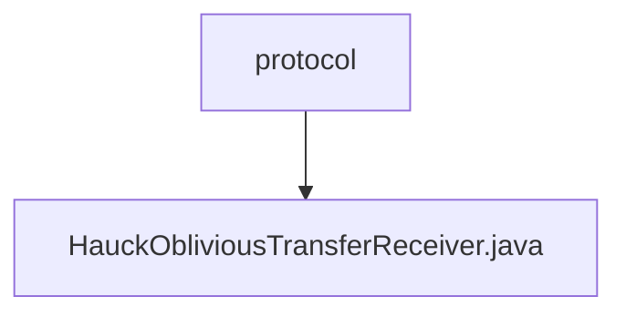

# 基础信息

|      |      |
|------|------|
| 名称 | protocol |
| 编码语言 | .java |
| 代码路径 | WeFe/mpc/mpc-pir/mpc-pir-sdk/src/main/java/com/welab/wefe/mpc/pir/sdk/protocol |
| 包名 | docs.mpc.mpc-pir.mpc-pir-sdk.src.main.java.com.welab.wefe.mpc.pir.sdk.protocol |
| 概述说明 | HauckObliviousTransferReceiver类实现ObliviousTransfer接口，负责密钥派生。通过生成随机数x和验证s合法性，计算r和xs，最终生成目标密钥。包含异步操作和错误处理。 |

# 说明

HauckObliviousTransferReceiver类实现了ObliviousTransfer接口，用于执行不经意传输协议的接收方逻辑。该类包含UUID标识、传输变量和初始值S等属性。核心方法keyDerivation通过生成随机数x、验证S合法性、计算R和XS值、初始化MAC以及生成目标密钥等步骤完成密钥派生。过程中使用异步计算和合法性检查机制，最终返回包含目标密钥和结果的ObliviousTransferKey列表。辅助方法包括发送R值、计算R值以及检查S合法性等操作。

### 包内部结构视图

该流程图展示了MPC-PIR-SDK项目中协议层的结构关系，其中protocol目录下包含HauckObliviousTransferReceiver.java实现文件，表示该文件是实现Hauck不经意传输协议的接收方逻辑的核心代码文件，属于隐私信息检索SDK的协议实现层。

# 文件列表

| 名称   | 类型  | 说明 |
|-------|------|-------------|
| [HauckObliviousTransferReceiver.java](HauckObliviousTransferReceiver.md) | file | HauckObliviousTransferReceiver类实现ObliviousTransfer接口，负责密钥派生。通过生成随机数x和验证s合法性，计算r和xs，最终生成目标密钥。包含异步操作和错误处理。 |

