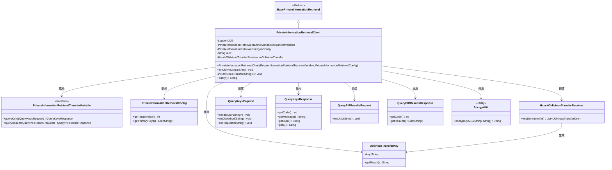
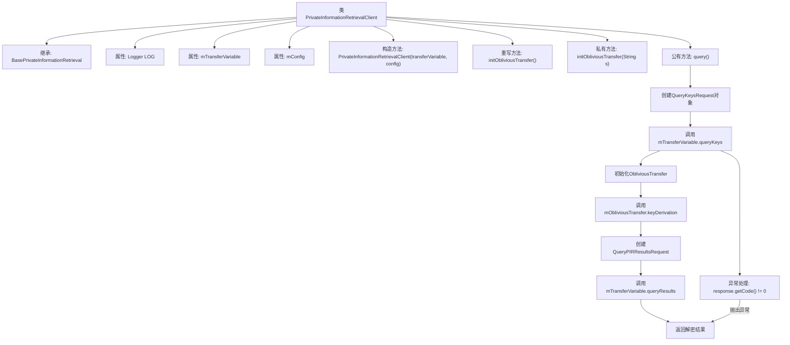

# 基础信息

|      |      |
|------|------|
| 名称 | PrivateInformationRetrievalClient |
| 编码语言 | .java |
| 代码路径 | WeFe/mpc/mpc-pir/mpc-pir-sdk/src/main/java/com/welab/wefe/mpc/pir/sdk/query/PrivateInformationRetrievalClient.java |
| 包名 | com.welab.wefe.mpc.pir.sdk.query |
| 依赖项 | ['org.slf4j.Logger', 'org.slf4j.LoggerFactory', 'com.welab.wefe.mpc.commom.Constants', 'com.welab.wefe.mpc.pir.flow.BasePrivateInformationRetrieval', 'com.welab.wefe.mpc.pir.protocol.ot.ObliviousTransferKey', 'com.welab.wefe.mpc.pir.request.QueryKeysRequest', 'com.welab.wefe.mpc.pir.request.QueryKeysResponse', 'com.welab.wefe.mpc.pir.request.QueryPIRResultsRequest', 'com.welab.wefe.mpc.pir.request.QueryPIRResultsResponse', 'com.welab.wefe.mpc.pir.sdk.config.PrivateInformationRetrievalConfig', 'com.welab.wefe.mpc.pir.sdk.protocol.HauckObliviousTransferReceiver', 'com.welab.wefe.mpc.pir.sdk.trasfer.PrivateInformationRetrievalTransferVariable', 'com.welab.wefe.mpc.util.EncryptUtil', 'cn.hutool.core.lang.UUID'] |
| 概述说明 | PrivateInformationRetrievalClient类继承BasePrivateInformationRetrieval，通过传输变量和配置初始化，实现基于HauckObliviousTransfer的隐私信息查询功能，包括密钥生成、查询请求和结果解密。 |

# 说明

PrivateInformationRetrievalClient类继承自BasePrivateInformationRetrieval，用于实现私有信息检索客户端功能。该类包含传输变量mTransferVariable和配置mConfig，通过构造函数初始化。提供initObliviousTransfer方法初始化不经意传输，query方法执行查询流程：生成请求、获取响应、初始化传输、密钥派生，最终解密并返回目标索引结果。过程中使用UUID标识请求，通过日志记录关键步骤，异常时抛出错误信息。

# 类列表 Class Summary

| 名称   | 类型  | 说明 |
|-------|------|-------------|
| PrivateInformationRetrievalClient | class | 私有信息检索客户端类，继承基类，包含传输变量和配置，提供初始化OT和查询方法，处理密钥请求与结果解密。 |

## 类 PrivateInformationRetrievalClient

|      |      |
|------|------|
| 访问范围 | public |
| 类型 | class |
| 名称 | PrivateInformationRetrievalClient |
| 说明 | 私有信息检索客户端类，继承基类，包含传输变量和配置，提供初始化OT和查询方法，处理密钥请求与结果解密。 |

### UML类图

这段代码展示了一个私有信息检索客户端实现，继承自基础抽象类，通过传输变量和配置对象实现安全查询功能。核心类PrivateInformationRetrievalClient包含查询流程控制、OT协议初始化和密钥派生功能，依赖多个请求/响应DTO类与加密工具类，通过传输变量接口与服务器交互，实现了基于Hauck OT协议的安全查询机制。

### 内部方法调用关系图

这段代码展示了一个私有信息检索客户端的实现流程。该客户端继承自基础类，通过传输变量和配置进行初始化，主要提供查询功能。查询过程包含请求构建、密钥交互、结果解密等步骤，涉及多个网络请求和异常处理。流程图清晰呈现了从初始化到结果返回的完整调用链，特别突出了错误处理分支和关键的数据处理节点（如密钥派生和结果解密），体现了安全通信和数据处理的核心逻辑。

### 字段列表 Field List

| 名称  | 类型  | 说明 |
|-------|-------|------|
| LOG = LoggerFactory.getLogger(PrivateInformationRetrievalClient.class) | Logger | 私有静态常量LOG，用于PrivateInformationRetrievalClient类的日志记录。 |
| mTransferVariable | PrivateInformationRetrievalTransferVariable | 私有信息检索传输变量mTransferVariable。 |
| mConfig | PrivateInformationRetrievalConfig | 私有信息检索配置对象mConfig。 |

### 方法列表

| 名称  | 类型  | 说明 |
|-------|-------|------|
| initObliviousTransfer | void | 初始化ObliviousTransfer，使用uuid、字符串s和mTransferVariable创建HauckObliviousTransferReceiver实例。 |
| initObliviousTransfer | void | 方法initObliviousTransfer为空实现，用于初始化不经意传输协议。 |
| query | String | 方法query执行查询流程：初始化请求，获取密钥响应，处理异常；若结果为空则发起二次查询，解密后返回目标索引结果。 |

