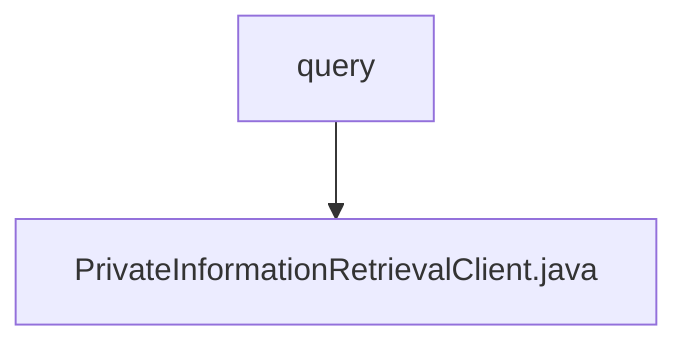

# 基础信息

|      |      |
|------|------|
| 名称 | query |
| 编码语言 | .java |
| 代码路径 | WeFe/mpc/mpc-pir/mpc-pir-sdk/src/main/java/com/welab/wefe/mpc/pir/sdk/query |
| 包名 | docs.mpc.mpc-pir.mpc-pir-sdk.src.main.java.com.welab.wefe.mpc.pir.sdk.query |
| 概述说明 | PrivateInformationRetrievalClient类继承BasePrivateInformationRetrieval，通过传输变量和配置初始化，实现基于HauckObliviousTransfer的隐私信息查询功能，包括密钥生成、查询请求和结果解密。 |

# 说明

PrivateInformationRetrievalClient类继承自BasePrivateInformationRetrieval，用于实现私有信息检索客户端功能。该类包含传输变量mTransferVariable和配置mConfig，通过构造函数初始化。提供initObliviousTransfer方法初始化不经意传输，query方法执行查询流程：生成请求、获取响应、初始化传输、密钥派生，最终解密并返回目标索引结果。过程中使用UUID标识请求，通过日志记录关键步骤，异常时抛出错误信息。

### 包内部结构视图

该流程图展示了WeFe项目中MPC-PIR-SDK模块的查询包结构，其中query目录下包含一个核心客户端类PrivateInformationRetrievalClient.java，用于实现私有信息检索功能。这种简洁的层级关系体现了SDK模块的单一职责设计原则，query作为功能入口点集中管理所有检索相关实现。

# 文件列表

| 名称   | 类型  | 说明 |
|-------|------|-------------|
| [PrivateInformationRetrievalClient.java](PrivateInformationRetrievalClient.md) | file | PrivateInformationRetrievalClient类继承BasePrivateInformationRetrieval，通过传输变量和配置初始化，实现基于HauckObliviousTransfer的隐私信息查询功能，包括密钥生成、查询请求和结果解密。 |

