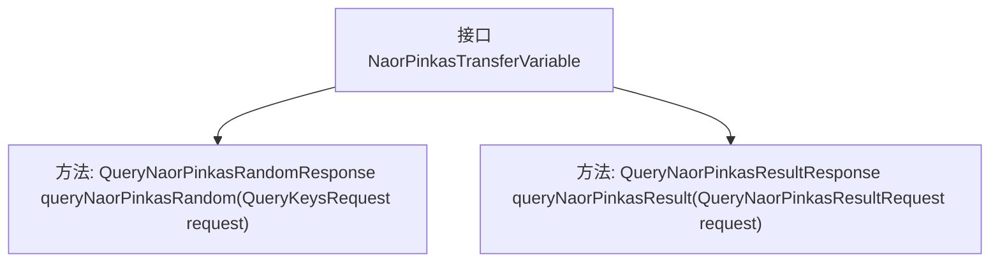

# 基础信息

|      |      |
|------|------|
| 名称 | NaorPinkasTransferVariable |
| 编码语言 | .java |
| 代码路径 | WeFe/mpc/mpc-pir/mpc-pir-sdk/src/main/java/com/welab/wefe/mpc/pir/sdk/trasfer/NaorPinkasTransferVariable.java |
| 包名 | com.welab.wefe.mpc.pir.sdk.trasfer |
| 依赖项 | ['com.welab.wefe.mpc.pir.request.QueryKeysRequest', 'com.welab.wefe.mpc.pir.request.naor.QueryNaorPinkasRandomResponse', 'com.welab.wefe.mpc.pir.request.naor.QueryNaorPinkasResultRequest', 'com.welab.wefe.mpc.pir.request.naor.QueryNaorPinkasResultResponse'] |
| 概述说明 | NaorPinkasTransferVariable接口定义了两个方法：queryNaorPinkasRandom用于查询随机数，queryNaorPinkasResult用于查询结果。 |

# 说明

该内容定义了一个名为NaorPinkasTransferVariable的Java接口，包含两个方法。第一个方法queryNaorPinkasRandom接收QueryKeysRequest类型参数，返回QueryNaorPinkasRandomResponse类型结果。第二个方法queryNaorPinkasResult接收QueryNaorPinkasResultRequest类型参数，返回QueryNaorPinkasResultResponse类型结果。两个方法均用于查询操作，但具体功能未详细说明。接口名称和参数类型表明其可能涉及Naor-Pinkas协议相关的传输变量处理。

# 类列表 Class Summary

| 名称   | 类型  | 说明 |
|-------|------|-------------|
| NaorPinkasTransferVariable | interface | NaorPinkasTransferVariable接口定义了两个方法：查询NaorPinkas随机数和查询NaorPinkas结果。 |

## 类 NaorPinkasTransferVariable

|      |      |
|------|------|
| 访问范围 | public |
| 类型 | interface |
| 名称 | NaorPinkasTransferVariable |
| 说明 | NaorPinkasTransferVariable接口定义了两个方法：查询NaorPinkas随机数和查询NaorPinkas结果。 |

### UML类图

该类图展示了一个名为NaorPinkasTransferVariable的接口，其中定义了两个公开方法：queryNaorPinkasRandom和queryNaorPinkasResult。前者接收QueryKeysRequest类型参数并返回QueryNaorPinkasRandomResponse，后者接收QueryNaorPinkasResultRequest参数并返回QueryNaorPinkasResultResponse。这个接口可能用于实现某种安全传输协议中的随机数查询和结果查询功能，体现了模块化的设计思想。

### 内部方法调用关系图

该流程图展示了NaorPinkasTransferVariable接口的结构，包含两个核心方法：queryNaorPinkasRandom和queryNaorPinkasResult。前者处理随机数查询请求并返回响应，后者处理结果查询请求并返回响应。接口作为抽象契约，定义了数据传输的标准化方法签名，适用于需要实现Naor-Pinkas协议相关功能的类。箭头表示接口与方法间的从属关系，整体结构简洁清晰。

### 字段列表 Field List

| 名称  | 类型  | 说明 |
|-------|-------|------|

### 方法列表

| 名称  | 类型  | 说明 |
|-------|-------|------|
| queryNaorPinkasResult | QueryNaorPinkasResultResponse | QueryNaorPinkasResultResponse是调用queryNaorPinkasResult方法的返回结果，该方法接收QueryNaorPinkasResultRequest请求参数。 |
| queryNaorPinkasRandom | QueryNaorPinkasRandomResponse | QueryNaorPinkasRandomResponse方法接收QueryKeysRequest参数，返回随机响应。 |

