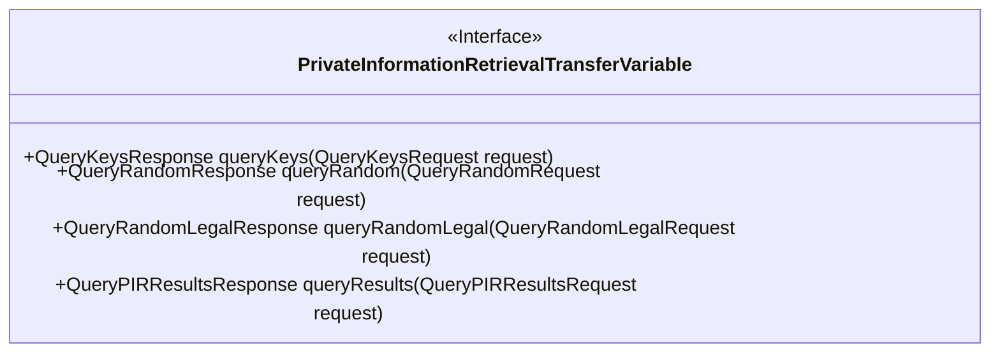
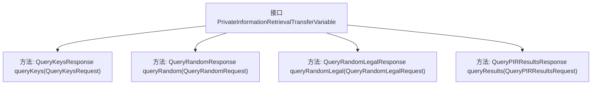

# 基础信息

|      |      |
|------|------|
| 名称 | PrivateInformationRetrievalTransferVariable |
| 编码语言 | .java |
| 代码路径 | WeFe/mpc/mpc-pir/mpc-pir-sdk/src/main/java/com/welab/wefe/mpc/pir/sdk/trasfer/PrivateInformationRetrievalTransferVariable.java |
| 包名 | com.welab.wefe.mpc.pir.sdk.trasfer |
| 依赖项 | ['com.welab.wefe.mpc.pir.request'] |
| 概述说明 | 接口定义私有信息检索传输方法，包括发送混淆用户、获取OT随机数、验证随机数合法性及获取加密结果。 |

# 说明

该接口定义了私有信息检索传输的四个关键方法：queryKeys用于发送混淆用户数据给服务器，queryRandom从服务器获取OT随机数，queryRandomLegal通知服务器OT随机数是否合规，queryResults获取所有混淆用户的加密结果。每个方法都有对应的请求和响应类型，用于实现安全的数据检索流程。

# 类列表 Class Summary

| 名称   | 类型  | 说明 |
|-------|------|-------------|
| PrivateInformationRetrievalTransferVariable | interface | 私有信息检索传输接口，包含发送混淆用户、获取OT随机数、验证随机数合法性及获取加密结果四个方法。 |

## 类 PrivateInformationRetrievalTransferVariable

|      |      |
|------|------|
| 访问范围 | public |
| 类型 | interface |
| 名称 | PrivateInformationRetrievalTransferVariable |
| 说明 | 私有信息检索传输接口，包含发送混淆用户、获取OT随机数、验证随机数合法性及获取加密结果四个方法。 |

### UML类图

该接口定义了私有信息检索(PIR)协议中的关键通信方法，包含四个核心操作：查询密钥、获取OT随机数、验证随机数合法性以及获取混淆用户的加密结果。每个方法都采用请求-响应模式，通过特定参数类型确保类型安全，体现了PIR协议中客户端与服务器交互的完整流程。

### 内部方法调用关系图

该流程图展示了私有信息检索传输变量接口的结构，包含四个核心方法：发送混淆用户密钥请求、获取OT随机数、验证随机数合法性以及获取混淆用户加密结果。每个方法都遵循请求-响应模式，通过特定类型的请求参数返回对应的响应对象，形成完整的隐私信息检索流程。接口设计体现了分步骤的交互过程，确保数据传输的安全性和可验证性。

### 字段列表 Field List

| 名称  | 类型  | 说明 |
|-------|-------|------|

### 方法列表

| 名称  | 类型  | 说明 |
|-------|-------|------|
| queryKeys | QueryKeysResponse | 查询密钥响应方法，接收查询密钥请求参数，返回密钥信息。 |
| queryRandom | QueryRandomResponse | 查询随机数接口，输入请求参数，返回随机结果。 |
| queryRandomLegal | QueryRandomLegalResponse | 随机查询合法请求的响应接口，输入请求参数，返回随机合法结果。 |
| queryResults | QueryPIRResultsResponse | 查询PIR结果响应方法，接收查询请求参数，返回查询结果。 |

