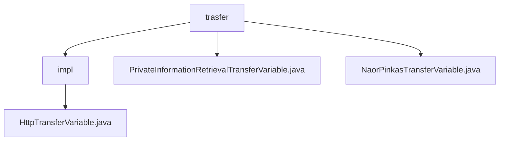

# 基础信息

|      |      |
|------|------|
| 名称 | trasfer |
| 编码语言 | .java |
| 代码路径 | WeFe/mpc/mpc-pir/mpc-pir-sdk/src/main/java/com/welab/wefe/mpc/pir/sdk/trasfer |
| 包名 | docs.mpc.mpc-pir.mpc-pir-sdk.src.main.java.com.welab.wefe.mpc.pir.sdk.trasfer |
| 概述说明 | HttpTransferVariable类继承AbstractHttpTransferVariable，实现两个接口，提供多种查询方法，均调用内部query方法处理请求和响应。接口定义了私有信息检索和Naor-Pinkas协议相关方法。 |

# 说明

## 概述  
该模块核心职责是实现基于Naor-Pinkas协议的安全私有信息检索(PIR)功能，通过抽象传输变量机制封装多方安全计算流程。接口规范统一为两类：PrivateInformationRetrievalTransferVariable提供数据混淆、OT随机数交互等基础方法；NaorPinkasTransferVariable专注协议特定的随机数和结果查询。关键数据结构包括QueryKeysRequest、QueryNaorPinkasRandomResponse等请求/响应对象，通过CommunicationConfig配置通信参数。外部依赖仅涉及基础通信框架。例如queryRandomLegal方法用于验证服务器OT随机数合规性。

## 主要业务场景  
典型应用模式为客户端-服务器安全检索流程：先通过queryKeys发送混淆数据，再分阶段调用queryNaorPinkasRandom获取协议参数，最终用queryResults取回加密结果。交互类似两阶段提交协议，所有API均基于请求-响应模型。例如queryNaorPinkasResult实现协议最终结果传输，而queryRandomLegal作为合规检查节点确保流程安全性。完整功能覆盖从数据准备到安全检索的全生命周期。

### 包内部结构视图

该流程图展示了MPC-PIR-SDK项目中trasfer目录的层级结构。顶层是trasfer文件夹，其下包含impl子目录和两个独立文件。impl子目录中包含HttpTransferVariable.java实现文件，而顶层trasfer目录下直接存放着两个不同的传输变量类文件，分别用于私有信息检索和Naor-Pinkas协议传输场景。

# 文件列表

| 名称   | 类型  | 说明 |
|-------|------|-------------|
| [PrivateInformationRetrievalTransferVariable.java](PrivateInformationRetrievalTransferVariable.md) | file | 接口定义私有信息检索传输方法，包括发送混淆用户、获取OT随机数、验证随机数合法性及获取加密结果。 |
| [NaorPinkasTransferVariable.java](NaorPinkasTransferVariable.md) | file | NaorPinkasTransferVariable接口定义了两个方法：queryNaorPinkasRandom用于查询随机数，queryNaorPinkasResult用于查询结果。 |
| [impl](impl/_module.md) | package | HttpTransferVariable类继承AbstractHttpTransferVariable，实现私有信息检索和NaorPinkas传输接口，提供多种查询方法，包括随机查询、合法查询、密钥查询和结果查询等。 |

