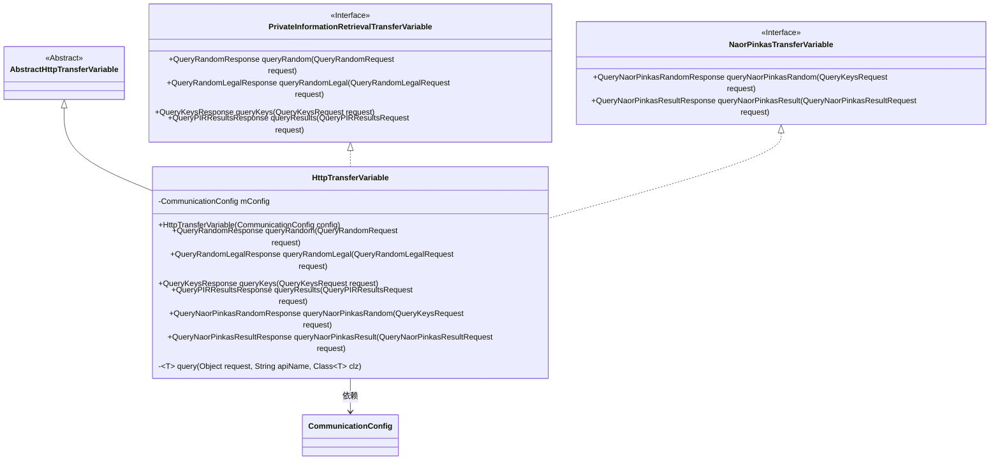

# 基础信息

|      |      |
|------|------|
| 名称 | HttpTransferVariable |
| 编码语言 | .java |
| 代码路径 | WeFe/mpc/mpc-pir/mpc-pir-sdk/src/main/java/com/welab/wefe/mpc/pir/sdk/trasfer/impl/HttpTransferVariable.java |
| 包名 | com.welab.wefe.mpc.pir.sdk.trasfer.impl |
| 依赖项 | ['com.welab.wefe.mpc.config.CommunicationConfig', 'com.welab.wefe.mpc.pir.PrivateInformationRetrievalApiName', 'com.welab.wefe.mpc.pir.request', 'com.welab.wefe.mpc.pir.request.naor.QueryNaorPinkasRandomResponse', 'com.welab.wefe.mpc.pir.request.naor.QueryNaorPinkasResultRequest', 'com.welab.wefe.mpc.pir.request.naor.QueryNaorPinkasResultResponse', 'com.welab.wefe.mpc.pir.sdk.trasfer.NaorPinkasTransferVariable', 'com.welab.wefe.mpc.pir.sdk.trasfer.PrivateInformationRetrievalTransferVariable', 'com.welab.wefe.mpc.trasfer.AbstractHttpTransferVariable'] |
| 概述说明 | HttpTransferVariable类继承AbstractHttpTransferVariable，实现私有信息检索和NaorPinkas传输接口，提供多种查询方法，包括随机查询、合法查询、密钥查询和结果查询等。 |

# 说明

HttpTransferVariable类继承AbstractHttpTransferVariable，实现了PrivateInformationRetrievalTransferVariable和NaorPinkasTransferVariable接口。该类通过CommunicationConfig配置初始化，提供多种查询方法：queryRandom、queryRandomLegal、queryKeys、queryResults、queryNaorPinkasRandom和queryNaorPinkasResult。这些方法均调用内部私有query方法，传入请求对象、API名称和响应类类型，最终返回对应类型的响应结果。

# 类列表 Class Summary

| 名称   | 类型  | 说明 |
|-------|------|-------------|
| HttpTransferVariable | class | HttpTransferVariable类继承AbstractHttpTransferVariable，实现私有信息检索和NaorPinkas传输接口，提供多种查询方法，通过配置对象处理请求。 |

## 类 HttpTransferVariable

|      |      |
|------|------|
| 访问范围 | public |
| 类型 | class |
| 名称 | HttpTransferVariable |
| 说明 | HttpTransferVariable类继承AbstractHttpTransferVariable，实现私有信息检索和NaorPinkas传输接口，提供多种查询方法，通过配置对象处理请求。 |

### UML类图

该类图展示了HttpTransferVariable类的继承和实现关系，该类继承自AbstractHttpTransferVariable抽象类，并实现了PrivateInformationRetrievalTransferVariable和NaorPinkasTransferVariable两个接口。该类封装了与HTTP传输相关的功能，包括随机查询、合法查询、密钥查询、结果查询等多种操作，通过CommunicationConfig配置对象来控制API行为。私有泛型方法query()为所有公共查询方法提供了统一的实现基础。

### 内部方法调用关系图

```mermaid
graph TD
    A["类HttpTransferVariable"]
    B["继承: AbstractHttpTransferVariable"]
    C["实现: PrivateInformationRetrievalTransferVariable"]
    D["实现: NaorPinkasTransferVariable"]
    E["属性: CommunicationConfig mConfig"]
    F["构造方法: HttpTransferVariable(CommunicationConfig config)"]
    G["方法: QueryRandomResponse queryRandom(QueryRandomRequest request)"]
    H["方法: QueryRandomLegalResponse queryRandomLegal(QueryRandomLegalRequest request)"]
    I["方法: QueryKeysResponse queryKeys(QueryKeysRequest request)"]
    J["方法: QueryPIRResultsResponse queryResults(QueryPIRResultsRequest request)"]
    K["方法: QueryNaorPinkasRandomResponse queryNaorPinkasRandom(QueryKeysRequest request)"]
    L["方法: QueryNaorPinkasResultResponse queryNaorPinkasResult(QueryNaorPinkasResultRequest request)"]
    M["私有方法: <T> T query(Object request, String apiName, Class<T> clz)"]

    A --> B
    A --> C
    A --> D
    A --> E
    A --> F
    A --> G
    A --> H
    A --> I
    A --> J
    A --> K
    A --> L
    A --> M
    G --> M
    H --> M
    I --> M
    J --> M
    K --> M
    L --> M
```

该流程图展示了HttpTransferVariable类的结构，该类继承自AbstractHttpTransferVariable并实现了两个接口。核心功能是通过query方法处理不同类型的请求，包括随机查询、合法随机查询、密钥查询、PIR结果查询以及Naor-Pinkas协议的随机和结果查询。所有公共查询方法最终都调用私有的泛型query方法完成实际请求处理，体现了代码复用和统一接口的设计思想。

### 字段列表 Field List

| 名称  | 类型  | 说明 |
|-------|-------|------|
| mConfig | CommunicationConfig | 私有通信配置对象mConfig。 |

### 方法列表

| 名称  | 类型  | 说明 |
|-------|-------|------|
| queryRandom | QueryRandomResponse | 该方法处理随机查询请求，调用内部查询方法并返回响应。 |
| queryRandomLegal | QueryRandomLegalResponse | 该方法接收查询请求，调用私有信息检索接口获取随机合法数据，返回查询结果。 |
| queryResults | QueryPIRResultsResponse | 方法queryResults处理查询请求，调用query方法并返回QueryPIRResultsResponse结果。 |
| queryKeys | QueryKeysResponse | 该方法重写父类方法，接收查询请求参数，调用内部查询接口并返回查询结果。 |
| queryNaorPinkasRandom | QueryNaorPinkasRandomResponse | 方法queryNaorPinkasRandom处理QueryKeysRequest请求，调用query方法并返回QueryNaorPinkasRandomResponse结果。 |
| queryNaorPinkasResult | QueryNaorPinkasResultResponse | 重写查询方法，调用私有信息检索API获取NaorPinkas结果，返回响应对象。 |
| query | T | 私有泛型方法，通过请求对象、API名称和目标类类型调用查询，返回指定类型结果。 |

