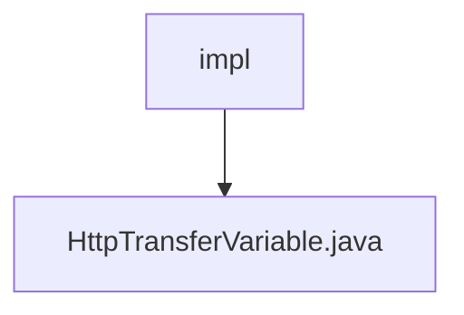

# 基础信息

|      |      |
|------|------|
| 名称 | impl |
| 编码语言 | .java |
| 代码路径 | WeFe/mpc/mpc-pir/mpc-pir-sdk/src/main/java/com/welab/wefe/mpc/pir/sdk/trasfer/impl |
| 包名 | docs.mpc.mpc-pir.mpc-pir-sdk.src.main.java.com.welab.wefe.mpc.pir.sdk.trasfer.impl |
| 概述说明 | HttpTransferVariable类继承AbstractHttpTransferVariable，实现私有信息检索和NaorPinkas传输接口，提供多种查询方法，包括随机查询、合法查询、密钥查询和结果查询等。 |

# 说明

HttpTransferVariable类继承AbstractHttpTransferVariable，实现了PrivateInformationRetrievalTransferVariable和NaorPinkasTransferVariable接口。该类通过CommunicationConfig配置初始化，提供多种查询方法：queryRandom、queryRandomLegal、queryKeys、queryResults、queryNaorPinkasRandom和queryNaorPinkasResult。这些方法均调用内部私有query方法，传入请求对象、API名称和响应类类型，最终返回对应类型的响应结果。

### 包内部结构视图

该流程图展示了mpc-pir-sdk项目中trasfer模块下的impl目录结构，其中包含一个具体的实现文件HttpTransferVariable.java。impl作为父节点，HttpTransferVariable.java作为其子节点，清晰地呈现了单层级的文件包含关系。这种结构常见于Java项目中的接口实现类存放目录，用于隔离不同传输协议的具体实现逻辑。

# 文件列表

| 名称   | 类型  | 说明 |
|-------|------|-------------|
| [HttpTransferVariable.java](HttpTransferVariable.md) | file | HttpTransferVariable类继承AbstractHttpTransferVariable，实现私有信息检索和NaorPinkas传输接口，提供多种查询方法，包括随机查询、合法查询、密钥查询和结果查询等。 |

