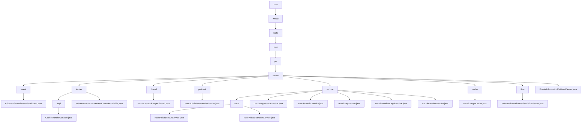

# 基础信息

|      |      |
|------|------|
| 名称 | com |
| 编码语言 | .java |
| 代码路径 | WeFe/mpc/mpc-pir/mpc-pir-server/src/main/java/com |
| 包名 | docs.mpc.mpc-pir.mpc-pir-server.src.main.java.com |
| 概述说明 | PrivateInformationRetrievalEvent类处理私有信息检索事件，含uuid和keys属性。模块实现PIR协议数据传输与验证，管理随机数和加密数据。ProduceHauckTargetThread线程生成并缓存HauckTarget对象。HauckObliviousTransferSender类实现密钥生成流程。模块基于Naor-Pinkas协议提供安全查询服务。HauckTargetCache单例类管理线程安全缓存。PrivateInformationRetrievalFlowServer类处理检索流程。PrivateInformationRetrievalServer类提供服务器初始化和缓存管理功能。 |

# 说明

## 概述  
该模块实现多方安全计算中的隐私信息检索(PIR)协议，核心职责包括密钥生成、随机数验证和加密数据传输，类似安全中间件模式。整合接口规范包含六类操作：随机数处理（如processHauckRandomLegal）、密钥派生（如keyDerivation）、缓存管理（如HauckTargetCache）等。关键数据结构聚合为四类：请求跟踪（UUID/ID）、加密参数（Diffie-Hellman密钥对/AES密钥）、缓存对象（HauckTarget）和传输载体（JSON/十六进制字符串）。外部依赖去重后包含JCE加密库、线程池和单例缓存实例，例如ArrayBlockingQueue实现线程安全缓存。

## 主要业务场景  
典型应用为分层式隐私查询：预处理阶段通过ProduceHauckTargetThread预生成随机数池，类似密钥分发中心；查询阶段组合Naor-Pinkas协议和AES加密（如NaorPinkasResultService），类似混合加密网关。完整业务流程包含三个维度：1）缓存控制（如500容量阈值+2秒休眠检测）2）安全验证（如120秒超时+MAC校验）3）异步传输（如PrivateInformationRetrievalFlowServer的JSON结果封装）。API集成模式呈现双轨制：同步接口处理即时请求（如getHauckTarget），异步服务管理后台任务（如HuackKeyService线程池）。

### 包内部结构视图

该流程图展示了MPC-PIR服务器项目的Java代码层级结构，从根目录com开始，逐级展开到welab、wefe、mpc、pir，最终到server模块。server模块下包含多个子模块如event、trasfer、service等，每个子模块又包含具体的实现类文件。整个结构清晰地呈现了项目代码的组织方式，体现了模块化设计思想。

# 文件列表

| 名称   | 类型  | 说明 |
|-------|------|-------------|
| [welab](welab/_module.md) | package | PrivateInformationRetrievalEvent类处理私有信息检索事件，含uuid和keys属性。模块实现PIR协议数据传输与验证，管理随机数和加密数据。ProduceHauckTargetThread线程生成并缓存HauckTarget对象。HauckObliviousTransferSender类实现密钥生成流程。模块基于Naor-Pinkas协议提供安全查询服务。HauckTargetCache单例类管理线程安全缓存。PrivateInformationRetrievalFlowServer类处理检索流程。PrivateInformationRetrievalServer类提供服务器初始化和缓存管理功能。 |

