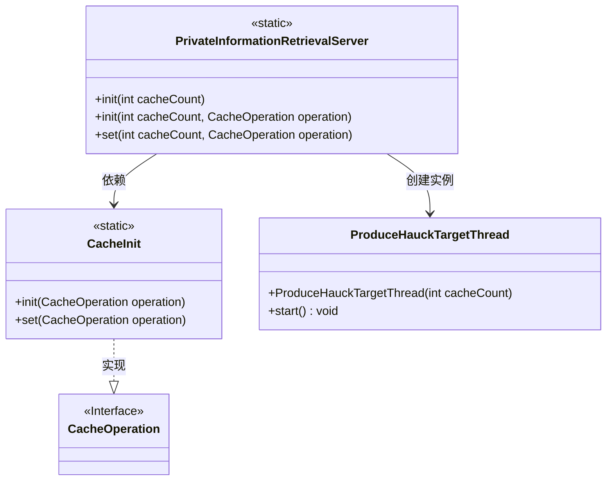
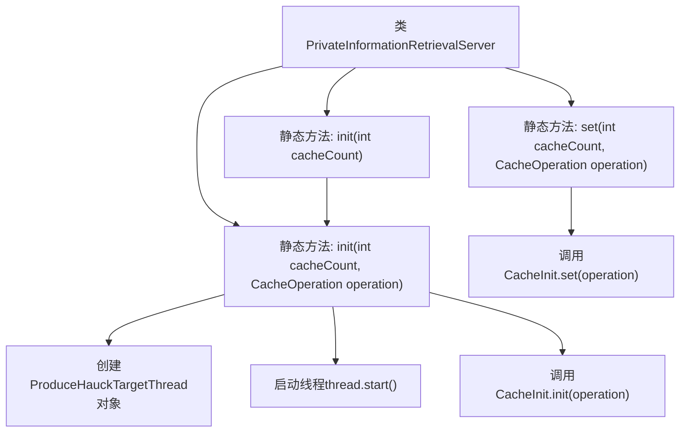

# 基础信息

|      |      |
|------|------|
| 名称 | PrivateInformationRetrievalServer |
| 编码语言 | .java |
| 代码路径 | WeFe/mpc/mpc-pir/mpc-pir-server/src/main/java/com/welab/wefe/mpc/pir/server/PrivateInformationRetrievalServer.java |
| 包名 | com.welab.wefe.mpc.pir.server |
| 依赖项 | ['com.welab.wefe.mpc.cache.CacheInit', 'com.welab.wefe.mpc.cache.intermediate.CacheOperation', 'com.welab.wefe.mpc.pir.server.thread.ProduceHauckTargetThread'] |
| 概述说明 | 私有信息检索服务器类，提供初始化方法，支持预生成Huack对象和缓存操作，可设置缓存数量及操作。 |

# 说明

这是一个名为PrivateInformationRetrievalServer的Java类，提供了私有信息检索服务器的初始化与设置功能。该类包含三个静态方法：第一个init方法接受缓存数量参数，调用第二个重载方法；第二个init方法接受缓存数量和缓存操作参数，启动一个生成Hauck目标对象的线程，并初始化缓存；set方法用于更新缓存操作配置。所有方法都涉及缓存管理和后台线程操作。

# 类列表 Class Summary

| 名称   | 类型  | 说明 |
|-------|------|-------------|
| PrivateInformationRetrievalServer | class | 私有信息检索服务器类，提供初始化方法，支持预生成Huack对象和缓存操作，可设置缓存数量及操作。 |

## 类 PrivateInformationRetrievalServer

|      |      |
|------|------|
| 访问范围 | public |
| 类型 | class |
| 名称 | PrivateInformationRetrievalServer |
| 说明 | 私有信息检索服务器类，提供初始化方法，支持预生成Huack对象和缓存操作，可设置缓存数量及操作。 |

### UML类图

这段类图展示了私有信息检索服务器的核心结构。PrivateInformationRetrievalServer 通过静态方法提供初始化功能，依赖 CacheInit 进行缓存操作，并创建 ProduceHauckTargetThread 线程进行预处理。CacheOperation 作为接口定义了缓存操作规范，由 CacheInit 具体实现。整个设计采用静态方法模式，强调线程安全和高并发处理能力，适用于需要高效缓存管理的检索场景。

### 内部方法调用关系图

这段代码展示了PrivateInformationRetrievalServer类的静态方法调用流程。类包含三个核心方法：两个重载的init()方法和一个set()方法。主init()方法会创建并启动ProduceHauckTargetThread线程，同时初始化缓存；set()方法则用于更新缓存操作。流程图清晰地展示了方法间的调用关系和执行顺序，特别是重载方法间的跳转和线程创建过程。

### 字段列表 Field List

| 名称  | 类型  | 说明 |
|-------|-------|------|

### 方法列表

| 名称  | 类型  | 说明 |
|-------|-------|------|
| init | void | 静态方法init，接受int参数cacheCount，调用重载方法init并传入cacheCount和null。 |
| set | void | 设置缓存操作：调用CacheInit.set方法，传入操作类型参数。 |
| init | void | 静态方法init初始化缓存：启动线程预生成Huack对象，并调用CacheInit.init进行缓存操作。参数为缓存数量cacheCount和操作类型operation。 |

