# 基础信息

|      |      |
|------|------|
| 名称 | server |
| 编码语言 | .java |
| 代码路径 | WeFe/mpc/mpc-pir/mpc-pir-server/src/main/java/com/welab/wefe/mpc/pir/server |
| 包名 | docs.mpc.mpc-pir.mpc-pir-server.src.main.java.com.welab.wefe.mpc.pir.server |
| 概述说明 | PrivateInformationRetrievalEvent类处理私有信息检索事件，含uuid和keys属性。模块实现PIR协议数据传输与验证，管理随机数和加密数据。ProduceHauckTargetThread线程生成并缓存HauckTarget对象。HauckObliviousTransferSender类实现密钥生成流程。模块基于Naor-Pinkas协议提供安全查询服务。HauckTargetCache单例类管理线程安全缓存。PrivateInformationRetrievalFlowServer类处理检索流程。PrivateInformationRetrievalServer类提供服务器初始化和缓存管理功能。 |

# 说明

## 概述  
该模块实现多方安全计算中的隐私信息检索(PIR)协议，核心职责包括密钥生成、随机数验证和加密数据传输，类似安全中间件模式。整合接口规范包含六类操作：随机数处理（如processHauckRandomLegal）、密钥派生（如keyDerivation）、缓存管理（如HauckTargetCache）等。关键数据结构聚合为四类：请求跟踪（UUID/ID）、加密参数（Diffie-Hellman密钥对/AES密钥）、缓存对象（HauckTarget）和传输载体（JSON/十六进制字符串）。外部依赖去重后包含JCE加密库、线程池和单例缓存实例，例如ArrayBlockingQueue实现线程安全缓存。

## 主要业务场景  
典型应用为分层式隐私查询：预处理阶段通过ProduceHauckTargetThread预生成随机数池，类似密钥分发中心；查询阶段组合Naor-Pinkas协议和AES加密（如NaorPinkasResultService），类似混合加密网关。完整业务流程包含三个维度：1）缓存控制（如500容量阈值+2秒休眠检测）2）安全验证（如120秒超时+MAC校验）3）异步传输（如PrivateInformationRetrievalFlowServer的JSON结果封装）。API集成模式呈现双轨制：同步接口处理即时请求（如getHauckTarget），异步服务管理后台任务（如HuackKeyService线程池）。

### 包内部结构视图

```mermaid
graph TD
    server --> event
    server --> trasfer
    server --> thread
    server --> protocol
    server --> service
    server --> cache
    server --> flow
    server --> PrivateInformationRetrievalServer.java
    event --> PrivateInformationRetrievalEvent.java
    trasfer --> impl
    trasfer --> PrivateInformationRetrievalTransferVariable.java
    impl --> CacheTransferVariable.java
    thread --> ProduceHauckTargetThread.java
    protocol --> HauckObliviousTransferSender.java
    service --> naor
    service --> GetEncryptResultService.java
    service --> HuackResultsService.java
    service --> HuackKeyService.java
    service --> HauckRandomLegalService.java
    service --> HauckRandomService.java
    naor --> NaorPinkasResultService.java
    naor --> NaorPinkasRandomService.java
    cache --> HauckTargetCache.java
    flow --> PrivateInformationRetrievalFlowServer.java
```

该流程图展示了mpc-pir-server模块的完整目录结构，以server为根节点，包含8个主要子目录：event、trasfer、thread、protocol、service、cache、flow以及主文件。其中service目录进一步细分为naor子目录和5个服务类文件，trasfer目录包含impl实现子目录。整个结构清晰地呈现了私有信息检索服务器的组件分布，包含事件处理、传输协议、线程管理、服务实现等核心功能模块。

# 文件列表

| 名称   | 类型  | 说明 |
|-------|------|-------------|
| [PrivateInformationRetrievalServer.java](PrivateInformationRetrievalServer.md) | file | 私有信息检索服务器类，提供初始化方法，支持预生成Huack对象和缓存操作，可设置缓存数量及操作。 |
| [flow](flow/_module.md) | package | PrivateInformationRetrievalFlowServer类继承BasePrivateInformationRetrieval，实现私有信息检索流程。通过异步查询和密钥派生处理数据，使用AES加密结果并传输。 |
| [cache](cache/_module.md) | package | HauckTargetCache是单例类，使用阻塞队列存储最多500个HauckTarget对象，提供put、get和size方法操作队列。 |
| [service](service/_module.md) | package | 该模块基于Naor-Pinkas协议实现安全多方计算查询，包含随机数生成和结果加密服务，采用异步处理和UUID跟踪，依赖JCE加密库和线程池，支持密钥生成、多层AES加密及缓存操作。 |
| [protocol](protocol/_module.md) | package | HauckObliviousTransferSender类实现ObliviousTransfer接口，负责密钥派生。通过HauckTarget计算密钥列表，支持多目标并行计算，包含缓存处理和异步操作。 |
| [thread](thread/_module.md) | package | ProduceHauckTargetThread线程类，用于生成HauckTarget对象并缓存。当缓存数量不足时持续生成，否则休眠2秒。异常时记录日志。 |
| [trasfer](trasfer/_module.md) | package | CacheTransferVariable类实现PIR数据传输接口，含四个方法处理随机数、加密结果及合法性检查，缓存操作带120秒超时。 |
| [event](event/_module.md) | package | PrivateInformationRetrievalEvent类包含uuid、keys和PrivateInformationRetrievalFlowServer属性，提供构造方法和getter方法。 |

