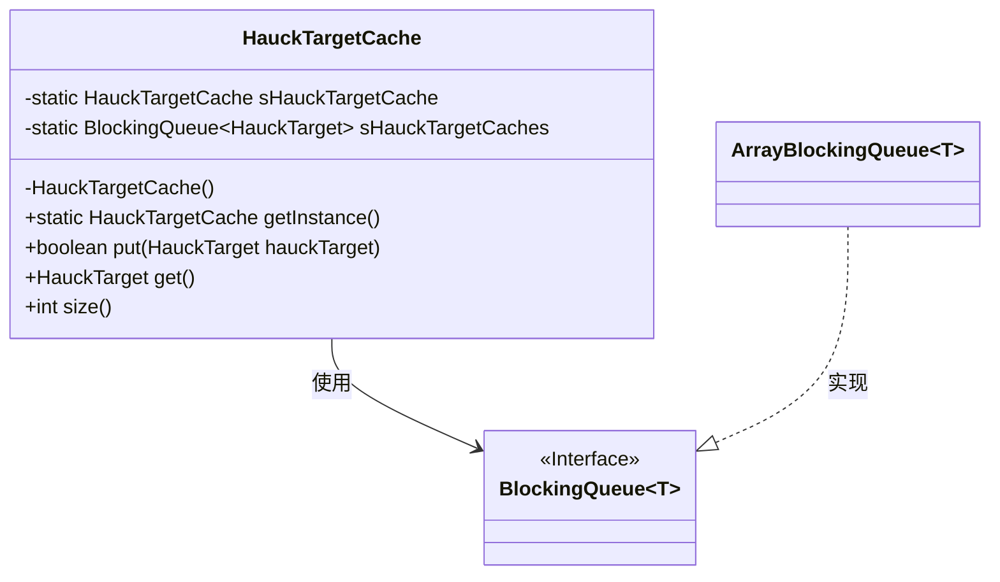
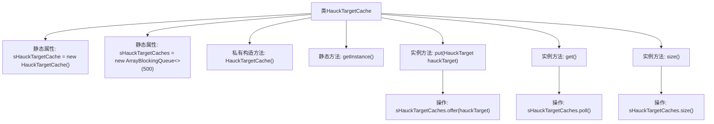

# 基础信息

|      |      |
|------|------|
| 名称 | HauckTargetCache |
| 编码语言 | .java |
| 代码路径 | WeFe/mpc/mpc-pir/mpc-pir-server/src/main/java/com/welab/wefe/mpc/pir/server/cache/HauckTargetCache.java |
| 包名 | com.welab.wefe.mpc.pir.server.cache |
| 依赖项 | ['com.welab.wefe.mpc.pir.protocol.ot.hauck.HauckTarget', 'java.util.concurrent.ArrayBlockingQueue', 'java.util.concurrent.BlockingQueue'] |
| 概述说明 | HauckTargetCache是单例类，使用阻塞队列存储最多500个HauckTarget对象，提供put、get和size方法操作队列。 |

# 说明

HauckTargetCache是一个单例类，用于管理HauckTarget对象的缓存。它使用私有静态实例sHauckTargetCache确保全局唯一性，并通过私有构造方法防止外部实例化。缓存使用容量为500的ArrayBlockingQueue实现线程安全操作。提供三个公共方法：put用于添加元素（非阻塞），get用于获取元素（非阻塞），size返回当前缓存大小。

# 类列表 Class Summary

| 名称   | 类型  | 说明 |
|-------|------|-------------|
| HauckTargetCache | class | HauckTargetCache是单例类，使用阻塞队列存储HauckTarget对象，提供put、get和size方法，队列容量500。 |

## 类 HauckTargetCache

|      |      |
|------|------|
| 访问范围 | public |
| 类型 | class |
| 名称 | HauckTargetCache |
| 说明 | HauckTargetCache是单例类，使用阻塞队列存储HauckTarget对象，提供put、get和size方法，队列容量500。 |

### UML类图

这段代码展示了一个单例模式的HauckTargetCache类，它使用BlockingQueue作为底层存储结构来缓存HauckTarget对象。该类通过私有构造函数确保单例，提供put/get方法操作队列，并支持查询当前缓存大小。类图中清晰地展示了HauckTargetCache与BlockingQueue接口及其实现类ArrayBlockingQueue之间的关系，体现了组合和接口实现的设计模式。

### 内部方法调用关系图

这段代码实现了一个基于阻塞队列的单例目标缓存类HauckTargetCache。通过静态属性sHauckTargetCache实现单例模式，使用容量为500的ArrayBlockingQueue存储HauckTarget对象。提供put()方法非阻塞添加元素，get()方法非阻塞获取元素，以及size()方法获取当前队列大小。流程图清晰展示了类结构、单例初始化过程以及三个核心方法与底层队列操作的调用关系。

### 字段列表 Field List

| 名称  | 类型  | 说明 |
|-------|-------|------|
| sHauckTargetCache = new HauckTargetCache() | HauckTargetCache | 静态变量sHauckTargetCache，初始化为HauckTargetCache实例。 |
| sHauckTargetCaches = new ArrayBlockingQueue<>(500) | BlockingQueue<HauckTarget> | 定义了一个容量为500的阻塞队列，用于存储HauckTarget对象。 |

### 方法列表

| 名称  | 类型  | 说明 |
|-------|-------|------|
| get | HauckTarget | 方法get()从缓存队列sHauckTargetCaches中取出并返回一个HauckTarget对象。 |
| getInstance | HauckTargetCache | 静态方法getInstance返回单例对象sHauckTargetCache。 |
| put | boolean | Java方法put将HauckTarget对象存入缓存队列sHauckTargetCaches，成功返回true，失败返回false。 |
| size | int | 该方法返回sHauckTargetCaches的大小，即元素数量。 |

