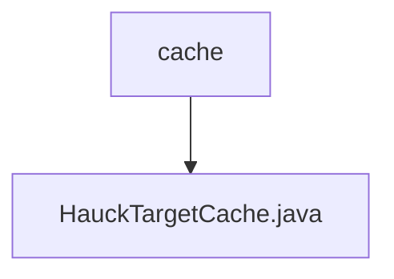

# 基础信息

|      |      |
|------|------|
| 名称 | cache |
| 编码语言 | .java |
| 代码路径 | WeFe/mpc/mpc-pir/mpc-pir-server/src/main/java/com/welab/wefe/mpc/pir/server/cache |
| 包名 | docs.mpc.mpc-pir.mpc-pir-server.src.main.java.com.welab.wefe.mpc.pir.server.cache |
| 概述说明 | HauckTargetCache是单例类，使用阻塞队列存储最多500个HauckTarget对象，提供put、get和size方法操作队列。 |

# 说明

HauckTargetCache是一个单例类，用于管理HauckTarget对象的缓存。它使用私有静态实例sHauckTargetCache确保全局唯一性，并通过私有构造方法防止外部实例化。缓存使用容量为500的ArrayBlockingQueue实现线程安全操作。提供三个公共方法：put用于添加元素（非阻塞），get用于获取元素（非阻塞），size返回当前缓存大小。

### 包内部结构视图

该流程图展示了mpc-pir-server项目中cache目录与HauckTargetCache.java文件的层级关系。cache作为父目录，包含一个具体的Java实现文件HauckTargetCache.java，体现了服务端缓存功能的具体实现位置。整个结构简洁明了，符合给定的两条路径信息。

# 文件列表

| 名称   | 类型  | 说明 |
|-------|------|-------------|
| [HauckTargetCache.java](HauckTargetCache.md) | file | HauckTargetCache是单例类，使用阻塞队列存储最多500个HauckTarget对象，提供put、get和size方法操作队列。 |

