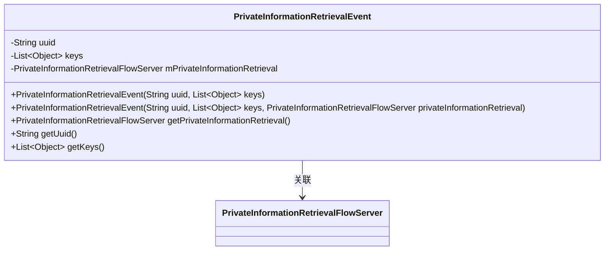
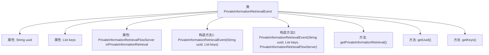

# 基础信息

|      |      |
|------|------|
| 名称 | PrivateInformationRetrievalEvent |
| 编码语言 | .java |
| 代码路径 | WeFe/mpc/mpc-pir/mpc-pir-server/src/main/java/com/welab/wefe/mpc/pir/server/event/PrivateInformationRetrievalEvent.java |
| 包名 | com.welab.wefe.mpc.pir.server.event |
| 依赖项 | ['com.welab.wefe.mpc.pir.server.flow.PrivateInformationRetrievalFlowServer', 'java.util.List'] |
| 概述说明 | PrivateInformationRetrievalEvent类包含uuid、keys和PrivateInformationRetrievalFlowServer属性，提供构造方法和getter方法。 |

# 说明

PrivateInformationRetrievalEvent类用于处理私有信息检索事件，包含uuid字符串和keys对象列表两个核心属性。该类提供两个构造函数，一个仅初始化uuid和keys，另一个额外初始化PrivateInformationRetrievalFlowServer对象。提供三个getter方法分别获取uuid、keys和PrivateInformationRetrievalFlowServer实例。

# 类列表 Class Summary

| 名称   | 类型  | 说明 |
|-------|------|-------------|
| PrivateInformationRetrievalEvent | class | PrivateInformationRetrievalEvent类包含uuid、keys和PrivateInformationRetrievalFlowServer属性，提供构造方法和getter方法。 |

## 类 PrivateInformationRetrievalEvent

|      |      |
|------|------|
| 访问范围 | public |
| 类型 | class |
| 名称 | PrivateInformationRetrievalEvent |
| 说明 | PrivateInformationRetrievalEvent类包含uuid、keys和PrivateInformationRetrievalFlowServer属性，提供构造方法和getter方法。 |

### UML类图

这段代码定义了一个`PrivateInformationRetrievalEvent`类，用于管理私有信息检索事件。该类包含三个主要属性：唯一标识符uuid、键值列表keys和服务器实例mPrivateInformationRetrieval，提供了两种构造方法和三个getter方法。类图清晰地展示了其与`PrivateInformationRetrievalFlowServer`的关联关系，体现了事件对象与服务器之间的交互依赖。

### 内部方法调用关系图

这段代码定义了一个名为PrivateInformationRetrievalEvent的类，用于处理私有信息检索事件。该类包含三个属性：uuid用于唯一标识事件，keys存储关联的键列表，mPrivateInformationRetrieval引用一个流服务器实例。提供了两个构造方法，分别用于初始化基本属性和完整属性，以及三个getter方法用于获取这些属性的值。这个类主要用于封装和传递私有信息检索相关的事件数据。

### 字段列表 Field List

| 名称  | 类型  | 说明 |
|-------|-------|------|
| uuid | String | 声明一个字符串变量uuid。 |
| mPrivateInformationRetrieval | PrivateInformationRetrievalFlowServer | 私有信息检索流服务器实例mPrivateInformationRetrieval。 |
| keys | List<Object> | 声明一个名为keys的列表，元素类型为Object。 |

### 方法列表

| 名称  | 类型  | 说明 |
|-------|-------|------|
| getKeys | List<Object> | 获取键值列表的方法，返回存储的键值集合。 |
| getPrivateInformationRetrieval | PrivateInformationRetrievalFlowServer | 获取私有信息检索流服务器实例的方法，返回成员变量mPrivateInformationRetrieval。 |
| getUuid | String | 方法getUuid返回字符串类型的uuid值。 |

