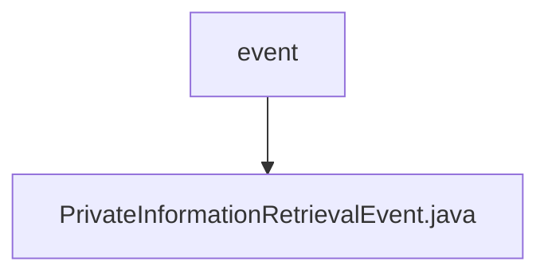

# 基础信息

|      |      |
|------|------|
| 名称 | event |
| 编码语言 | .java |
| 代码路径 | WeFe/mpc/mpc-pir/mpc-pir-server/src/main/java/com/welab/wefe/mpc/pir/server/event |
| 包名 | docs.mpc.mpc-pir.mpc-pir-server.src.main.java.com.welab.wefe.mpc.pir.server.event |
| 概述说明 | PrivateInformationRetrievalEvent类包含uuid、keys和PrivateInformationRetrievalFlowServer属性，提供构造方法和getter方法。 |

# 说明

PrivateInformationRetrievalEvent类用于处理私有信息检索事件，包含uuid字符串和keys对象列表两个核心属性。该类提供两个构造函数，一个仅初始化uuid和keys，另一个额外初始化PrivateInformationRetrievalFlowServer对象。提供三个getter方法分别获取uuid、keys和PrivateInformationRetrievalFlowServer实例。

### 包内部结构视图

该流程图展示了mpc-pir-server项目中事件模块的层级结构。根节点"event"表示事件处理目录，其下包含一个具体的事件实现类"PrivateInformationRetrievalEvent.java"。这种结构符合典型的事件驱动架构设计，其中事件处理器作为父节点，具体事件类作为子节点，体现了单一职责原则。整个结构简洁清晰，便于维护和扩展事件处理逻辑。

# 文件列表

| 名称   | 类型  | 说明 |
|-------|------|-------------|
| [PrivateInformationRetrievalEvent.java](PrivateInformationRetrievalEvent.md) | file | PrivateInformationRetrievalEvent类包含uuid、keys和PrivateInformationRetrievalFlowServer属性，提供构造方法和getter方法。 |

