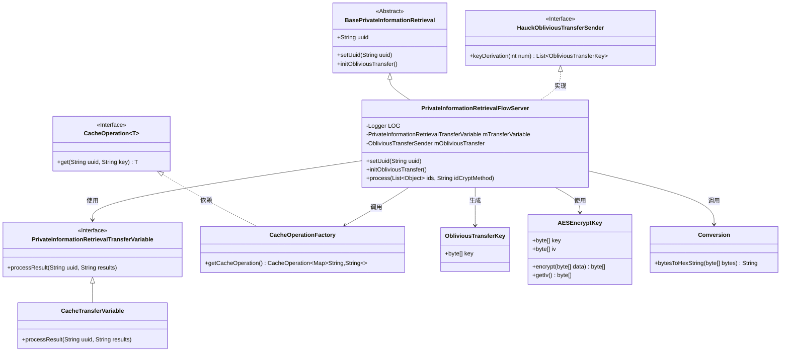
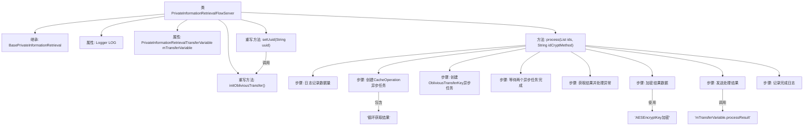

# 基础信息

|      |      |
|------|------|
| 名称 | PrivateInformationRetrievalFlowServer |
| 编码语言 | .java |
| 代码路径 | WeFe/mpc/mpc-pir/mpc-pir-server/src/main/java/com/welab/wefe/mpc/pir/server/flow/PrivateInformationRetrievalFlowServer.java |
| 包名 | com.welab.wefe.mpc.pir.server.flow |
| 依赖项 | ['cn.hutool.core.util.ObjectUtil', 'com.alibaba.fastjson.JSON', 'com.welab.wefe.mpc.cache.intermediate.CacheOperation', 'com.welab.wefe.mpc.cache.intermediate.CacheOperationFactory', 'com.welab.wefe.mpc.commom.Constants', 'com.welab.wefe.mpc.commom.Conversion', 'com.welab.wefe.mpc.pir.flow.BasePrivateInformationRetrieval', 'com.welab.wefe.mpc.pir.protocol.ot.ObliviousTransferKey', 'com.welab.wefe.mpc.pir.protocol.se.SymmetricKey', 'com.welab.wefe.mpc.pir.protocol.se.aes.AESEncryptKey', 'com.welab.wefe.mpc.pir.server.protocol.HauckObliviousTransferSender', 'com.welab.wefe.mpc.pir.server.trasfer.PrivateInformationRetrievalTransferVariable', 'com.welab.wefe.mpc.pir.server.trasfer.impl.CacheTransferVariable', 'org.slf4j.Logger', 'org.slf4j.LoggerFactory', 'java.util.ArrayList', 'java.util.List', 'java.util.Map', 'java.util.concurrent.CompletableFuture', 'java.util.concurrent.TimeUnit'] |
| 概述说明 | PrivateInformationRetrievalFlowServer类继承BasePrivateInformationRetrieval，实现私有信息检索流程。通过异步查询和密钥派生处理数据，使用AES加密结果并传输。 |

# 说明

PrivateInformationRetrievalFlowServer类继承BasePrivateInformationRetrieval，实现私有信息检索流程。核心功能包括初始化不经意传输协议HauckObliviousTransferSender，处理ID列表和加密方法。通过异步操作查询缓存数据并生成密钥，使用AES加密结果后转换为十六进制字符串，最终通过传输变量发送JSON格式的加密结果。整个过程包含日志记录、错误处理和并发控制。

# 类列表 Class Summary

| 名称   | 类型  | 说明 |
|-------|------|-------------|
| PrivateInformationRetrievalFlowServer | class | PrivateInformationRetrievalFlowServer类继承BasePrivateInformationRetrieval，实现私有信息检索流程。通过异步查询和密钥派生处理数据，使用AES加密结果并传输。包含UUID设置、初始化、数据处理和结果加密发送功能。 |

## 类 PrivateInformationRetrievalFlowServer

|      |      |
|------|------|
| 访问范围 | public |
| 类型 | class |
| 名称 | PrivateInformationRetrievalFlowServer |
| 说明 | PrivateInformationRetrievalFlowServer类继承BasePrivateInformationRetrieval，实现私有信息检索流程。通过异步查询和密钥派生处理数据，使用AES加密结果并传输。包含UUID设置、初始化、数据处理和结果加密发送功能。 |

### UML类图

该类图展示了私有信息检索流程服务器的核心结构，继承自基础抽象类并实现 oblivious transfer 接口。主要功能包括：通过异步任务并行获取缓存数据和生成加密密钥，使用AES加密查询结果后通过传输变量返回。系统包含缓存操作工厂、密钥派生、数据加密等组件，通过组合模式实现高并发安全数据处理流程，各模块职责明确且通过接口解耦。

### 内部方法调用关系图

流程图描述：
该流程图展示了PrivateInformationRetrievalFlowServer类的完整处理流程，从继承关系开始，详细描述了process方法的执行步骤。主要包括初始化日志记录、创建两个并行异步任务（数据查询和密钥派生）、等待任务完成、异常处理、数据加密和结果发送等关键环节。特别突出了异步任务协同处理和AES加密等核心功能，最后通过传输变量发送处理结果并记录完成状态。

### 字段列表 Field List

| 名称  | 类型  | 说明 |
|-------|-------|------|
| LOG = LoggerFactory.getLogger(PrivateInformationRetrievalFlowServer.class) | Logger | 私有日志记录器，用于PrivateInformationRetrievalFlowServer类。 |
| mTransferVariable = new CacheTransferVariable() | PrivateInformationRetrievalTransferVariable | 创建私有信息检索传输变量mTransferVariable，并初始化为CacheTransferVariable实例。 |

### 方法列表

| 名称  | 类型  | 说明 |
|-------|-------|------|
| process | void | 该方法异步处理ID列表，通过缓存查询和密钥派生并行获取数据，使用AES加密结果后发送。包含异常处理和日志记录。 |
| setUuid | void | 重写setUuid方法，调用父类方法后初始化OT协议。 |
| initObliviousTransfer | void | 初始化HauckObliviousTransferSender实例，使用uuid作为参数。 |

