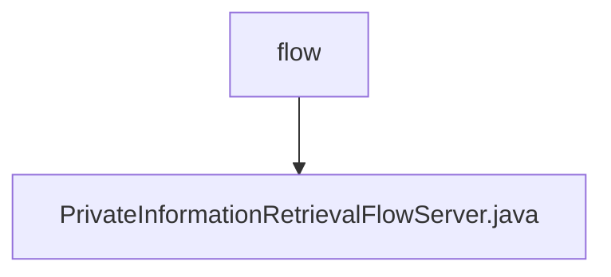

# 基础信息

|      |      |
|------|------|
| 名称 | flow |
| 编码语言 | .java |
| 代码路径 | WeFe/mpc/mpc-pir/mpc-pir-server/src/main/java/com/welab/wefe/mpc/pir/server/flow |
| 包名 | docs.mpc.mpc-pir.mpc-pir-server.src.main.java.com.welab.wefe.mpc.pir.server.flow |
| 概述说明 | PrivateInformationRetrievalFlowServer类继承BasePrivateInformationRetrieval，实现私有信息检索流程。通过异步查询和密钥派生处理数据，使用AES加密结果并传输。 |

# 说明

PrivateInformationRetrievalFlowServer类继承BasePrivateInformationRetrieval，实现私有信息检索流程。核心功能包括初始化不经意传输协议HauckObliviousTransferSender，处理ID列表和加密方法。通过异步操作查询缓存数据并生成密钥，使用AES加密结果后转换为十六进制字符串，最终通过传输变量发送JSON格式的加密结果。整个过程包含日志记录、错误处理和并发控制。

### 包内部结构视图

该流程图展示了mpc-pir-server项目中server/flow目录下的文件结构关系。根节点"flow"下包含一个Java实现文件"PrivateInformationRetrievalFlowServer.java"，表示这是流程服务器的主要实现类。这种简洁的结构表明该模块功能聚焦，核心业务逻辑集中在一个文件中实现。

# 文件列表

| 名称   | 类型  | 说明 |
|-------|------|-------------|
| [PrivateInformationRetrievalFlowServer.java](PrivateInformationRetrievalFlowServer.md) | file | PrivateInformationRetrievalFlowServer类继承BasePrivateInformationRetrieval，实现私有信息检索流程。通过异步查询和密钥派生处理数据，使用AES加密结果并传输。 |

