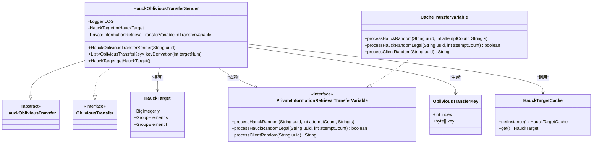
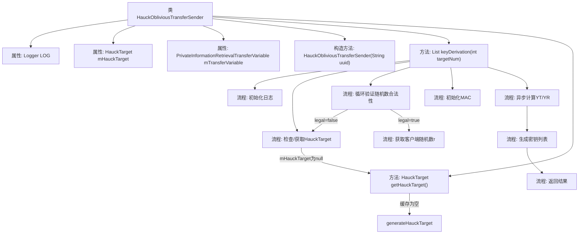
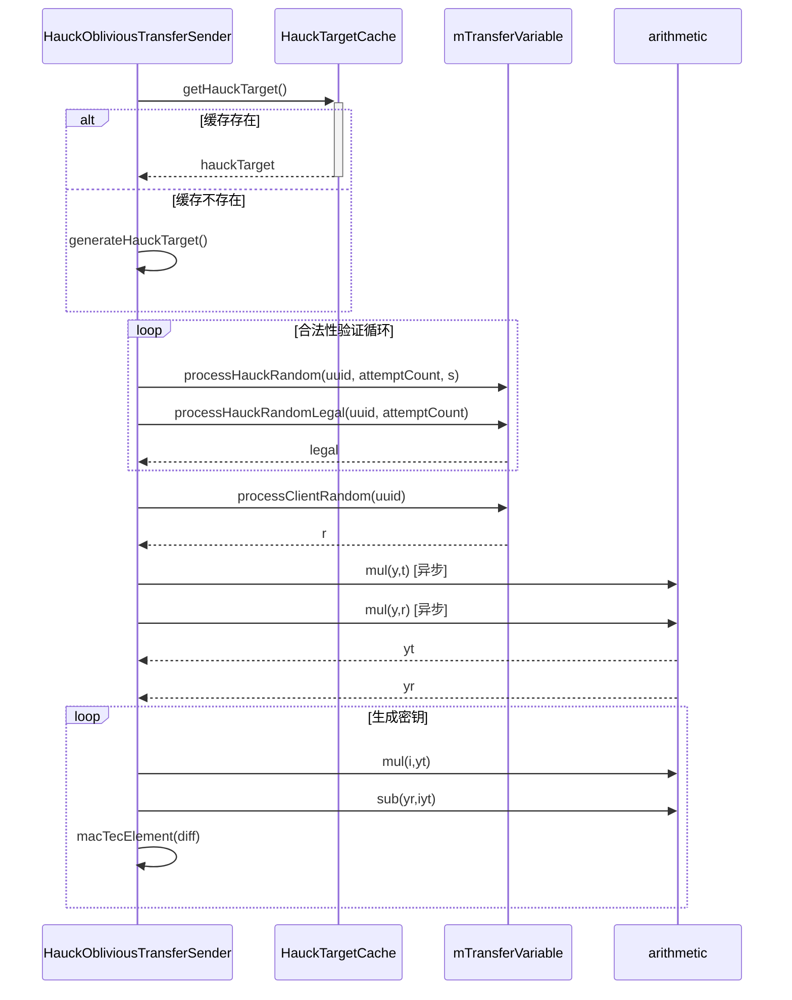

# 基础信息

|      |      |
|------|------|
| 名称 | HauckObliviousTransferSender |
| 编码语言 | .java |
| 代码路径 | WeFe/mpc/mpc-pir/mpc-pir-server/src/main/java/com/welab/wefe/mpc/pir/server/protocol/HauckObliviousTransferSender.java |
| 包名 | com.welab.wefe.mpc.pir.server.protocol |
| 依赖项 | ['com.welab.wefe.mpc.commom.Conversion', 'com.welab.wefe.mpc.pir.protocol.nt.group.GroupElement', 'com.welab.wefe.mpc.pir.protocol.ot.ObliviousTransfer', 'com.welab.wefe.mpc.pir.protocol.ot.ObliviousTransferKey', 'com.welab.wefe.mpc.pir.protocol.ot.hauck.HauckObliviousTransfer', 'com.welab.wefe.mpc.pir.protocol.ot.hauck.HauckTarget', 'com.welab.wefe.mpc.pir.server.cache.HauckTargetCache', 'com.welab.wefe.mpc.pir.server.trasfer.PrivateInformationRetrievalTransferVariable', 'com.welab.wefe.mpc.pir.server.trasfer.impl.CacheTransferVariable', 'org.slf4j.Logger', 'org.slf4j.LoggerFactory', 'java.math.BigInteger', 'java.util.ArrayList', 'java.util.List', 'java.util.concurrent.CompletableFuture'] |
| 概述说明 | HauckObliviousTransferSender类实现ObliviousTransfer接口，负责密钥派生。通过HauckTarget计算密钥列表，支持多目标并行计算，包含缓存处理和异步操作。 |

# 说明

HauckObliviousTransferSender类实现了ObliviousTransfer接口，继承自HauckObliviousTransfer基类。该类包含一个HauckTarget对象和PrivateInformationRetrievalTransferVariable变量。核心方法keyDerivation负责生成密钥列表，流程包括：检查并获取HauckTarget对象，处理随机数合法性验证，初始化MAC，计算yt和yr，最终生成指定数量的ObliviousTransferKey对象。getHauckTarget方法优先从缓存获取目标对象，不存在时生成新对象。整个过程通过日志记录关键步骤状态。

# 类列表 Class Summary

| 名称   | 类型  | 说明 |
|-------|------|-------------|
| HauckObliviousTransferSender | class | HauckObliviousTransferSender类实现ObliviousTransfer接口，负责密钥派生。通过HauckTarget和异步计算生成密钥列表，支持缓存和合法性验证。 |

## 类 HauckObliviousTransferSender

|      |      |
|------|------|
| 访问范围 | public |
| 类型 | class |
| 名称 | HauckObliviousTransferSender |
| 说明 | HauckObliviousTransferSender类实现ObliviousTransfer接口，负责密钥派生。通过HauckTarget和异步计算生成密钥列表，支持缓存和合法性验证。 |

### UML类图

这段代码描述了一个HauckObliviousTransferSender类，它继承自HauckObliviousTransfer抽象类并实现了ObliviousTransfer接口。主要功能是通过密钥派生算法生成一组ObliviousTransferKey，包含与HauckTarget、缓存系统和传输变量的交互。类图展示了其继承关系、依赖关系和关键数据结构，包括用于存储中间计算结果的HauckTarget、处理传输变量的CacheTransferVariable实现类，以及最终生成的密钥对象ObliviousTransferKey。整个设计采用异步计算和缓存机制来提高性能。

### 内部方法调用关系图

该流程图描述了HauckObliviousTransferSender类的密钥派生过程，主要包含6个阶段：初始化检查、目标对象获取、随机数合法性验证、异步数学运算、密钥列表生成和结果返回。时序图则详细展示了对象间的交互过程，特别是与缓存系统和算术组件的异步调用关系。整个过程采用循环验证机制确保随机数合法性，并通过CompletableFuture实现并行计算优化性能。

### 字段列表 Field List

| 名称  | 类型  | 说明 |
|-------|-------|------|
| LOG = LoggerFactory.getLogger(HauckObliviousTransferSender.class) | Logger | 定义HauckObliviousTransferSender类的私有静态日志对象LOG。 |
| mHauckTarget = null | HauckTarget | 声明了一个名为mHauckTarget的变量，类型为HauckTarget，初始值为null。 |
| mTransferVariable = new CacheTransferVariable() | PrivateInformationRetrievalTransferVariable | 创建私有信息检索传输变量mTransferVariable，并初始化为CacheTransferVariable实例。 |

### 方法列表

| 名称  | 类型  | 说明 |
|-------|-------|------|
| getHauckTarget | HauckTarget | 方法getHauckTarget从缓存获取HauckTarget，若为空则生成新实例并缓存后返回。 |
| keyDerivation | List<ObliviousTransferKey> | 方法生成ObliviousTransferKey列表，通过循环验证HauckTarget合法性，计算YT和YR，最终基于目标数量生成密钥列表。 |

