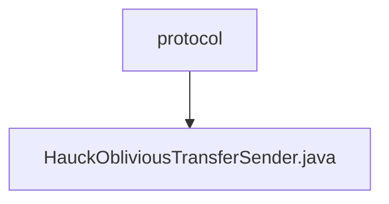

# 基础信息

|      |      |
|------|------|
| 名称 | protocol |
| 编码语言 | .java |
| 代码路径 | WeFe/mpc/mpc-pir/mpc-pir-server/src/main/java/com/welab/wefe/mpc/pir/server/protocol |
| 包名 | docs.mpc.mpc-pir.mpc-pir-server.src.main.java.com.welab.wefe.mpc.pir.server.protocol |
| 概述说明 | HauckObliviousTransferSender类实现ObliviousTransfer接口，负责密钥派生。通过HauckTarget计算密钥列表，支持多目标并行计算，包含缓存处理和异步操作。 |

# 说明

HauckObliviousTransferSender类实现了ObliviousTransfer接口，继承自HauckObliviousTransfer基类。该类包含一个HauckTarget对象和PrivateInformationRetrievalTransferVariable变量。核心方法keyDerivation负责生成密钥列表，流程包括：检查并获取HauckTarget对象，处理随机数合法性验证，初始化MAC，计算yt和yr，最终生成指定数量的ObliviousTransferKey对象。getHauckTarget方法优先从缓存获取目标对象，不存在时生成新对象。整个过程通过日志记录关键步骤状态。

### 包内部结构视图

该流程图展示了WeFe项目中MPC-PIR服务器协议模块的层级结构，protocol文件夹下包含HauckObliviousTransferSender.java实现文件，反映了协议层与具体OT发送方实现之间的包含关系。

# 文件列表

| 名称   | 类型  | 说明 |
|-------|------|-------------|
| [HauckObliviousTransferSender.java](HauckObliviousTransferSender.md) | file | HauckObliviousTransferSender类实现ObliviousTransfer接口，负责密钥派生。通过HauckTarget计算密钥列表，支持多目标并行计算，包含缓存处理和异步操作。 |

