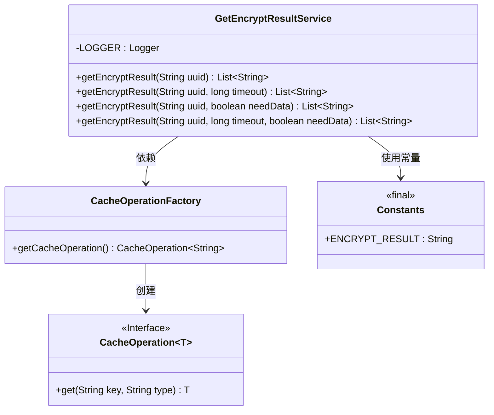
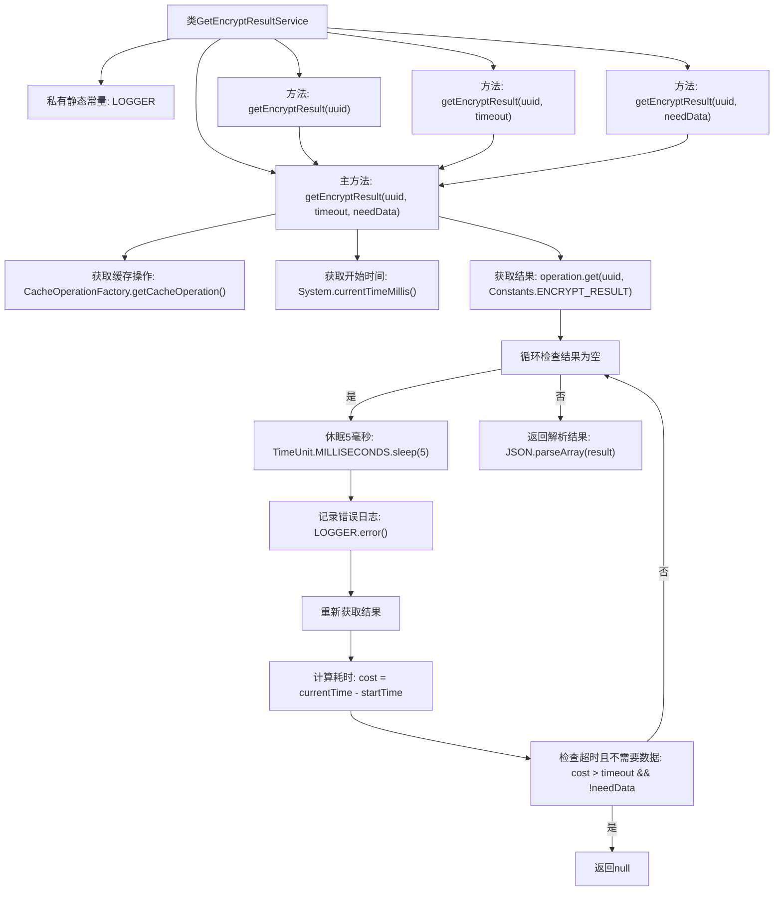

# 基础信息

|      |      |
|------|------|
| 名称 | GetEncryptResultService |
| 编码语言 | .java |
| 代码路径 | WeFe/mpc/mpc-pir/mpc-pir-server/src/main/java/com/welab/wefe/mpc/pir/server/service/GetEncryptResultService.java |
| 包名 | com.welab.wefe.mpc.pir.server.service |
| 依赖项 | ['com.alibaba.fastjson.JSON', 'com.welab.wefe.mpc.cache.intermediate.CacheOperation', 'com.welab.wefe.mpc.cache.intermediate.CacheOperationFactory', 'com.welab.wefe.mpc.commom.Constants', 'org.slf4j.Logger', 'org.slf4j.LoggerFactory', 'java.util.List', 'java.util.concurrent.TimeUnit'] |
| 概述说明 | 获取加密结果的静态方法，支持超时和是否必须返回数据的参数，通过缓存操作查询结果。 |

# 说明

GetEncryptResultService是一个提供加密结果查询功能的工具类，包含四个重载方法。核心方法通过uuid从缓存中获取加密结果数据，支持设置超时时间和是否必须返回数据的控制参数。方法内部使用循环检查缓存数据，若未获取到数据则短暂休眠后重试。当达到超时时间且不要求必须返回数据时终止循环。最终将获取的JSON格式结果解析为字符串列表返回，若无数据则返回null。日志记录器用于捕获异常信息。

# 类列表 Class Summary

| 名称   | 类型  | 说明 |
|-------|------|-------------|
| GetEncryptResultService | class | GetEncryptResultService类提供静态方法，通过uuid获取加密结果，支持设置超时和是否必须返回数据，内部使用缓存操作和轮询机制。 |

## 类 GetEncryptResultService

|      |      |
|------|------|
| 访问范围 | public |
| 类型 | class |
| 名称 | GetEncryptResultService |
| 说明 | GetEncryptResultService类提供静态方法，通过uuid获取加密结果，支持设置超时和是否必须返回数据，内部使用缓存操作和轮询机制。 |

### UML类图

该代码展示了一个加密结果查询服务，通过多参数重载方法提供灵活查询方式。核心方法使用缓存操作接口轮询获取数据，支持超时控制和数据必需性检查。类图包含服务类、缓存操作接口、工厂类和常量类，展现了通过接口解耦和常量复用的设计模式。

### 内部方法调用关系图

这段代码流程图展示了GetEncryptResultService类的核心逻辑，主要包含4个重载方法最终都调用主处理方法。主方法通过缓存操作获取加密结果，采用轮询机制检查结果，支持超时控制和数据需求判断。当结果为空时会循环等待并检查超时条件，最终返回解析后的结果或null。整个过程体现了对缓存数据的异步获取和超时处理机制，适用于需要等待后台处理结果的场景。

### 字段列表 Field List

| 名称  | 类型  | 说明 |
|-------|-------|------|
| LOGGER = LoggerFactory.getLogger(GetEncryptResultService.class) | Logger | 定义GetEncryptResultService类的静态日志记录器实例，使用LoggerFactory创建。 |

### 方法列表

| 名称  | 类型  | 说明 |
|-------|-------|------|
| getEncryptResult | List<String> | 静态方法getEncryptResult接收uuid和timeout参数，调用同名方法并默认传入false参数，返回字符串列表。 |
| getEncryptResult | List<String> | 这是一个Java静态方法，接收UUID字符串参数，调用重载方法并默认不加密，返回字符串列表。 |
| getEncryptResult | List<String> | 获取加密结果的方法，通过缓存操作查询UUID对应的结果，支持超时和空数据检查，返回解析后的字符串列表。 |
| getEncryptResult | List<String> | 静态方法getEncryptResult接收uuid和needData参数，默认超时60秒，返回加密结果列表。 |

