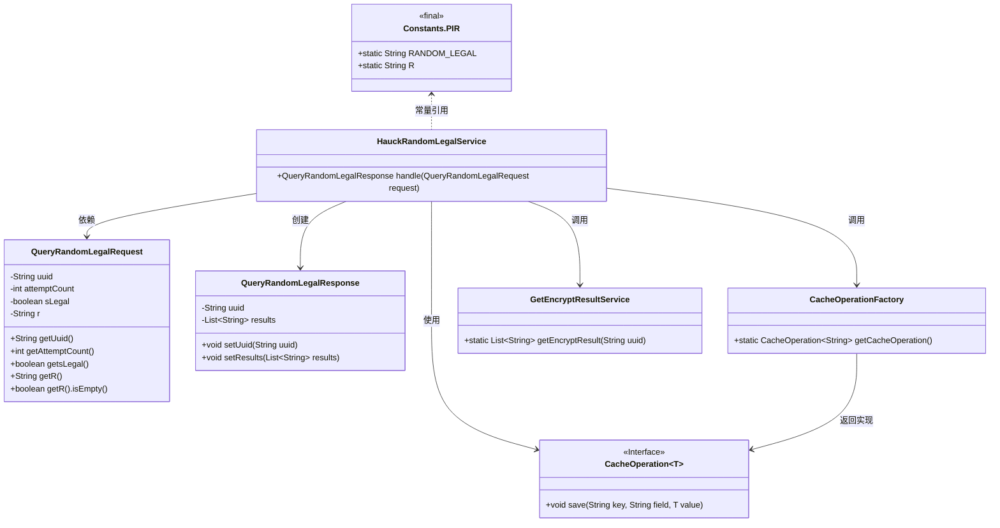
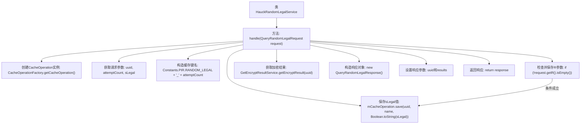

# 基础信息

|      |      |
|------|------|
| 名称 | HauckRandomLegalService |
| 编码语言 | .java |
| 代码路径 | WeFe/mpc/mpc-pir/mpc-pir-server/src/main/java/com/welab/wefe/mpc/pir/server/service/HauckRandomLegalService.java |
| 包名 | com.welab.wefe.mpc.pir.server.service |
| 依赖项 | ['com.welab.wefe.mpc.cache.intermediate.CacheOperation', 'com.welab.wefe.mpc.cache.intermediate.CacheOperationFactory', 'com.welab.wefe.mpc.commom.Constants', 'com.welab.wefe.mpc.pir.request.QueryRandomLegalRequest', 'com.welab.wefe.mpc.pir.request.QueryRandomLegalResponse', 'java.util.List'] |
| 概述说明 | HauckRandomLegalService处理随机合法请求，保存UUID和尝试次数到缓存，获取加密结果并返回响应。 |

# 说明

HauckRandomLegalService类处理QueryRandomLegalRequest请求，通过CacheOperation保存请求中的uuid、attemptCount和sLegal参数到缓存。若请求包含R参数，也将其保存。随后调用GetEncryptResultService获取加密结果，构建QueryRandomLegalResponse响应对象，设置uuid和结果列表（若存在）。整个过程涉及缓存操作和结果加密处理。

# 类列表 Class Summary

| 名称   | 类型  | 说明 |
|-------|------|-------------|
| HauckRandomLegalService | class | HauckRandomLegalService处理随机合法查询请求，保存UUID、尝试次数和合法性到缓存，若有R值也保存，最后返回加密结果和UUID的响应。 |

## 类 HauckRandomLegalService

|      |      |
|------|------|
| 访问范围 | public |
| 类型 | class |
| 名称 | HauckRandomLegalService |
| 说明 | HauckRandomLegalService处理随机合法查询请求，保存UUID、尝试次数和合法性到缓存，若有R值也保存，最后返回加密结果和UUID的响应。 |

### UML类图

这段代码描述了一个处理随机合法查询的服务类HauckRandomLegalService，它接收QueryRandomLegalRequest请求，通过缓存操作和加密结果服务处理数据，最终返回QueryRandomLegalResponse响应。核心流程包括：1) 从请求中提取参数；2) 使用CacheOperation保存数据到缓存；3) 调用GetEncryptResultService获取加密结果；4) 构建并返回响应对象。涉及的主要组件包括缓存操作工厂、加密结果服务和常量类，展现了典型的分层服务处理模式。

### 内部方法调用关系图

这段代码流程图展示了HauckRandomLegalService处理随机法律查询请求的完整流程。服务首先通过工厂模式获取缓存操作实例，然后提取请求参数并构造缓存键，将布尔型sLegal值转换为字符串后存入缓存。如果请求中包含R参数，则额外缓存该参数。接着调用GetEncryptResultService获取加密结果，最后构造响应对象并返回。整个过程体现了参数验证、数据缓存和结果封装三个关键阶段，各步骤通过清晰的箭头连接展示了逻辑执行顺序。

### 字段列表 Field List

| 名称  | 类型  | 说明 |
|-------|-------|------|

### 方法列表

| 名称  | 类型  | 说明 |
|-------|-------|------|
| handle | QueryRandomLegalResponse | 该方法处理随机合法查询请求，保存请求参数到缓存，获取加密结果并返回响应。关键操作包括缓存保存和结果加密查询。 |

