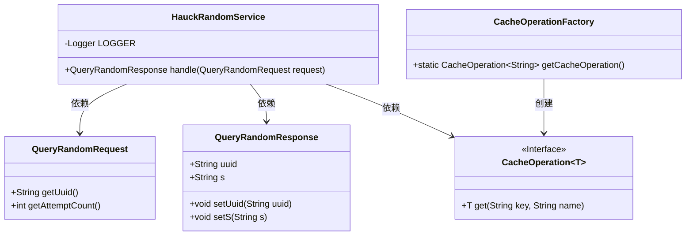
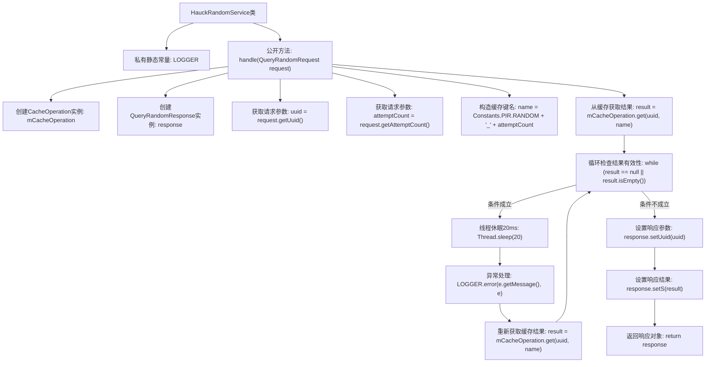

# 基础信息

|      |      |
|------|------|
| 名称 | HauckRandomService |
| 编码语言 | .java |
| 代码路径 | WeFe/mpc/mpc-pir/mpc-pir-server/src/main/java/com/welab/wefe/mpc/pir/server/service/HauckRandomService.java |
| 包名 | com.welab.wefe.mpc.pir.server.service |
| 依赖项 | ['com.welab.wefe.mpc.cache.intermediate.CacheOperation', 'com.welab.wefe.mpc.cache.intermediate.CacheOperationFactory', 'com.welab.wefe.mpc.commom.Constants', 'com.welab.wefe.mpc.pir.request.QueryRandomRequest', 'com.welab.wefe.mpc.pir.request.QueryRandomResponse', 'org.slf4j.Logger', 'org.slf4j.LoggerFactory'] |
| 概述说明 | HauckRandomService类处理随机查询请求，通过缓存操作获取结果，若结果为空则循环等待，最终返回包含UUID和结果的响应。 |

# 说明

HauckRandomService类处理随机查询请求，通过缓存操作获取结果。服务接收QueryRandomRequest请求，从中提取uuid和attemptCount参数，构建缓存键名。使用CacheOperation从缓存中获取结果，若结果为空则循环等待20毫秒后重试，直到获取有效结果。最终将uuid和结果封装到QueryRandomResponse对象返回。过程中捕获并记录中断异常。

# 类列表 Class Summary

| 名称   | 类型  | 说明 |
|-------|------|-------------|
| HauckRandomService | class | HauckRandomService处理随机查询请求，通过缓存操作获取结果，若结果为空则循环等待，最终返回包含UUID和结果的响应。 |

## 类 HauckRandomService

|      |      |
|------|------|
| 访问范围 | public |
| 类型 | class |
| 名称 | HauckRandomService |
| 说明 | HauckRandomService处理随机查询请求，通过缓存操作获取结果，若结果为空则循环等待，最终返回包含UUID和结果的响应。 |

### UML类图

这段代码展示了一个随机服务处理类HauckRandomService，它通过CacheOperationFactory获取缓存操作实例，处理QueryRandomRequest请求并返回QueryRandomResponse。主要流程包括：从请求中获取UUID和尝试次数，构造缓存键名，循环查询缓存直到获取有效结果，最后设置响应数据。代码使用了泛型接口CacheOperation<T>进行缓存操作，并通过工厂模式创建实例，体现了良好的解耦设计。

### 内部方法调用关系图

这段代码流程图展示了HauckRandomService处理随机查询请求的完整过程。服务首先初始化缓存操作实例和响应对象，然后从请求中提取关键参数并构造缓存键名。核心逻辑是通过循环不断尝试从缓存获取结果，若结果无效则休眠20毫秒后重试，直到获得有效结果为止。最后将获取到的结果封装到响应对象中返回。整个过程包含异常处理和日志记录机制，确保服务的健壮性。该流程图清晰呈现了主流程与循环控制结构的关系，以及异常处理分支的逻辑路径。

### 字段列表 Field List

| 名称  | 类型  | 说明 |
|-------|-------|------|
| LOGGER = LoggerFactory.getLogger(HauckRandomService.class) | Logger | HauckRandomService类中定义了一个静态不可变的日志记录器实例LOGGER。 |

### 方法列表

| 名称  | 类型  | 说明 |
|-------|-------|------|
| handle | QueryRandomResponse | 处理随机查询请求，通过缓存操作获取结果，若结果为空则循环等待，最终返回包含UUID和结果的响应。 |

