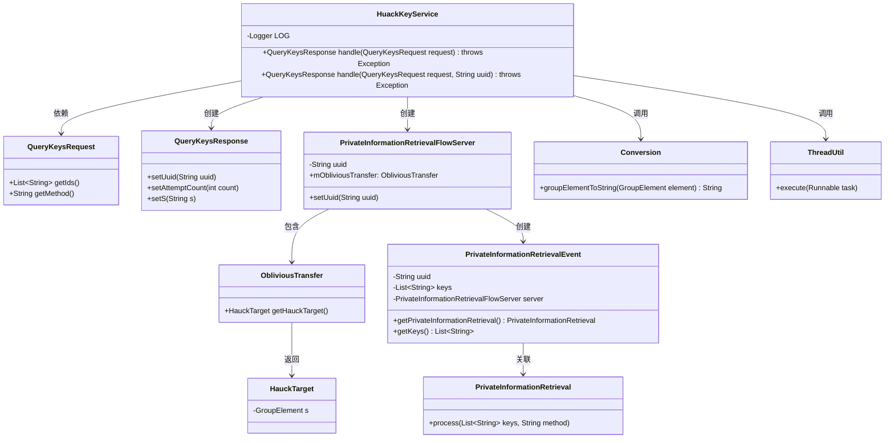
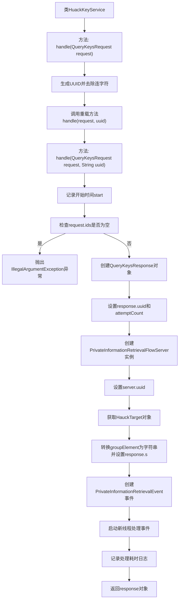

# 基础信息

|      |      |
|------|------|
| 名称 | HuackKeyService |
| 编码语言 | .java |
| 代码路径 | WeFe/mpc/mpc-pir/mpc-pir-server/src/main/java/com/welab/wefe/mpc/pir/server/service/HuackKeyService.java |
| 包名 | com.welab.wefe.mpc.pir.server.service |
| 依赖项 | ['cn.hutool.core.thread.ThreadUtil', 'com.welab.wefe.mpc.commom.Conversion', 'com.welab.wefe.mpc.pir.protocol.ot.hauck.HauckTarget', 'com.welab.wefe.mpc.pir.request.QueryKeysRequest', 'com.welab.wefe.mpc.pir.request.QueryKeysResponse', 'com.welab.wefe.mpc.pir.server.event.PrivateInformationRetrievalEvent', 'com.welab.wefe.mpc.pir.server.flow.PrivateInformationRetrievalFlowServer', 'org.slf4j.Logger', 'org.slf4j.LoggerFactory', 'java.util.UUID'] |
| 概述说明 | HuackKeyService类处理密钥查询请求，生成UUID并验证请求ID非空，通过PrivateInformationRetrievalFlowServer处理请求，记录耗时并返回响应。 |

# 说明

HuackKeyService类是一个处理密钥查询请求的服务类。它包含两个主要方法：一个生成随机UUID并调用另一个方法，另一个方法执行具体处理逻辑。该方法首先验证请求ID是否为空，然后创建响应对象并设置UUID和尝试次数。接着初始化PrivateInformationRetrievalFlowServer，获取HauckTarget对象并将其S属性转换为字符串设置到响应中。最后创建异步处理事件，通过线程池执行密钥处理任务，并记录处理耗时日志。整个过程涉及UUID生成、参数校验、服务器初始化、异步任务处理和性能监控等关键操作。

# 类列表 Class Summary

| 名称   | 类型  | 说明 |
|-------|------|-------------|
| HuackKeyService | class | HuackKeyService类处理密钥查询请求，生成UUID，验证请求ID非空，初始化响应并设置参数，通过PrivateInformationRetrievalFlowServer处理请求，记录耗时后返回响应。 |

## 类 HuackKeyService

|      |      |
|------|------|
| 访问范围 | public |
| 类型 | class |
| 名称 | HuackKeyService |
| 说明 | HuackKeyService类处理密钥查询请求，生成UUID，验证请求ID非空，初始化响应并设置参数，通过PrivateInformationRetrievalFlowServer处理请求，记录耗时后返回响应。 |

### UML类图

该类图展示了HuackKeyService的核心结构和依赖关系。HuackKeyService通过handle方法处理QueryKeysRequest，生成QueryKeysResponse，并涉及PrivateInformationRetrievalFlowServer、ObliviousTransfer等组件协作。流程中包含了UUID生成、参数校验、异步处理等关键操作，最终通过PrivateInformationRetrieval完成核心业务逻辑。各组件职责明确，通过方法调用和数据传递形成完整处理链条。

### 内部方法调用关系图

这段代码流程图展示了HuackKeyService类的两个主要方法调用流程。第一个handle方法生成UUID后调用第二个重载方法，第二个方法首先验证请求参数，然后创建响应对象并初始化相关属性，接着通过PrivateInformationRetrievalFlowServer进行密钥处理，最后在新线程中异步处理事件并返回响应。整个过程包含了参数校验、对象初始化、服务调用和异步处理等关键步骤，体现了密钥查询服务的完整处理流程。

### 字段列表 Field List

| 名称  | 类型  | 说明 |
|-------|-------|------|
| LOG = LoggerFactory.getLogger(HuackKeyService.class) | Logger | HuackKeyService类中定义了一个静态不可变的日志记录器LOG。 |

### 方法列表

| 名称  | 类型  | 说明 |
|-------|-------|------|
| handle | QueryKeysResponse | 该方法处理查询密钥请求，生成随机UUID并去除连字符后，调用另一个处理方法并返回响应。 |
| handle | QueryKeysResponse | 处理查询请求，验证ID非空后生成响应，初始化私有信息检索服务并设置参数，异步处理检索事件，记录耗时后返回响应。 |

